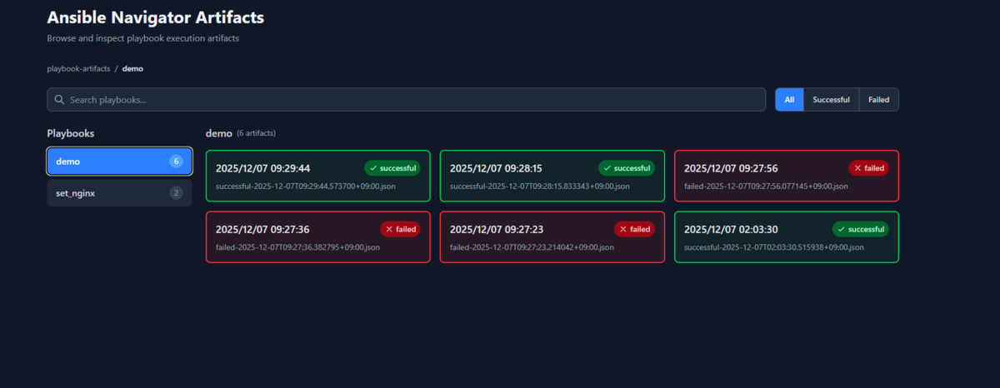
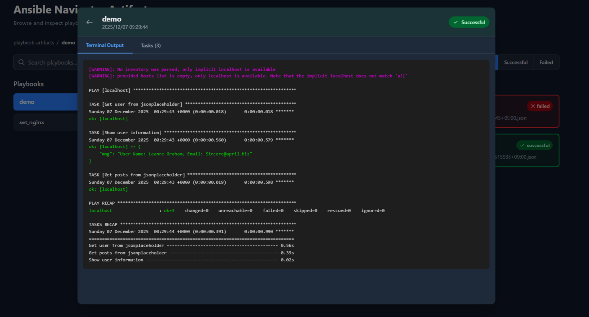
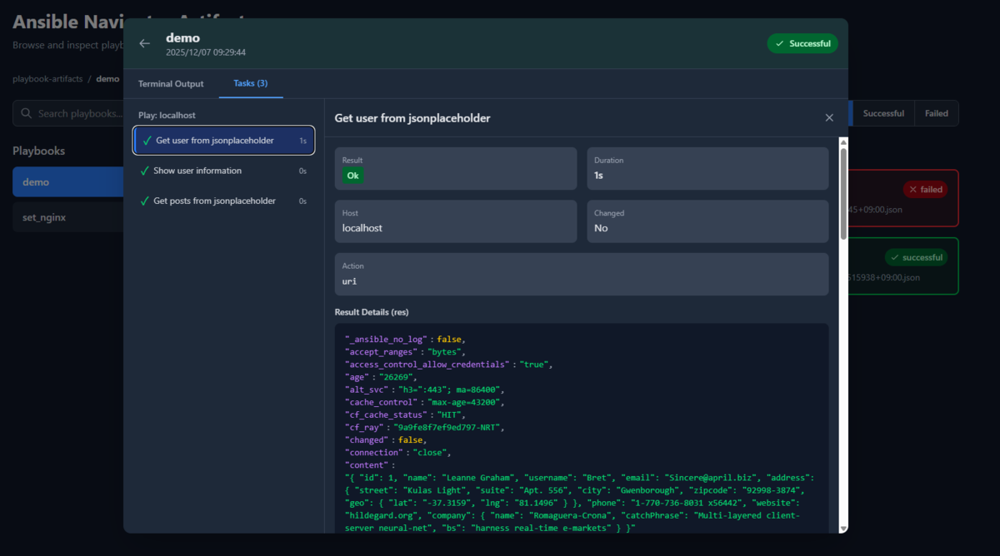

こちらは [エーピーコミュニケーションズ Advent Calendar 2025](https://qiita.com/advent-calendar/2025/ap-com) 7日目の記事です！

## 【懺悔】Ansible Navigator活用できてません

2021年に`ansible-navigator`がリリースされてもう4年程年月が経ちましたが、私はいまだに`ansible-playbook`の方を使ってしまっています。

なぜか？

-   設定が面倒
    -   公式のconfigurationのドキュメントの長さに挫折
    -   必要に迫られているわけではなかったので余計に面倒に感じた
-   `uv`の登場
    -   個人的にネックになっていたPython仮想環境を整える面倒くささが改善された

とはいえ、このままだとAnsibleの進歩に置いて行かれる気がしたのでここらで`ansible-navigator`に慣れていきたい！

そんな、`ansible-playbook`コマンド愛用者に送る備忘録。

## これが分かれば使える！

### mode

私個人の感想ですが、`stdout`一択です。 `ansible-playbook`に慣れ親しみすぎたためTUIである必要性は今のところ感じていません。

```yaml
---
ansible-navigator:
  mode: stdout
```

### execution-environment

とりあえず、扱うにあたって押さえておきたいのは`execution-environment`の設定項目です。

これが`ansible-navigator`を使う最大のメリットなのでこの設定を改めて覚えて活用したいと思います。

設定例

```yaml
---
ansible-navigator:
  execution-environment:
    enabled: true
    container-engine: docker
    image: quay.io/ansible/awx-ee:latest
    pull:
      policy: missing
```

こんな感じです。 とりあえず押さえておきたい設定項目としては下記の4つです（他にも便利そうな設定項目はあるけどキャッチアップできてない、、、）。

-   enabled
    -   EEを使うかどうかをbool値で指定
    -   基本的にはtrueでよい
    -   [Defaultはtrueなので設定しなくてもよい](https://docs.ansible.com/projects/navigator/settings/#execution-environment)
-   container-engine
    -   使用するコンテナエンジンを指定
    -   `auto`, `podman`, `docker`から選択
    -   [Defaultは`podman`なので注意](https://docs.ansible.com/projects/navigator/settings/#container-engine)
-   image
    -   コンテナをpullする際のパスを指定
    -   ローカルでビルドしたイメージももちろん指定可能
-   pull
    -   コンテナをpullする際の設定
    -   policyでコンテナをpullする条件を指定
        -   `always`, `missing`, `tag`, `never`から選択
        -   [Defaultはtag](https://docs.ansible.com/projects/navigator/settings/#pull-policy)
    -   argumentでpullするときのオプションを指定できる
        -   podmanなら`--tls-verify=false`などはここで指定できる
        -   dockerだとあんまり使わないかも？

### playbook-artifact

これが分かると`ansible-navigator`サイコーになれる設定です。 Playbookを実施する際のログを細かくとることができます。

設定例

```yaml
---
ansible-navigator:
  playbook-artifact:
    enable: true
    save-as: ./playbook-artifacts/{playbook_name}/{playbook_status}-{time_stamp}.json
```

設定値は下記の2つです。

-   enable
    -   artifactの取得を行うかを決める設定値
    -   Defaultがtrueなのでこの設定を意識せずにPlaybookを実行して、何かログみたいなのが勝手に増えてる！？ってなった記憶
-   save-as
    -   artifactの保存先を決める設定値
    -   動的な値を使用可能
        -   {playbook\_dir}
            -   Playbookのあるディレクトリまでの絶対パス
        -   {playbook\_name}
            -   Playbookファイルのbasename
        -   {playbook\_status}
            -   Playbookの実行結果のステータス
            -   `successful`か`failed`（もしかしたら他にもあるかも）
        -   {time\_stamp}
            -   Playbookを実行したときの時刻
            -   便利だけどtime stampは長いので視認性は下がる
            -   ただこれを入れないと、実行ごとにartifactを分けることができないので実質必須
    -   [Defaultは`{playbook_dir}/{playbook_name}-artifact-{time_stamp}.json`](https://docs.ansible.com/projects/navigator/settings/#playbook-artifact-save-as)

## Artifactいいね！

`ansible-navigator`を使う良さはこのArtifactにあると私は感じています。

ログを後からゆっくり見返すことができます。 個人的におすすめなのは `{playbook_name}`でディレクトリを分割してそこに`{playbook_status}-{time_stamp}.json`を置く形です。

```yaml
---
ansible-navigator:
  playbook-artifact:
    save-as: ./playbook-artifacts/{playbook_name}/{playbook_status}-{time_stamp}.json
```

こうしておくと、Playbookごとにartifactがまとまって便利です。

Artifactの`plays.tasks`ではtaskの実行時間やモジュールの変数の値など結構細かい情報が見れます。

このタスクを行ったときに

```yaml
    - name: Get user from jsonplaceholder
      uri:
        url: https://jsonplaceholder.typicode.com/users/1
        method: GET
        return_content: yes
      register: user_response
```

こんなのが見えます

```yaml
{
    "__changed": false,
    "__duration": "1s",
    "__host": "localhost",
    "__number": 0,
    "__result": "Ok",
    "__task": "Get user from jsonplaceholder",
    "__task_action": "uri",
    "duration": 0.669066,
    "end": "2025-12-06T17:03:30.041794+00:00",
    "event_loop": null,
    "host": "localhost",
    "play": "localhost",
    "play_pattern": "localhost",
    "play_uuid": "695c9853-f1a2-d479-9ec4-000000000001",
    "playbook": "/path/to/playbook/demo.yaml",
    "playbook_uuid": "ab54aadf-5d19-42f7-9e4e-8a52d2138340",
    "remote_addr": "127.0.0.1",
    "res": {
        "_ansible_no_log": false,
        "accept_ranges": "bytes",
        "access_control_allow_credentials": "true",
        "age": "28305",
        "alt_svc": "h3=\":443\"; ma=86400",
        "cache_control": "max-age=43200",
        "cf_cache_status": "HIT",
        "cf_ray": "9a9d5b4daa6548c0-NRT",
        "changed": false,
        "connection": "close",
        "content": "{\n  \"id\": 1,\n  \"name\": \"Leanne Graham\",\n  \"username\": \"Bret\",\n  \"email\": \"Sincere@april.biz\",\n  \"address\": {\n    \"street\": \"Kulas Light\",\n    \"suite\": \"Apt. 556\",\n    \"city\": \"Gwenborough\",\n    \"zipcode\": \"92998-3874\",\n    \"geo\": {\n      \"lat\": \"-37.3159\",\n      \"lng\": \"81.1496\"\n    }\n  },\n  \"phone\": \"1-770-736-8031 x56442\",\n  \"website\": \"hildegard.org\",\n  \"company\": {\n    \"name\": \"Romaguera-Crona\",\n    \"catchPhrase\": \"Multi-layered client-server neural-net\",\n    \"bs\": \"harness real-time e-markets\"\n  }\n}",
        "content_length": "509",
        "content_type": "application/json; charset=utf-8",
        "cookies": {},
        "cookies_string": "",
        "date": "Sat, 06 Dec 2025 17:03:26 GMT",
        "elapsed": 0,
        "etag": "W/\"1fd-+2Y3G3w049iSZtw5t1mzSnunngE\"",
        "expires": "-1",
        "invocation": {
            "module_args": {
                "attributes": null,
                "body": null,
                "body_format": "raw",
                "ca_path": null,
                "ciphers": null,
                "client_cert": null,
                "client_key": null,
                "creates": null,
                "decompress": true,
                "dest": null,
                "follow_redirects": "safe",
                "force": false,
                "force_basic_auth": false,
                "group": null,
                "headers": {},
                "http_agent": "ansible-httpget",
                "method": "GET",
                "mode": null,
                "owner": null,
                "remote_src": false,
                "removes": null,
                "return_content": true,
                "selevel": null,
                "serole": null,
                "setype": null,
                "seuser": null,
                "src": null,
                "status_code": [
                    200
                ],
                "timeout": 30,
                "unix_socket": null,
                "unredirected_headers": [],
                "unsafe_writes": false,
                "url": "https://jsonplaceholder.typicode.com/users/1",
                "url_password": null,
                "url_username": null,
                "use_gssapi": false,
                "use_netrc": true,
                "use_proxy": true,
                "validate_certs": true
            }
        },
        "json": {
            "address": {
                "city": "Gwenborough",
                "geo": {
                    "lat": "-37.3159",
                    "lng": "81.1496"
                },
                "street": "Kulas Light",
                "suite": "Apt. 556",
                "zipcode": "92998-3874"
            },
            "company": {
                "bs": "harness real-time e-markets",
                "catchPhrase": "Multi-layered client-server neural-net",
                "name": "Romaguera-Crona"
            },
            "email": "Sincere@april.biz",
            "id": 1,
            "name": "Leanne Graham",
            "phone": "1-770-736-8031 x56442",
            "username": "Bret",
            "website": "hildegard.org"
        },
        "msg": "OK (509 bytes)",
        "nel": "{\"report_to\":\"heroku-nel\",\"response_headers\":[\"Via\"],\"max_age\":3600,\"success_fraction\":0.01,\"failure_fraction\":0.1}",
        "pragma": "no-cache",
        "redirected": false,
        "report_to": "{\"group\":\"heroku-nel\",\"endpoints\":[{\"url\":\"https://nel.heroku.com/reports?s=bPhj6La0YC%2B3R7rXVC9ERQ77znxwjpqxfTUsHOoecEI%3D\\u0026sid=e11707d5-02a7-43ef-b45e-2cf4d2036f7d\\u0026ts=1761228021\"}],\"max_age\":3600}",
        "reporting_endpoints": "heroku-nel=\"https://nel.heroku.com/reports?s=bPhj6La0YC%2B3R7rXVC9ERQ77znxwjpqxfTUsHOoecEI%3D&sid=e11707d5-02a7-43ef-b45e-2cf4d2036f7d&ts=1761228021\"",
        "server": "cloudflare",
        "server_timing": "cfCacheStatus;desc=\"HIT\", cfEdge;dur=3,cfOrigin;dur=0",
        "status": 200,
        "url": "https://jsonplaceholder.typicode.com/users/1",
        "vary": "Origin, Accept-Encoding",
        "via": "2.0 heroku-router",
        "x_content_type_options": "nosniff",
        "x_powered_by": "Express",
        "x_ratelimit_limit": "1000",
        "x_ratelimit_remaining": "999",
        "x_ratelimit_reset": "1761228067"
    },
    "resolved_action": "ansible.builtin.uri",
    "start": "2025-12-06T17:03:29.372728+00:00",
    "task": "Get user from jsonplaceholder",
    "task_action": "uri",
    "task_args": "",
    "task_path": "/path/to/playbook/demo.yaml:6",
    "task_uuid": "695c9853-f1a2-d479-9ec4-000000000003",
    "uuid": "51c06d52-1058-4b61-945f-a68ae8521a79"
},
```

## AIでさらに飛躍

昨今のAI開発技術の進歩により、ちょっと作ってみようかなって思ったときに目指せる距離が伸びた気がします。 ということで、`ansible-navigator`のArtifactいい感じだし、整形されたものがブラウザで確認出来たらもっと便利だろうな～

ってことで簡単なツールを作ってみました。







いい感じ！

Vibeで作ったから参照するディレクトリとかはべた書きですが、これをデータベースとかに格納するようにしたら後からプロジェクトとか追加できそうです。 そしたらいっそのこと`ansible-navigator`コマンドをブラウザ経由で実行できるようにすればログも回収できるし、実行もできるのでは？

あれ、こんな感じのやつあったような、、、

＿人人人人人＿  
＞　[AWX](https://github.com/ansible/awx)　＜  
￣Y^Y^Y^Y￣

## 最後に

Ansible Navigatorは設定が面倒ですが、覚えてしまえば強力なツールです！

是非この機に乗り換えましょう。
