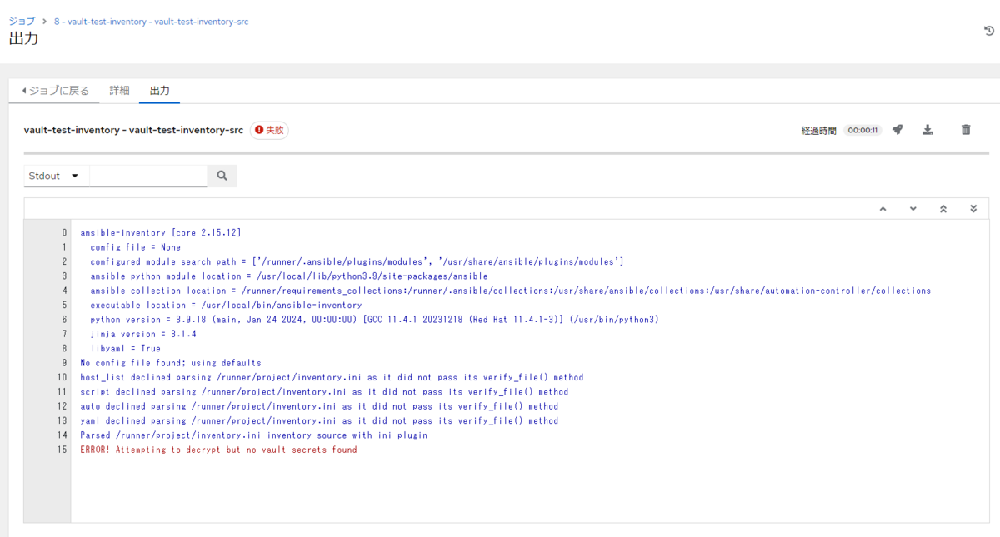
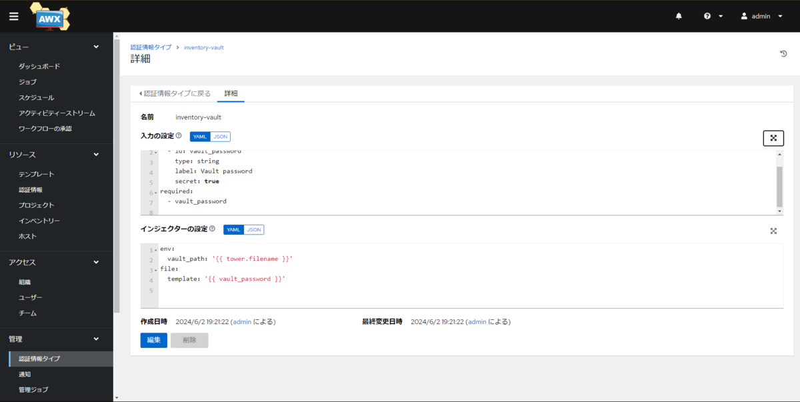
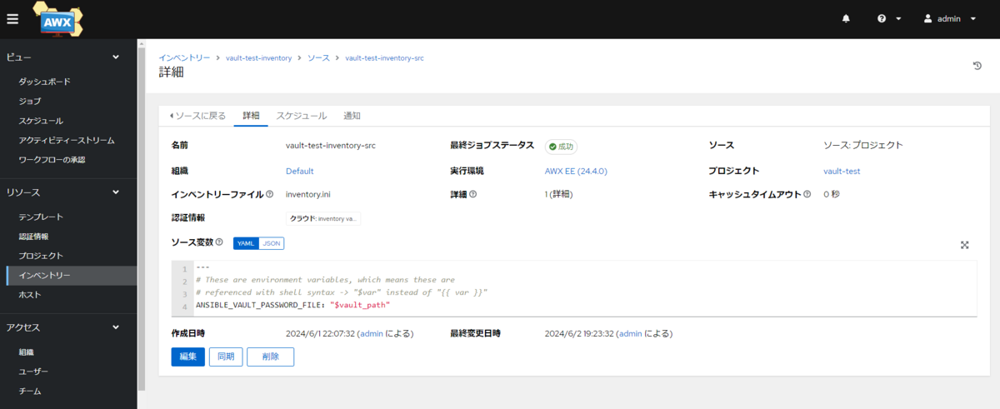
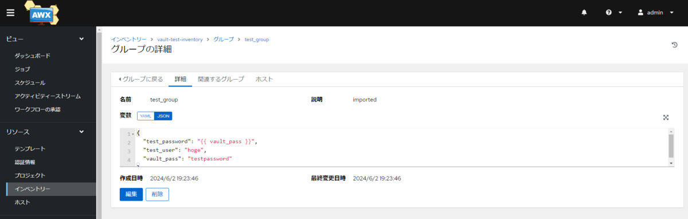
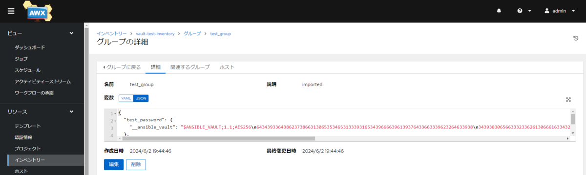
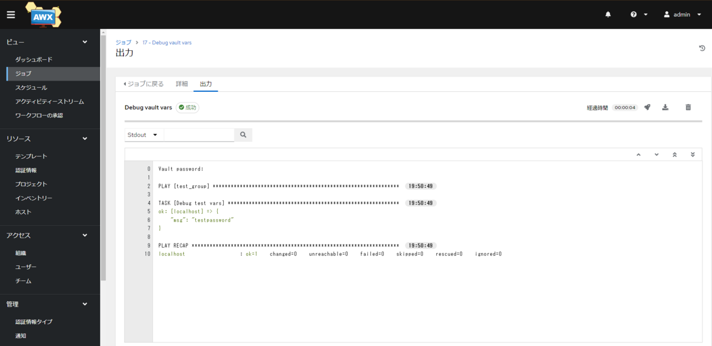

## AWXではgroup\_varsやhost\_varsにansible-vaultを使用するときは要注意！

### 最初に結論

AWX × group\_vars or host\_vars × ansible-vault

この組み合わせをするときは`ansible-vault encrypt_string`を使おう！

### Ansible-vaultをgroup\_varsやhost\_varsで利用する。

Ansible-vaultをgroup\_varsやhost\_varsで利用する際には下記の構成が公式のTipsで推奨されている。

[General tips — Ansible Community Documentation](https://docs.ansible.com/ansible/latest/tips_tricks/ansible_tips_tricks.html#keep-vaulted-variables-safely-visible)

ディレクトリ構成

```
project/
├── debug_test.yml # テスト用プレイブック
├── group_vars
│   └── test_group
│       ├── vars.yml # こちらは暗号化しない
│       └── vault.yml # 暗号化するファイル
└── inventory.ini
```

`group_vars/test_group/vars.yml`

暗号化したい変数は`vault.yml`を参照する形にする。

```yaml
test_user: hoge
test_password: "{{ vault_password }}"
```

`group_vars/test_group/vault.yml`

```yaml
vault_password: testpassword
```

プレイブック側からは`test_password`を参照する。

```yaml
---
- hosts: test_group
  connection: local
  gather_facts: false
  tasks:
    - name: Debug test vars
      ansible.builtin.debug:
        msg: "{{ test_password }}"
```

参照の順は下記のイメージ

flowchart LR A("debug\_test.yml") -->|test\_password| B("vars.yml") -->|vault\_password| C("vault.yml")

`vault.yml`は`ansible-vault`で暗号化する。

```bash
$ ansible-vault encrypt group_vars/test_group/vault.yml 
New Vault password: 
Confirm New Vault password:  
Encryption successful
```

暗号化されるとファイルは下記のようになり、ファイルの中身はすべて暗号化された状態になる。

```
$ANSIBLE_VAULT;1.1;AES256
31653430633961386264613463376532623438373565626636326234663663323138353662386137
3038303930303039653232326662363230396232343831330a313539306662373731343137333739
61336334343337343634343865633331386632633165653233366236346561373461316231346364
3033626232626137350a653837303662663663303739326636326566373164356461623665336530
3535
```

Playbook実行時は`--ask-vault-pass`、`--vault-password-file`、`--vault-id`のいずれかでパスワードを渡して実行。

```bash
$ ansible-playbook -i inventory.ini debug_test.yml --ask-vault-pass
Vault password: 

PLAY [test_group] **********************************************************************************************************************************************************************************************************

TASK [Debug test vars] *****************************************************************************************************************************************************************************************************
ok: [localhost] => {
    "msg": "testpassword"
}

PLAY RECAP *****************************************************************************************************************************************************************************************************************
localhost                  : ok=1    changed=0    unreachable=0    failed=0    skipped=0    rescued=0    ignored=0   
```

これはCLIではうまくいく。

### AWX

上記の構成をAWXでやるとインベントリー→ソースで`ソース: プロジェクト`、インベントリーファイルで`inventory.ini`を指定し同期を行うとエラーが出る。



どうやらvaultの復号に失敗している。しかし、インベントリーのソースでは認証情報にVaultの認証情報タイプを選択できない。

この件はAWXのIssueでも議論されている。まだopenであるので根本的な事象解決は終わっていないと考えられる。

[Allow Vault Credentials for Project SCM Type Inventories to process encrypted vault files · Issue #4089 · ansible/awx](https://github.com/ansible/awx/issues/4089)

[github.com](https://github.com/ansible/awx/issues/4089)

この中では下記のカスタム認証情報タイプを作るワークアラウンドが紹介されている。

[https://github.com/ansible/awx/issues/4089#issuecomment-1632066592](https://github.com/ansible/awx/issues/4089#issuecomment-1632066592)

これを利用してみる。





これで同期を行うと成功したが暗号化したはずの変数がGUI上で丸見えになってしまった。



これだと商用利用する場合などでは運用方法としては許可されないことも予想される。

### encrypt\_string

ansible-vaultには`encrypt_string`というオプションもあり、これは変数単位で暗号化を行うことができる。

```bash
$ ansible-vault encrypt_string "testpassword" --name test_password
New Vault password: 
Confirm New Vault password: 
Encryption successful
test_password: !vault |
          $ANSIBLE_VAULT;1.1;AES256
          64343933643862373866313065353465313339316534396666396139376433663339623264633938
          3439383065663332336261306661633432396366373034610a613137616436303836313161373864
          31323033303466303663373937633132303834623262643162623061316431306532343632346134
          6233373831326434340a656436313331663631626130636538623662303938623432343332393766
          3933
```

これを`vault.yml`にコピーしてプロジェクトを更新する。  
インベントリ－のグループを削除して再度同期を行う。

そうすると下記の結果が得られた。



WebGUI上でも暗号化された状態で表示された。

ジョブテンプレート側にVaultの認証情報を持たせておけば問題なく参照可能。



これならAWX上でも安全に機密情報をグループ変数に持たせることができそうだ。

### encrypt\_string用のPlaybookを作る

以上より、`ansible-vault encrypt_string`を利用することでAWX上でも安全に機密情報をグループ変数に持たせることができると示された。

しかし、`ansible-vault encrypt_string`は1変数ごとでしか暗号化できず、若干効率が悪い。  
ということで、変数ファイルの中身をすべて`encrypt_string`して書き換えるPlaybookを作成した。

これなら暗号化すべき変数が増えてもその分`encrypt_string`をする必要もなく、Playbookを動かすだけで変数の暗号化ができる。

```yaml
---
- name: Encrypt vars file
  hosts: localhost
  gather_facts: false
  vars:
    password_file: vault_password
    vars_file: inventory/group_vars/sample/vault.yml
  tasks:
    # 暗号化するvarsファイルをtmp_varsとして読みだしておく
    - name: Read vars file
      ansible.builtin.include_vars:
        file: "{{ vars_file }}"
        name: tmp_vars

    # 読みだしたtmp_varsを一つずつ暗号化する
    - name: Encrypt string
      ansible.builtin.command:
        cmd: ansible-vault encrypt_string {{ item.value }} --vault-password-file {{ password_file }} --name {{ item.key }}
      register: res_encrypt
      changed_when: true
      loop: "{{ tmp_vars | dict2items }}"
      loop_control:
        label: "{{ item.key }}"

    # 暗号化する前のファイルを削除する
    - name: Delete vars file
      ansible.builtin.file:
        path: "{{ vars_file }}"
        state: absent

    # varsファイルの内容を全て消す
    - name: Reset vars file
      ansible.builtin.lineinfile:
        path: "{{ vars_file }}"
        line: ""
        create: true
        mode: "0644"

    # 暗号化した変数を書き込む
    - name: Write encrypted vars
      ansible.builtin.lineinfile:
        path: "{{ vars_file }}"
        line: "{{ item.stdout }}"
      loop: "{{ res_encrypt.results }}"
      loop_control:
        label: "{{ tmp_item.stdout.split(':') | first }}"
```

### まとめ

[最初に書いた結論を参照](#%E6%9C%80%E5%88%9D%E3%81%AB%E7%B5%90%E8%AB%96)

### 参考

[Ansible Vaultのベストプラクティス - 96 Tech Blog](https://ikiri96hyo.hateblo.jp/entry/2020/11/22/151237)

[ikiri96hyo.hateblo.jp](https://ikiri96hyo.hateblo.jp/entry/2020/11/22/151237)
