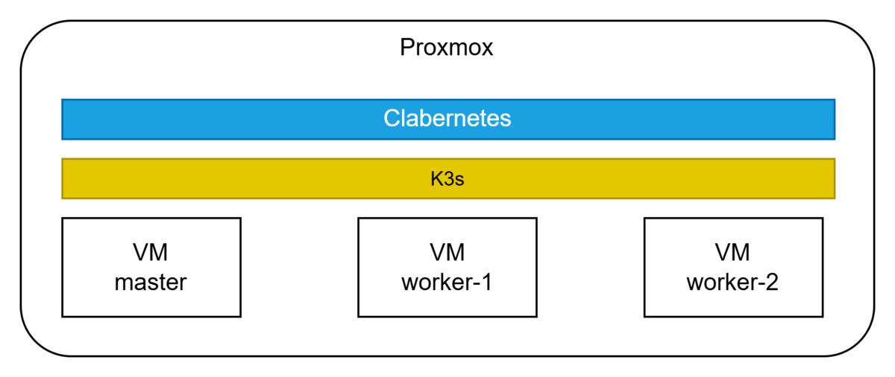
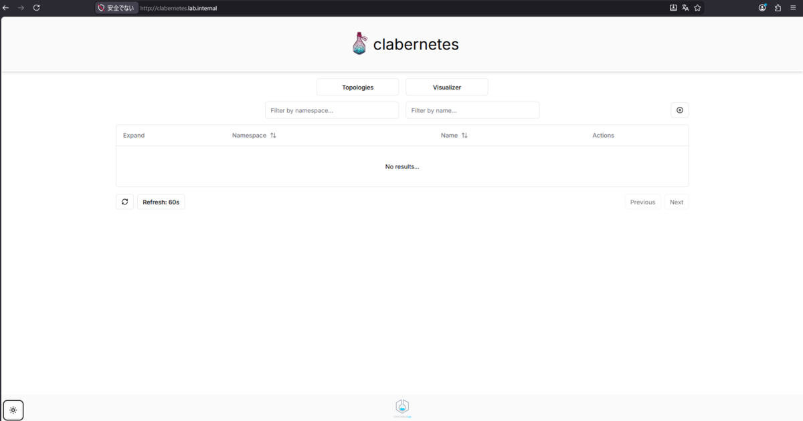
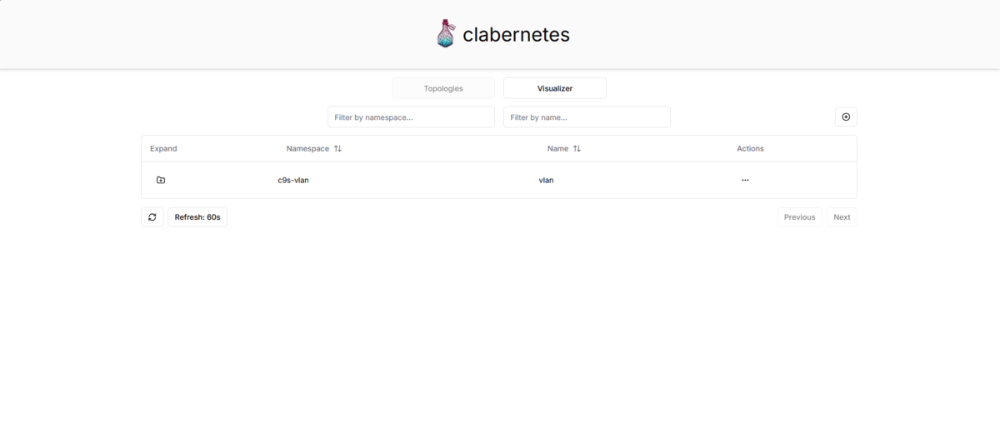
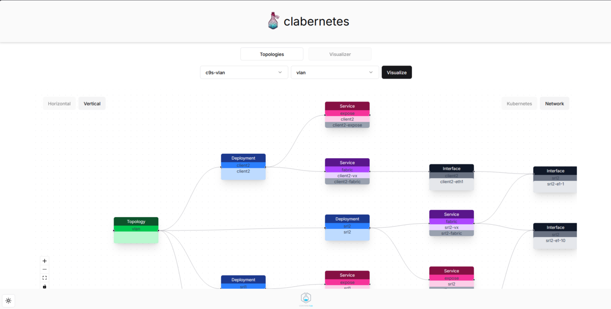

【格闘】⇒この記事内にはこの書き出しで筆者がハマったところを残しています。

## Clabernetesとは？

コンテナ仮想化を用いてネットワーク機器の検証環境をIaCで作成できるOSSのContainerlabをKubernetesを用いてマルチノードで扱えるようにするものがClabernetesです。

[containerlab - Clabernetes](https://containerlab.dev/manual/clabernetes/)

[containerlab.dev](https://containerlab.dev/manual/clabernetes/)

### 自宅のProxmoxでマルチノードContainerlabを作るぞ！

というわけで早速Clabernetesを構築してみようとおもうのですが自宅環境でお安く動作検証をしたいので、Proxmox上に立てたVM三台のK3sクラスター構成を作成し、そこで作業していこうと思います。



非常に雑な概念図としてこんな感じ

【格闘】各MTUは上げとかないと、ラボの検証がうまく進まないかつ切り分けがめっちゃ面倒になるのでいっそ9000にしてしまおう。

#### 準備

##### VMを立てる

ProxmoxにVM（Debian 13）を3つ立てます。 特に工夫も何もないので割愛します。

（Nested Virtualizationは動くようにしないといけないのでそこだけ注意！ [Nested Virtualization - Proxmox VE](https://pve.proxmox.com/wiki/Nested_Virtualization#Enable_Nested_Hardware-assisted_Virtualization)）

##### K3sを入れる

【格闘】Clabernetesは各Containerlab Nodeに対してデフォルトで下記のポートを公開するように構成するので、K3sがデフォルトで具備しているServiceLBではポート競合によりKubernetes ノードより多くのContainerlab Nodeを構築することができません。 なのでMetalLBなどに切り替えます。 インストールする際もServiceLBはデプロイしないようにします。

【格闘】またK3sのデフォルトCNIのflannelはVXLANでPod間をつなぎますがこれがContainerlabとの食い合わせが悪いのでVXLANを使用しないhost-gwでデプロイします。（すべてのノードが同一のL2NWに属している必要があります。）

マスターノード

```
# curl -sfL https://get.k3s.io | sh -s - \
  --disable servicelb \
  --flannel-backend=host-gw
# kubectl apply -f https://raw.githubusercon\tent.com/metallb/metallb/v0.15.3/config/manifests/metallb-native.yaml
```

MetalLBでExternal IPとして使用するIPアドレスのプールを作成しておきます。

```
# cat <<EOF | kubectl apply -f -
apiVersion: metallb.io/v1beta1
kind: IPAddressPool
metadata:
  name: default-pool
  namespace: metallb-system
spec:
  addresses:
  - 192.168.0.200-192.168.0.250 # ここは使用するネットワーク次第で変えてください。
---
apiVersion: metallb.io/v1beta1
kind: L2Advertisement
metadata:
  name: default
  namespace: metallb-system
EOF
```

このあとワーカーノードを登録する際に使用する`/var/lib/rancher/k3s/node-token`の内容を参照してコピーしておく

```
# cat /var/lib/rancher/k3s/node-token
<node-tokenの内容>
```

ワーカーノード

```
# curl -sfL https://get.k3s.io | K3S_URL=https://<master nodeのIP>:6443 K3S_TOKEN=<コピーしておいたnode-tokenの内容> sh -
```

##### Helmのインストール（マスターノードのみ）

これも公式をそのままなぞります。

[Installing Helm | Helm](https://helm.sh/ja/docs/intro/install)

```
# curl -fsSL -o get_helm.sh https://raw.githubusercontent.com/helm/helm/main/scripts/get-helm-4
# chmod 700 get_helm.sh
# ./get_helm.sh
```

### Clabernetes入れるぞ！

ClabernetesにはNext.js製のWeb UIの存在がリポジトリからは確認できます。 また、公式のコマンドでHelm経由でのInstallを行った場合にもこのUIのコンテナが起動します。

ですが、なぜか一切の言及がなく恐らくアルファ版的な位置づけであると予測します。

Web UIからはデプロイしたラボのトポロジーを視覚的に確認できるので、動くようにしておきます。

デフォルトのURLが`ui.clabernetes.containerlab.dev`、Ingress Classが`nginx`となっているのでこれを良しなに変更します。

【格闘】Ingress Hostを変更←デフォルトの`ui.clabernetes.containerlab.dev`は`containerlab.dev`はContainerlabの公式ページ等で使用されているドメインなのでこれは自分が使いたいものに変えておきましょう。 IngressClassをtraefik（K3sのデフォルト）に変更。

```
# helm upgrade clabernetes oci://ghcr.io/srl-labs/clabernetes/clabernetes \
  --namespace c9s \
  --set ui.ingress.host=clabernetes.lab.internal\
  --set ui.ingress.ingressClass=traefik
```

`/etc/rancher/k3s/k3s.yaml`が`~/.kube/config`にコピーされていないとこんなエラーがでるので注意

```
Error: kubernetes cluster unreachable: Get "http://localhost:8080/version": dial tcp [::1]:8080: connect: connection refused
```

インストールが完了したら下記コマンドでデプロイできているかを確認します。

```
# kubectl get -n c9s pods -o wide
NAME                                  READY   STATUS    RESTARTS   AGE   IP           NODE                   NOMINATED NODE   READINESS GATES
clabernetes-manager-56b785d49-8j7ks   1/1     Running   0          11h   10.42.0.27   clabernetes-master     <none>           <none>
clabernetes-manager-56b785d49-dn8fr   1/1     Running   0          11h   10.42.3.19   clabernetes-worker-1   <none>           <none>
clabernetes-manager-56b785d49-gzs87   1/1     Running   0          11h   10.42.1.18   clabernetes-worker-2   <none>           <none>
clabernetes-ui-77d9645689-4sk9z       1/1     Running   0          11h   10.42.0.28   clabernetes-master     <none>           <none>
clabernetes-ui-77d9645689-nwr5z       1/1     Running   0          11h   10.42.1.17   clabernetes-worker-2   <none>           <none>
clabernetes-ui-77d9645689-x7mm2       1/1     Running   0          11h   10.42.3.18   clabernetes-worker-1   <none>           <none>
```

Web UIを確認します。

```
# kubectl get -n c9s ingress
NAME             CLASS     HOSTS                 ADDRESS          PORTS   AGE
clabernetes-ui   traefik   clabernetes.lab.internal   192.168.0.200   80      2d
```

上記コマンドでIPを確認した後、ブラウザアクセスを行う端末側のhostsファイルで`clabernetes.lab.internal`の名前解決をできるようにします。

そのうえで任意のブラウザからアクセスしてみましょう。

下記のメニュー画面が表示されればOKです。



これでClabernetesを構築できました。

### Clabverterのインストール

ClabverterはContainerlabのトポロジーを示すYAMLファイルをClabernetes用に変換するツールです。 公式では別途Dockerコンテナを起動してコマンドの実行を行っています。

ただKubernetesだとホスト側で持っているファイルをコンテナにバインドするのが結構面倒なのでビルドしてしまいます。

ビルドにはGO言語のランタイムが必要なのでリポジトリのクローンと合わせてインストールしておきます。

```
# git clone https://github.com/srl-labs/clabernetes.git
# apt install golang
```

リポジトリに移動した後、go言語の依存関係を解決します。

```
# cd clabernetes
# go mod tidy
```

ビルドする

```
# CGO_ENABLED=0 go build -o /usr/local/bin/clabverter ./cmd/clabverter/
```

`/usr/local/bin/`にはPATH通しておいてください。

### ラボをデプロイ

QuickStartにあるサンプルのラボをデプロイしてみます。

```
# git clone --depth 1 https://github.com/srl-labs/srlinux-vlan-handling-lab.git \
  && cd srlinux-vlan-handling-lab
```

【格闘】この時に`vlan.clab.yml`のlinksの順番を入れ替えます。

```yaml
topology:
  ...
  links:
    # links between client1 and srl1
    - endpoints: [client1:eth1, srl1:e1-1]

    # links between client2 and srl2
    - endpoints: [srl2:e1-1, client2:eth1] # ここのリンクを2番目に持ってくる

    # inter-switch link
    - endpoints: [srl1:e1-10, srl2:e1-10]
```

claverterを使用してデプロイ

```
# clabverter --stdout --naming non-prefixed | kubectl apply -f - 
```

デプロイできたかどうかをコマンドとブラウザから確認します。

```
# kubectl get pods  -n c9s-vlan -o wide
```

私の環境ですが、きちんと分散してコンテナが建てられていそうです。

```
NAME                      READY   STATUS    RESTARTS   AGE    IP           NODE                   NOMINATED NODE   READINESS GATES
client1-fd4fc556c-qfv29   1/1     Running   0          129m   10.42.2.11   clabernetes-worker-2   <none>           <none>
client2-898969d86-pwfxh   1/1     Running   0          129m   10.42.1.12   clabernetes-worker-1   <none>           <none>
srl1-55644785fd-mvvgb     1/1     Running   0          129m   10.42.0.26   clabernetes-master     <none>           <none>
srl2-8699dd6d95-z7xl2     1/1     Running   0          129m   10.42.0.27   clabernetes-master     <none>           <none>
```

ブラウザではc9s-vlanのラボがTopologiesのリストに追加されています。



VisualizerではKubernetesのリソースを視覚的に確認することができます。



この画面を見るとよくわかるのですが、ClabernetesのラボはTopologyというCRDをルートに各ノードがDeploymentととして定義される形でデプロイされています。

本当に各ノードがつながっているかを公式にあるやり方をなぞって確認します。

まずはsrl1にログインしてLLDPを確認。

```
# NS=c9s-vlan POD=srl1; \
kubectl -n $NS exec -it \
  $(kubectl -n $NS get pods | grep ^$POD | awk '{print $1}') -- \
    docker exec $POD sr_cli show system lldp neighbor
  +---------------+-------------------+----------------------+---------------------+------------------------+----------------------+---------------+
  |     Name      |     Neighbor      | Neighbor System Name | Neighbor Chassis ID | Neighbor First Message | Neighbor Last Update | Neighbor Port |
  +===============+===================+======================+=====================+========================+======================+===============+
  | ethernet-1/10 | 1A:98:00:FF:00:00 | srl2                 | 1A:98:00:FF:00:00   | an hour ago            | 5 seconds ago        | ethernet-1/10 |
  +---------------+-------------------+----------------------+---------------------+------------------------+----------------------+---------------+
```

次にclientとして作成されているコンテナ同士でPingが通るかを確認。

```
# NS=c9s-vlan POD=client1; \
kubectl -n $NS exec -it \
  $(kubectl -n $NS get pods | grep ^$POD | awk '{print $1}') -- \
    docker exec -it $POD ping -c 2 10.1.0.2
PING 10.1.0.2 (10.1.0.2) 56(84) bytes of data.
64 bytes from 10.1.0.2: icmp_seq=1 ttl=64 time=4.23 ms
64 bytes from 10.1.0.2: icmp_seq=2 ttl=64 time=0.888 ms

--- 10.1.0.2 ping statistics ---
2 packets transmitted, 2 received, 0% packet loss, time 1001ms
rtt min/avg/max/mdev = 0.888/2.560/4.232/1.672 ms
```

これで無事にラボが動いていることも確認できました。

### まとめ

QuickStartの例ではKindでしたが、今回K3sでマルチノードのClabernetesを構築できました。

これでかなり大きな構成のラボも作ることができそうです。

とはいえ格闘がかなりしんどくてClaudeがいなかったらだいぶ手前で挫折していたような気がします。 結局デッカイマシン作ってそのうえでDocker ComposeでContainerlab動かすのが一番楽で良い！
