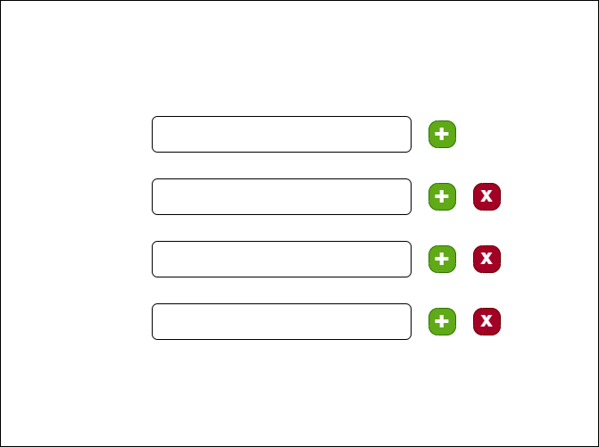
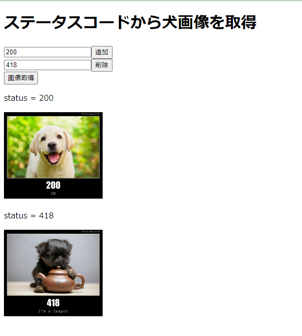
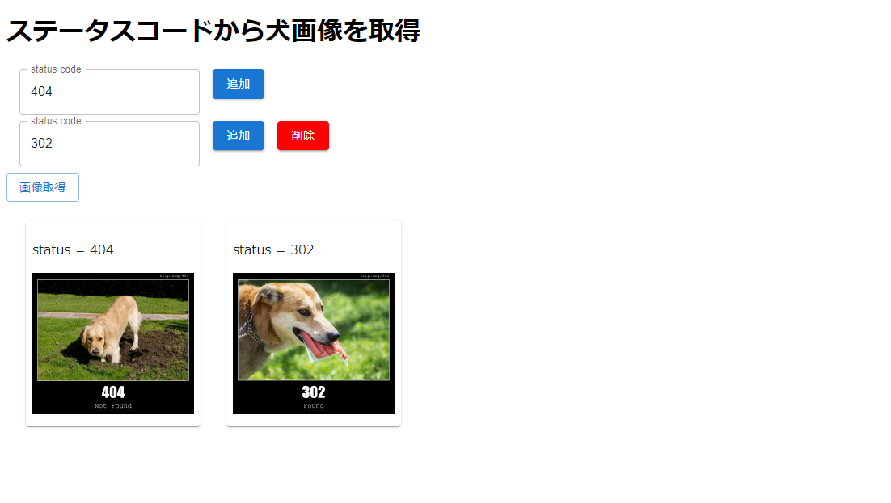

React + TypeScriptを用いて入力できる枠の数がユーザー側で調整可能な入力欄を作っていきます。 完成イメージはこんな感じ↓



入力値をstring型の配列のStateとして持つような形で作るとこんな感じ ただ入力欄だけ作っても面白みがないので下記のフリーのAPIサービスを利用してステータスコードを入れると犬の画像が出るような形にしました。

[https://http.dog/](https://http.dog/)

```typescript
const MultiInputPage = () => {
  const [statusCodes, setStatusCodes] = useState([""])
  const [dogImgUrls, setDogImgUrls] = useState<string[]>([])

  // 要素を追加
  const addStatusCodes = (): void => setStatusCodes([...statusCodes, ""])
  // 要素を編集
  const changeStatusCodes = (e: React.ChangeEvent<HTMLInputElement>): void => (
    setStatusCodes(statusCodes.map((value, index) => String(index) === e.currentTarget.name ? e.currentTarget.value : value))
  )
  // 要素を削除
  const removeStatusCodes = (e: React.MouseEvent<HTMLButtonElement>): void => (
    setStatusCodes(statusCodes.filter((_, index) => String(index) !== e.currentTarget.name))
  )

  const onSubmit = (e: React.FormEvent) => {
    e.preventDefault()
    setDogImgUrls(statusCodes.map((statusCode) => `https://http.dog/${statusCode}.jpg`))
  }

  return (
    <>
      <h1>ステータスコードから犬画像を取得</h1>
      <form onSubmit={onSubmit}>
        {
          statusCodes.map((value, index) => (
            <div key={index}>
              <input type="text" name={String(index)} value={value} onChange={changeStatusCodes} />
              {
                index === 0 ?
                  <button type="button" onClick={addStatusCodes}>追加</button>
                  :
                  <button type="button" name={String(index)} onClick={removeStatusCodes}>削除</button>
              }
            </div>
          ))
        }
        <button type="submit">画像取得</button>
      </form>
      {
        dogImgUrls.length > 0 && <>{
          dogImgUrls.map((imgUrl, index) => (
            <>
              <p>status = {statusCodes[index]}</p>
              
            </>))
        }</>
      }
    </>
  )
}
```



この例だとフォームも複雑じゃないし、submit時の処理も大したことないのであまり問題は感じないですが、これが複雑で記述量も多いフォームになってくると、配列の操作の部分とかが若干邪魔になるような気がしますね。

[【LINE証券 FrontEnd】コンポーネントをカスタムフックで提供してみた](https://engineering.linecorp.com/ja/blog/line-securities-frontend-3/)

[engineering.linecorp.com](https://engineering.linecorp.com/ja/blog/line-securities-frontend-3/)

こちらの記事にあるrender Hooksの概念を使用して複数入力を受け付けるコンポーネントを分離していきたいと思います。

```typescript
type UseMultiInputResult = [string[], () => JSX.Element]
const useMultiInput = (initValue: string[] = [""]): UseMultiInputResult => {
  const [values, setValues] = useState(initValue)

  // 要素を追加
  const addValues = (): void => setValues([...values, ""])
  // 要素を編集
  const changeValues = (e: React.ChangeEvent<HTMLInputElement>): void => (
    setValues(values.map((value, index) => String(index) === e.currentTarget.name ? e.currentTarget.value : value))
  )
  // 要素を削除
  const removeValues = (e: React.MouseEvent<HTMLButtonElement>): void => (
    setValues(values.filter((_, index) => String(index) !== e.currentTarget.name))
  )

  const render = () => (
    <>
      {
        values.map((value, index) => (
          <div key={index}>
            <input type="text" name={String(index)} value={value} onChange={changeValues} />
            {
              index === 0 ?
                <button type="button" onClick={addValues}>追加</button>
                :
                <button type="button" name={String(index)} onClick={removeValues}>削除</button>
            }
          </div>
        ))
      }
    </>
  )
  return [values, render]
}
```

これでフォームをレンダリングするコンポーネントからは複数入力についてその内部の処理を分離し、最終的に使用する入力値の配列とレンダリング用の関数だけを提供できています。 こうすると、先ほどのフォームのコンポーネントも見やすくなります。

```typescript
export const SimpleMultiInput = () => {
  const [statusCodes, renderInput] = useMultiInput()
  const [dogImgUrls, setDogImgUrls] = useState<string[]>([])

  const onSubmit = (e: React.FormEvent) => {
    e.preventDefault()
    setDogImgUrls(statusCodes.map((statusCode) => `https://http.dog/${statusCode}.jpg`))
  }
  return <div style={{ justifyContent: "center" }}>
    <h1>ステータスコードから犬画像を取得</h1>
    <form onSubmit={onSubmit}>
      {renderInput()}
      <button type="submit">画像取得</button>
    </form>
    {
      dogImgUrls.length > 0 && <>{
        dogImgUrls.map((imgUrl, index) => (
          <>
            <p>status = {statusCodes[index]}</p>
            
          </>))
      }</>
    }
  </div>
}
```

render Hooksを使って処理体系をいい感じにできたんじゃないかなと思います。 このrender Hooksちょっと中毒性がありますね。 これがベストなんじゃないかって思考が止まってしまう。 便利なんだけど考えなしに使うのはさすがにまずいかな。

### おまけ

デザインがイケてないのでCSSとかを当てていい感じにする取り組み MUIのstyledコンポーネントを使ってみる。

```typescript
const StatusCodeInput = styled(TextField)({
  marginLeft: "1rem",
  marginRight: "1rem",
  marginBottom: "0.5rem"
})

const AddButton = styled(Button)({
  marginRight: "1rem",
})
const DeleteButton = styled(Button)({
  marginRight: "1rem",
  backgroundColor: "red",
  "&:hover": {
    backgroundColor: "#DF143C",
  },
})

const useMultiInput = (initValue: string[] = [""]): UseMultiInputResult => {
  const [values, setValues] = useState(initValue)

  // 要素を追加
  const addValues = (e: React.MouseEvent<HTMLButtonElement>): void => {
    const tmpValues = values.slice(0)
    tmpValues.splice(Number(e.currentTarget.name) + 1, 0, "")
    setValues(tmpValues)
  }
  // 要素を編集
  const changeValues = (e: React.ChangeEvent<HTMLInputElement>): void => (
    setValues(values.map((value, index) => String(index) === e.currentTarget.name ? e.currentTarget.value : value))
  )
  // 要素を削除
  const removeValues = (e: React.MouseEvent<HTMLButtonElement>): void => (
    setValues(values.filter((_, index) => String(index) !== e.currentTarget.name))
  )

  const render = () => (
    <>
      {
        values.map((value, index) => (
          <div key={index}>
            <StatusCodeInput label="status code" name={String(index)} value={value} onChange={changeValues} />
            <AddButton variant="contained" name={String(index)} onClick={addValues}>追加</AddButton>
            {
              index !== 0 &&
              <DeleteButton variant="contained" name={String(index)} onClick={removeValues}>削除</DeleteButton>
            }
          </div>
        ))
      }
    </>
  )
  return [values, render]
}
```



MUIを使うだけでちょっと洗練された感じがでてとても満足です。
