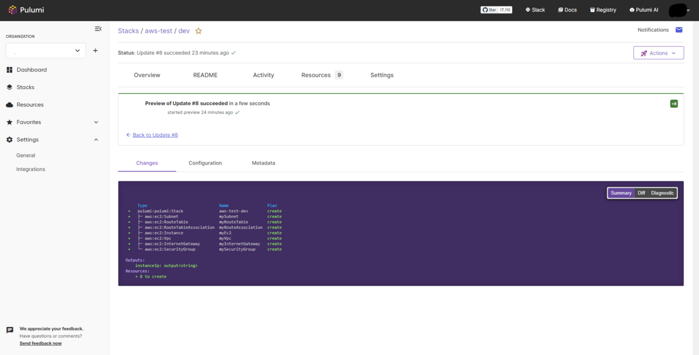
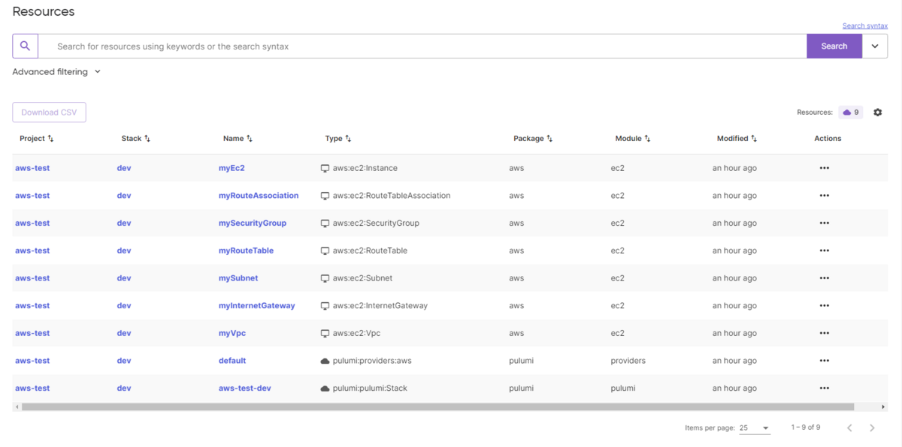
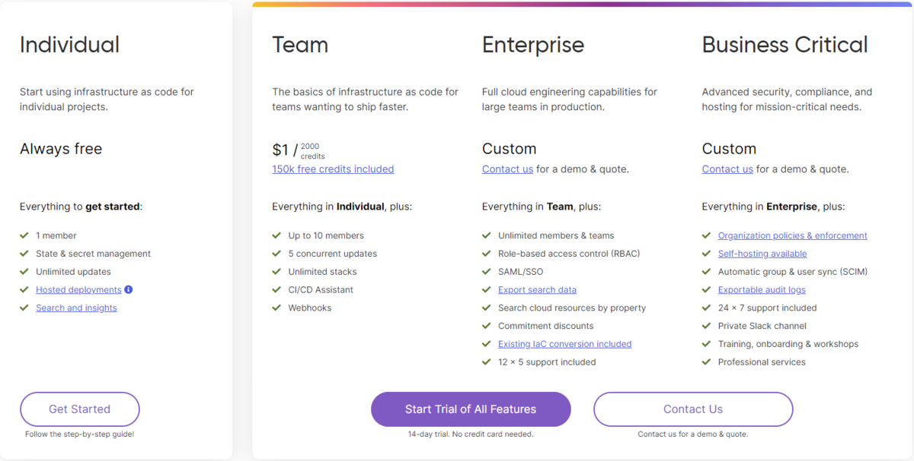
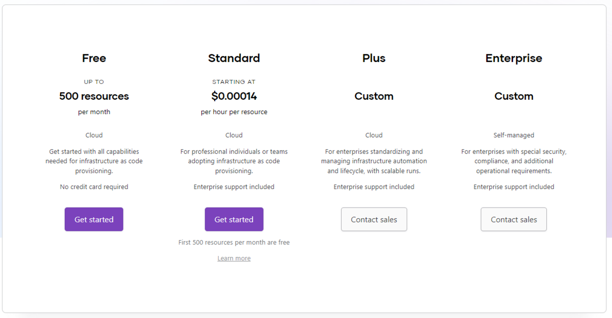

最近目にしたこの記事の最後に`Pulumi`なるものが出てきていて、恥ずかしながら私はまったくこの存在を知りませんでした。  
いい機会なのでPulumiについて公式の手順を参考に入門していきます。

[Terraformのライセンスの変更とその影響](https://zenn.dev/the_exile/articles/b90fe8c5c41694)

[zenn.dev](https://zenn.dev/the_exile/articles/b90fe8c5c41694)

## What is Pulumi?

[Pulumi - Infrastructure as Code in Any Programming Language](https://www.pulumi.com/)

Pulumiとは何か、  
トップページ曰く

> Infrastructure as code in any programming language Build infrastructure intuitively on any cloud using familiar languages.

これがPulumiを使うとできるみたいです。

## Get Start

環境はWSL（Ubuntu22.04）

### Pulumiをインストール

```bash
curl -fsSL https://get.pulumi.com | sh
```

インストールできたら`pulumi version`で確認

```bash
$ pulumi version
v3.78.1
```

今回はAWS上にリソースを構築する予定なので、環境変数として`AWS_ACCESS_KEY_ID`と`AWS_SECRET_ACCESS_KEY`を設定しておきます。 ここは`aws cli`をインストールしている場合はその設定を利用することが可能なようです。

### プロジェクトを作成する

Pulumiがインストールできたら次にプロジェクトを作成します。

冒頭にあった通り、Pulumiでは様々な言語で構成を記述することができます。  
現状、`TypeScript`, `JavaScript`, `Python`, `Go`, `C#`,`Java`, `YAML`から選択できます。

個人的な好みで`YAML`で構成を採用します。

`pulumi new`のコマンドでひな形を作ることができます。  
この時にどのプロバイダーを利用するのかとどの言語で書くかを指定します。

プロジェクトを置くディレクトリを作ってそこにプロジェクトを作成していきます。

```bash
mkdir pulumi_aws && cd pulumi_aws
pulumi new aws-yaml
```

この`pulumi new`のコマンドは実行するとPulumi Cloudへのログインを求められます。  
Pulumi Cloudについてパッと見の感想になりますが、その立ち位置はTerraform Cloudに近いなと思っています。 Pulumi Cloudは個人利用がタダなので、サクッとアカウントも作ってログインしましたが、Pulumi Cloudを利用したくない場合は事前に`pulumi login --local`を実行してローカル環境をおくと良いそうです。

[Pulumi CLI & Pulumi Cloud FAQ | Pulumi Docs](https://www.pulumi.com/docs/support/faq/#can-i-use-pulumi-without-depending-on-the-pulumi-cloud)

その他、プロジェクト名やプロジェクトのDescription、利用するAWSのロケーション（例: ap-northeast-1）などをインタラクティブに設定します。  
Pulumi Cloudを利用するかどうか、利用するプロバイダーや言語によっても変わるようですが大体下記のことを聞かれます。

```bash
project name: (pulumi_aws) 
project description: (A minimal AWS Pulumi YAML program) 
stack name: (dev) 
aws:region: The AWS region to deploy into: (us-east-1) 
```

これで下記のようにファイルが作られました。

```
.
├── Pulumi.dev.yaml
└── Pulumi.yaml
```

stack名を`dev`で作ってしまったのでややこしいですが、`Pulumi.dev.yaml`の`dev`の部分はstack名によって変わるようです。

`Pulumi.yaml`がリソースなどを記述するメインのファイルで、`Pulumi.dev.yaml`は構成の設定が入ってくるようです。

`pulumi new aws-yaml`した直後が下記。

`Pulumi.yaml`

```yaml
name: aws-test
runtime: yaml
description: A minimal AWS Pulumi YAML program
outputs:
  # Export the name of the bucket
  bucketName: ${my-bucket.id}
resources:
  # Create an AWS resource (S3 Bucket)
  my-bucket:
    type: aws:s3:Bucket
```

`Pulumi.dev.yaml`

```yaml
config:
  aws:region: ap-northeast-1
```

なるほど、構成の設定とはクラウドのロケーションなどの情報を指すみたいです。

AWSのConfiguration Optionはこちらから

[AWS Classic Installation & Configuration | Pulumi Registry](https://www.pulumi.com/registry/packages/aws/installation-configuration/#configuration-options)

`pulumi new`直後の状態でもS3についてのリソースは記述されているのでこの状態で`pulumi up`することでAWSにS3バケットを作ることができます。

このあたりのコマンドはTerraformほとんど同じ感覚で使えます。  
若干文言が違うので対応表にしました。

Terraform

Pulumi

plan

preview

apply

up

destroy

destory

ただこれだと`Pulumi.yaml`がS3バケットのみなのでもうちょっとリソース色々組んでみたいと思います。

### Pulumiを書く（YAML）

#### Pulumi.yaml

これはどの言語で書く際にも実は生成されています。 トップレベルのキー`runtime`で使用言語を決めてプロジェクトの名前や説明も使用言語にかかわらずこのファイルに載ってきます。

Pulumiの公式examplesより

[examples/aws-apigateway-py-routes at master · pulumi/examples · GitHub](https://github.com/pulumi/examples/tree/master/aws-apigateway-py-routes)

```yaml
name: aws-apigateway-py-routes
runtime:
  name: python
  options:
    virtualenv: venv
description: Demonstration of API Gateway routes
template:
    config:
      aws:region:
        description: The AWS region to deploy into
        default: us-east-2
```

`runtime: yaml`の場合はこの`Pulumi.yaml`にさらに`resources`や`outputs`を書いていきます。

この`resources`や`outputs`の書き方は感覚的にTerraformと近かったです。　　 ただ、これはなんとなく近いわけではなくPulumiのパッケージはTerraformのものをベースに作られているものが少なからずあるため意図的なもののようです。

PulumiのexampleがあるのでここからYAMLベースのやつを参考にして簡単なものを自分でも書いてみます。

[GitHub - pulumi/examples: Infrastructure, containers, and serverless apps to AWS, Azure, GCP, and Kubernetes... all deployed with Pulumi](https://github.com/pulumi/examples/tree/master)

[github.com](https://github.com/pulumi/examples/tree/master)

まずは簡単にVPC, Subnet, SecurityGroup, EC2を作るやつを書いてみました。

```yaml
name: aws-test
runtime: yaml
variables:
  myIp: myGrobalIp
  ubuntu:
    fn::invoke:
      function: aws:ec2:getAmi
      arguments:
        mostRecent: true
        filters:
          - name: name
            values:
              - ubuntu/images/hvm-ssd/ubuntu-focal-20.04-amd64-server-*
          - name: virtualization-type
            values:
              - hvm
        owners:
          - '000000000000'
  keyPair: myKeyPair
resources:
  myVpc:
    type: aws:ec2:Vpc
    properties:
      cidrBlock: 10.0.0.0/16
      enableDnsHostnames: true
      enableDnsSupport: true
      tags:
        Name: tkd-pulumi-vpc
  
  mySubnet:
    type: aws:ec2:Subnet
    properties:
      vpcId: ${myVpc.id}
      cidrBlock: 10.0.1.0/24
      tags:
        Name: tkd-pulumi-subnet

  mySecurityGroup:
    type: aws:ec2:SecurityGroup
    properties:
      vpcId: ${myVpc.id}
      ingress:
        - description: for HTTP
          fromPort: 80
          toPort: 80
          protocol: tcp
          cidrBlocks:
            - 0.0.0.0/0
        - description: for SSH
          fromPort: 22
          toPort: 22
          protocol: tcp
          cidrBlocks:
            - ${myIp}
      egress:
        - protocol: "-1"
          fromPort: 0
          toPort: 0
          cidrBlocks:
            - 0.0.0.0/0

  myInternetGateway:
    type: aws:ec2:InternetGateway
    properties:
      vpcId: ${myVpc.id}
      tags:
        Name: tkd-pulumi-igw

  myRouteTable:
    type: aws:ec2:RouteTable
    properties:
      vpcId: ${myVpc.id}
      routes:
        - cidrBlock: 0.0.0.0/0
          gatewayId: ${myInternetGateway.id}
      tags:
        Name: tkd-pulumi-route-table

  myRouteAssociation:
    type: aws:ec2:RouteTableAssociation
    properties:
      routeTableId: ${myRouteTable.id}
      subnetId: ${mySubnet.id}

  myEc2:
    type: aws:ec2:Instance
    properties:
      subnetId: ${mySubnet.id}
      ami: ${ubuntu.id}
      instanceType: t2.micro
      vpcSecurityGroupIds:
        - ${mySecurityGroup.id}
      associatePublicIpAddress: true
      keyName: ${keyPair}
      tags:
        Name: tkd-pulumi-Ubuntu

outputs:
  instanceIp: ${myEc2.publicIp}
```

### Pulumiを実行

`pulumi up`コマンドで実行できます。

実行するとTerraformと同じでリソースの見積をしてから確認を経てプロビジョニングします。

```bash
View in Browser (Ctrl+O): https://app.pulumi.com/<username>/aws-test/dev/previews/a0333beb-4e14-4691-b569-ad4c3d3c52ac

     Type                              Name                Plan       
 +   pulumi:pulumi:Stack               aws-test-dev        create     
 +   ├─ aws:ec2:Vpc                    myVpc               create     
 +   ├─ aws:ec2:InternetGateway        myInternetGateway   create     
 +   ├─ aws:ec2:SecurityGroup          mySecurityGroup     create     
 +   ├─ aws:ec2:Subnet                 mySubnet            create     
 +   ├─ aws:ec2:RouteTable             myRouteTable        create     
 +   ├─ aws:ec2:RouteTableAssociation  myRouteAssociation  create     
 +   └─ aws:ec2:Instance               myEc2               create     

Outputs:
    instanceIp: output<string>

Resources:
    + 8 to create

Do you want to perform this update?
```

今回はPulumi Cloudを利用しているので、ブラウザからも同じ内容を見ることができます。 

そしてプロビジョニング

```bash
Updating (dev)

View in Browser (Ctrl+O): https://app.pulumi.com/<username>/aws-test/dev/updates/8

     Type                              Name                Status              
 +   pulumi:pulumi:Stack               aws-test-dev        created (48s)       
 +   ├─ aws:ec2:Vpc                    myVpc               created (11s)       
 +   ├─ aws:ec2:Subnet                 mySubnet            created (1s)        
 +   ├─ aws:ec2:InternetGateway        myInternetGateway   created (0.93s)     
 +   ├─ aws:ec2:SecurityGroup          mySecurityGroup     created (3s)        
 +   ├─ aws:ec2:RouteTable             myRouteTable        created (1s)        
 +   ├─ aws:ec2:RouteTableAssociation  myRouteAssociation  created (0.67s)     
 +   └─ aws:ec2:Instance               myEc2               created (32s)       

Outputs:
    instanceIp: "---.---.---.---"

Resources:
    + 8 created

Duration: 49s
```

これもPulumi Cloudから見るとこんな感じ 

これでいい感じにプロビジョニングができていました。

### 使用感

Terraformと近いけど、それが自分の使いたい言語でできるのでそこは中々良いと感じました。 ただ`YAML`だと関数などが使いづらいので使用感はあんまりよくない（現時点では）。

Pulumi Cloudはなんとなく触った感じ、Terraform Cloudと近いながらもプロジェクトの追加に関してはTerraform Cloudよりも触りやすい印象。

ちなみ金額がPulumi Cloudの方が安く見えるので、そういう意味ではPulumiは選択肢になるかもなと思いました。 今後PulumiとTerraformはどうなっていくのか注視していきたいところです。




