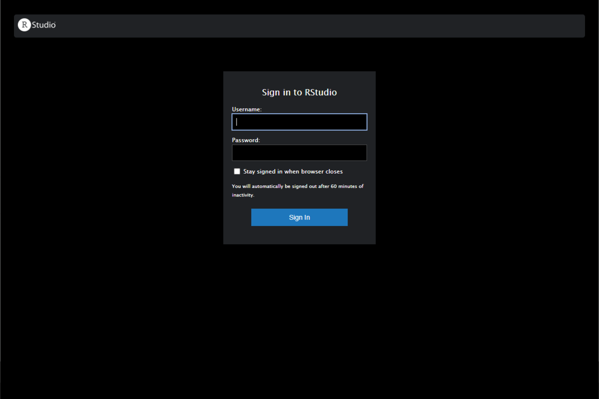
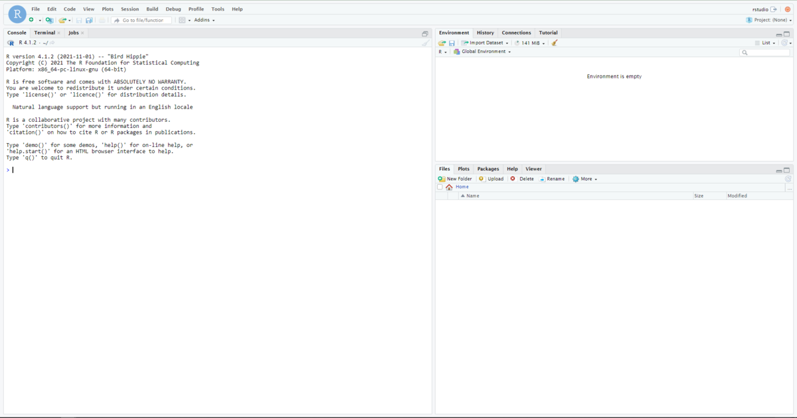
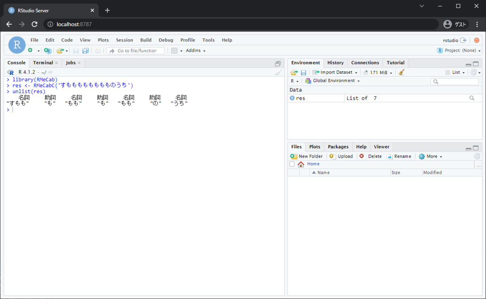

## Rstudioのバージョン更新結構ほったらかしがち(N=1)

恐る恐る手元のRのバージョン確認したら3.2使ってました、、、（執筆時のWindowsの最新版は4.1.2）  
Rのバージョンアップ本当にやらない。  
やらない理由はただ面倒なだけやったらいいのに

### そこでRocker

Rocker Project というRのコンテナ環境を作っているプロジェクトがあります。  
そこがDocker Hubに挙げているイメージを使って最新のRのコンテナ環境をサクッと作ることができるというわけなんですね、ありがたい。  
さらにコンテナ環境ということでRstudio Serverを使う形になっているのでクラウドとかに用意すれば簡単に複数人でおなじR環境を使えるようになる！  
いいことづくめかもしれないですね。

### 早速実践

今回の環境は以下になります。  
完全に自分用なのでWSL2上に構築する形にしてみました。  
\- Ubuntu20.04(WSL2) - Docker Dockerは[公式のインストール手順](https://docs.docker.com/engine/install/ubuntu/)をもとにインストール

今回は以下の記事をかなり参考にしています。  
[MeCab のインストール（Ubuntu 上）](https://www.kkaneko.jp/tools/ubuntu/ubuntu_mecab.html)

RockerのイメージはDocker Hubから拾ってきます。  
Rockerもいくつかの種類がありますが、自分はtidyverseがあれば満足かなというところで`rocker/tidyverse`を選びました。

以下がDocker Imageです。 下に行くほどパッケージが充実しています。

イメージ

内容

r-ver

安定版のRとソースビルドツール

rstudio

Rstudioを追加

tidyverse

tidyverseとdevtoolsを追加

verse

texなどの文書作成パッケージを追加

geospatial

地理情報のライブラリを追加

※他にもいくつかイメージがあります⇒[こちら](https://www.rocker-project.org/images/)を参照

#### docker runで立ち上げてみる

まずは簡単に`docker run`コマンドのみで立ち上げてみます。  
Rstudio Serverが8787番ポートで起動するのでそのポートをホストにつなげます。  
また、環境変数でのパスワード設定が必要になるのでそれも置いておきます。

```bash
$ docker container run -d -p 8787:8787 -e PASSWORD=myPassword rocker/tidyverse
```

コンテナの立ち上げに成功したら`localhost:8787`に接続してみます。  
下のようなログイン画面が出れば大丈夫です。



ユーザー名は`rstudio`パスワードは環境変数で設定したものでログインができます。 いい感じです！ 

### ボリュームを永続化する

とりあえずRockerのイメージを使ってRstudio Serverのコンテナを動かして接続するところまではできました。  
しかしこれだとRstudioで作業した内容がコンテナの中にしかないのでコンテナが破棄されるとデータも消えてしまいます。

すなわち、Rockerのバージョンを入れ替えたい時などにデータが引き継げなくなってしまいます。  
これを避けるためにデータをコンテナホスト側と共有することでデータを永続化できます。  
Rockerのコンテナイメージではデフォルトで`/home/rstudio/`にスクリプト等のデータがおかれるため以下のコマンドでrockerを立ち上げればコンテナ側で作成したファイル等はコンテナホスト側の`rstudio`ディレクトリに保存されることになりデータの永続化が可能になります。  
（※Rstudio側でも保存するパスは選べるので保存先を`/home/rstudio`以外にすることも可能、ただし下記のコマンドで立ち上げた場合は`/home/rstudio`配下以外のファイル、ディレクトリは共有されない）

```bash
$ docker container run -d -p 8787:8787 -e PASSWORD=myPassword -v rstudio:/home/rstudio rocker/tidyverse
```

### もっとカスタマイズ

ここまででかなりカスタマイズできたがDockerfileを使ったさらなるカスタマイズをしていきます。

#### RMeCabを入れる

Rで形態素解析をする際には`RMeCab`というパッケージを使って行います。  
`RMeCab`は`MeCab`というソフトのラッパーです。`RMeCab`の使用には`MeCab`のインストールが必要になります。 ということで`MeCab`と`RMeCab`がインストールされたRockerをDockerfileを使って作っていきます。

```Dockerfile
FROM rocker/tidyverse
RUN apt-get update && apt-get install -y \
    mecab \
    libmecab-dev \
    mecab-utils \
    mecab-ipadic-utf8
RUN install2.r RMeCab --repo https://rmecab.jp/R
```

Dockerfileからイメージのビルドをする

```bash
docker image build -t rocker_mecab .
```

ビルドされたイメージからコンテナを起動する。 `rocker_mecab`でイメージにタグをつけたのでそのタグ名を使って呼び出します。 せっかくなのでコンテナに名前も付けましょう。`rstudio_server`と名付けました。

```bash
docker container run -d --name rstudio_server -p 8787:8787 -e PASSWORD=myPassword -v rstudio:/home/rstudio rocker_mecab
```

これで立ち上がったコンテナにアクセスして`RMeCab`が使えるかどうかを試してみます。



RMeCabを問題なく使うことができました。

#### neologd辞書を入れる

ここまででRMeCab入りのRockerコンテナを立ち上げることができました。  
ただこのMeCabが持つデフォルト辞書では新語などには対応できないという難点があります。

```r
RMeCabC("鬼滅の刃を見ながら午後の紅茶を飲む")
[[1]]
名詞 
"鬼" 

[[2]]
名詞 
"滅" 

[[3]]
助詞 
"の" 

[[4]]
名詞 
"刃" 

[[5]]
助詞 
"を" 

[[6]]
動詞 
"見" 

[[7]]
    助詞 
"ながら" 

[[8]]
  名詞 
"午後" 

[[9]]
助詞 
"の" 

[[10]]
  名詞 
"紅茶" 

[[11]]
助詞 
"を" 

[[12]]
  動詞 
"飲む" 
```

「鬼滅の刃」や「午後の紅茶」は固有名詞であるのそれらは１語で扱ってほしいところです。  
このような新語・固有名詞についてもかなりの対応しているのがNEologd辞書になります。 

[GitHub - neologd/mecab-ipadic-neologd: Neologism dictionary based on the language resources on the Web for mecab-ipadic](https://github.com/neologd/mecab-ipadic-neologd)

[github.com](https://github.com/neologd/mecab-ipadic-neologd) ということでNEologd辞書を入れつつそれをデフォルト辞書に設定するDockerfileを作ってみました。 mecabはlinuxのalternativeシステムを使ってデフォルト辞書のパスをとっているのでそれを`update-alternatives`コマンドでNEologdの方に曲げてあります。

```Dockerfile
FROM rocker/tidyverse
RUN apt-get update && apt-get install -y \
    mecab \
    libmecab-dev \
    mecab-utils \
    mecab-ipadic-utf-8 \
    git \
    build-essintial \
    curl

RUN install2.r rmecab --repo https://rmecab.jp/R

# NEologd辞書を入れる
RUN git clone --depth 1 https://github.com/neologd/mecab-ipadic-neologd.git  && mecab-ipadic-neologd/bin/install-mecab-ipadic-neologd -n

# NEologdをデフォルトに設定
RUN update-alternatives --install /var/lib/mecab/dic/debian mecab-dictionary /usr/lib/x86_64-linux-gnu/mecab/dic/mecab-ipadic-neologd 100
```

これビルドするのにそこそこ時間がかかりました。（特にNEologdのダウンロード）

上記ファイルよりビルドされたイメージでコンテナを立ち上げたらもう一度先ほどの文章をMeCabに投げてみます。

```r
 RMeCabC("鬼滅の刃を見ながら午後の紅茶を飲む")
[[1]]
      名詞 
"鬼滅の刃" 

[[2]]
助詞 
"を" 

[[3]]
動詞 
"見" 

[[4]]
    助詞 
"ながら" 

[[5]]
        名詞 
"午後の紅茶" 

[[6]]
助詞 
"を" 

[[7]]
  動詞 
"飲む" 
```

ということできちんとNEologd辞書が反映されていることが確認できます。

これで自然言語処理を行うベースもできました。

今後はこのイメージを使って色々やっていこうと思います。
