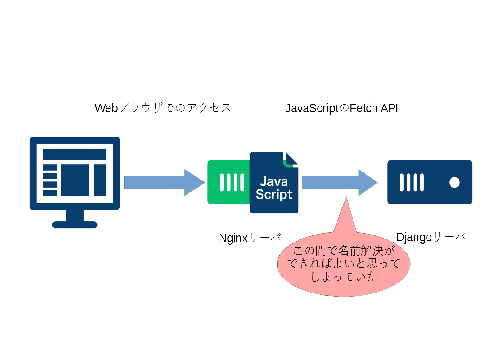
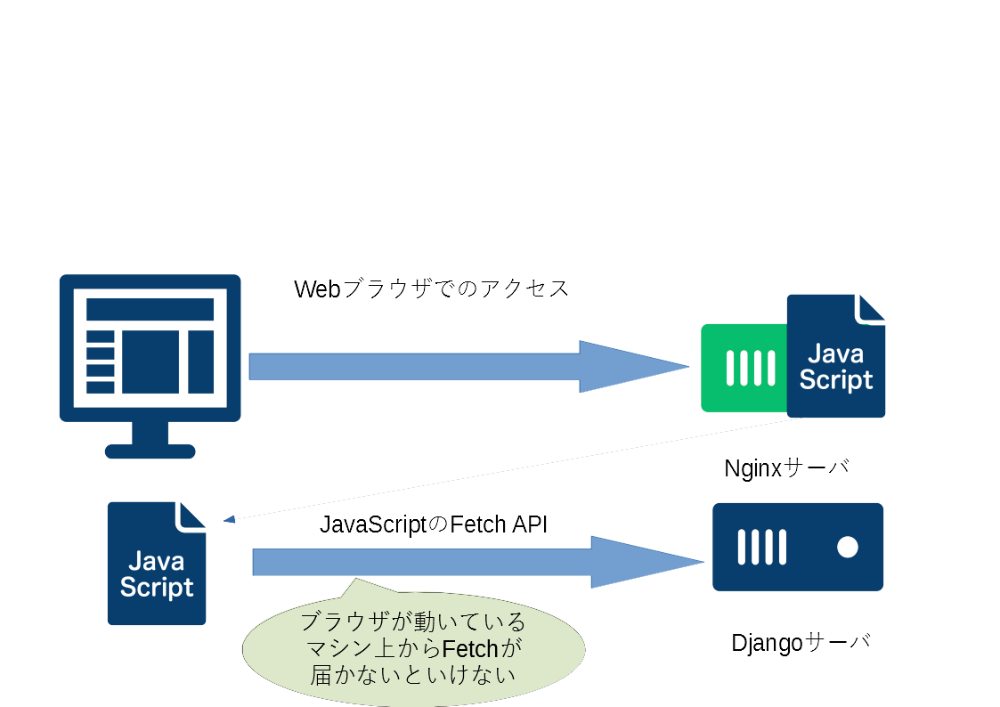

## Web開発始めました

インフラ周りの業務しかやっていなかったのでなんも知らんところから頑張ってやっていますが根本を理解していませんでしたという話。  
React + Django + Nginxを使って開発をしていますが正直Reactは、、、（勘で書いている）

### Fetchがうまく通らない

事の発端はReactで作成しビルドしたJSのFetchがうまく通らないことでした。  
システムの構成としてはDocker composeでNginxとDjangoコンテナを動かしDjangoの方はuwsgiで受けてリクエストを捌く、みたいなよくある感じです。  
それでNginxの方にReactで作成しビルドしたHTML、JS、CSSのファイルを配置し、バックエンド側のDjango Rest Framework（以下DRF）をたたいて情報を取得し、レンダリングするみたいなことをするつもりでした。  
Reactは`create-react-app`で作っているので`npm run start`のコマンドを使って開発サーバーでの挙動の確認を行っていましたがその時はうまく動いているように見えました。

しかし、いざコンテナ化して動きを確認すると全然動かない、、、  
デベロッパーツールを開いてConsoleを見ると、、、`ERR_NAME_NOT_RESOLVED`、、、  
あらら～なんで～DRFの設定が悪いのかなと思って色々試したがうまくいかず、Docker composeの作り方が悪いのかなと思ってそっちもあれやこれやしてみたがうまくいかず、途方に暮れているとこんなありがたいお言葉が・・・

> But using fetch API, it's done on the browser side so it does not know the server/docker names

雑翻訳⇒fetch APIを使うときって、それ自体はブラウザ側で行われるからブラウザはそのサーバ/dockerの名前は知らないよ。 ↓ソース

[React + fetch API + Docker - net::ERR_NAME_NOT_RESOLVED on specific page](https://stackoverflow.com/questions/69092071/react-fetch-api-docker-neterr-name-not-resolved-on-specific-page#comment122113663_69092071)

[stackoverflow.com](https://stackoverflow.com/questions/69092071/react-fetch-api-docker-neterr-name-not-resolved-on-specific-page#comment122113663_69092071)

なんとまあこんなこともわからないとは、正直これを呼んだ時に自分の思考の足りなさに呆れてしまいました。。。

### 結論

JavaScriptはブラウザ上で動くという**基本的なこと**を忘れておりFetchするURLをコンテナのサービス名にしてました。なのでコンテナ化したときに名前解決ができなくなってしまっていました。（Fetchする先をDocker composeのサービス名にしていたのでそれがブラウザ側で名前解決できていなかった。）  
ついスクリプトはそれがあるサーバ上で動くという思い込みが先行し、こんな基本的な話なのにここにたどり着くのにかなり時間を要してしまいました。

### 絵をかいてみました。

