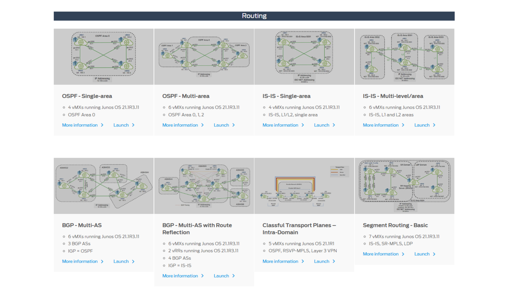
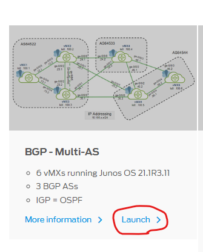
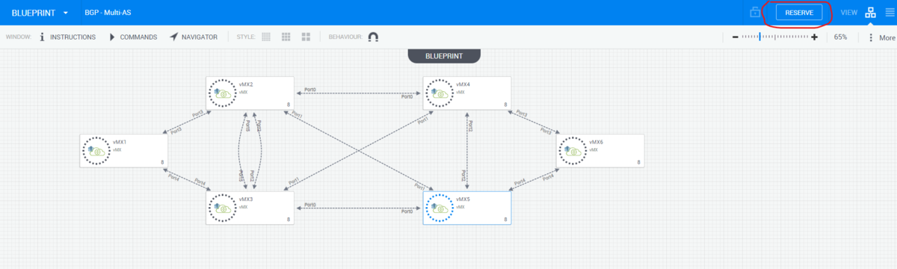
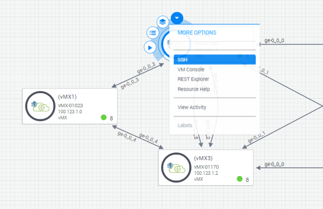
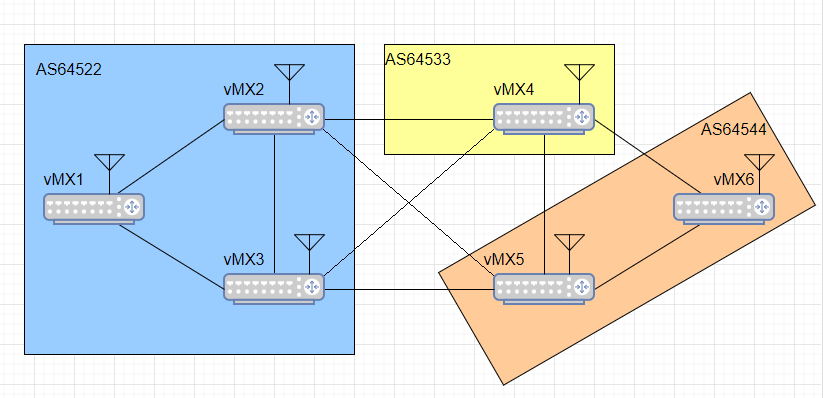
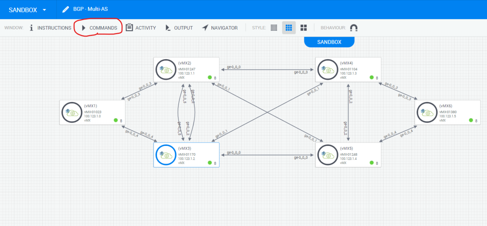
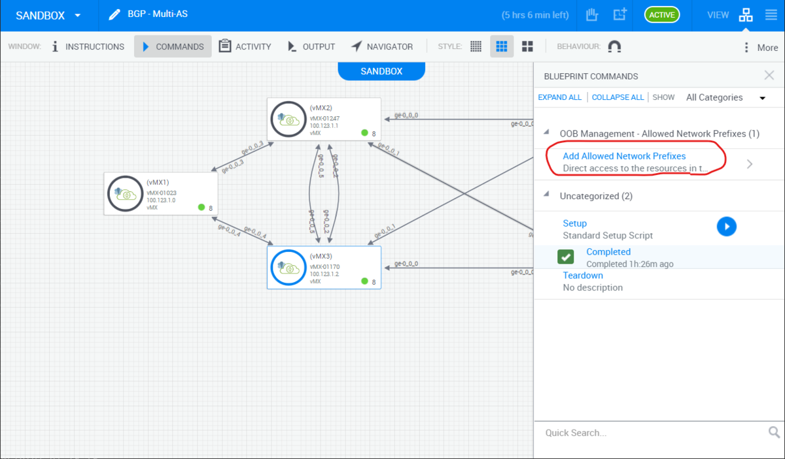
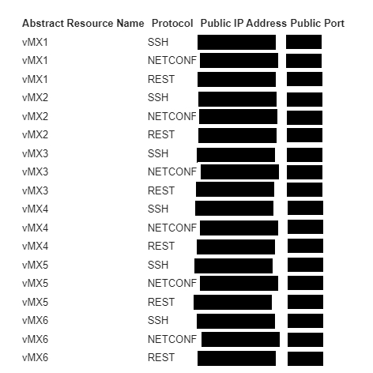
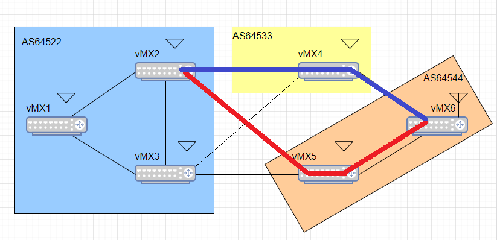

この記事は [【アットホームな現場です】🎄★☆ネットワーク系エンジニア★☆アレコレアウトプット★☆🎄のカレンダー | Advent Calendar 2022 - Qiita](https://qiita.com/advent-calendar/2022/nw-engineering-are-core-output) の20日目の記事になります。

今回はJuniper vLabsのBGP - Multi - ASの構成でAnsibleを使った設定投入にチャレンジしていきます。

## Juniper vLabsを立ち上げる

Juniper vLabsはJuniper Networks社が提供する、無料の（登録必要）のラボ環境です。（Ciscoの提供するDevNetSandboxとほぼ同じ感じ） 1回3時間（最大6時間）の制約付きで用意されている様々な構成のJuniper製品をお試しできます。 （お得！）



そしてこのJuniper vLabsでは特定のIPからvLabs内の機器に通信を許可することが出来ます。  
ということは、自分の手元のAnsibleから設定を流すこともできるということ！

### 立ち上げ方

まずは今回利用する BGP - Multi - ASの環境を起動します。

1.  [Juniper vLabs](https://jlabs.juniper.net/vlabs/portal/index.page)にアクセス
2.  BGP - Multi - ASのLaunchをクリック 
3.  構成の画面からRESERVEボタンをクリック 
4.  あとは環境が立ち上がるのを待ちます。  
    ここは構成によっては10分~15分かかるものもあるので気長待ちましょう。
5.  起動が完了した通知メールがアカウントに紐づいているアドレスに来ればOKです。
6.  Sandboxのページ（RESERVEをした時のページ、閉じた場合はメールのリンクから再度開けます。）でApache Guacamoleを使用したSSHでの接続ができます。 
7.  Apache Guacamoleを使用してブラウザ上でSSH接続ができていれば準備完了です。

## vLabsの構成

BGP - Multi - ASの構成は下記のようになっています。



vMXルータ６台で構成されており、それぞれのAS間はeBGPのネイバー関係が確立されており、AS内はIGPとしてOSPFが設定されているほか、iBGPが張られています。  
また、それぞれloopbackインターフェース（10.100.100.1 ~ 6）を持っており、これらのアドレスがルーティングテーブルに乗ってくるかどうかでBGPの動作確認ができそうです。

各vMXルータはBGPのネイバー関係こそ確立しているもののアドバタイズの設定が全く入っていないので、構築初期の段階では他ASのルータが持つloopbackインターフェースは見えません。 起動時のvMX2のルーティングテーブルはこんな感じ

```
jcluser@vMX2> show route 

inet.0: 16 destinations, 16 routes (16 active, 0 holddown, 0 hidden)
+ = Active Route, - = Last Active, * = Both

0.0.0.0/0          *[Static/5] 00:46:44
                    >  to 100.123.0.1 via fxp0.0
10.100.12.0/24     *[Direct/0] 00:41:52
                    >  via ge-0/0/3.0
10.100.12.2/32     *[Local/0] 00:41:52
                       Local via ge-0/0/3.0
10.100.13.0/24     *[OSPF/10] 00:40:51, metric 2
                    >  to 10.100.23.2 via ge-0/0/2.0
                       to 10.100.12.1 via ge-0/0/3.0
10.100.23.0/24     *[Direct/0] 00:41:52
                    >  via ge-0/0/2.0
10.100.23.1/32     *[Local/0] 00:41:52
                       Local via ge-0/0/2.0
10.100.24.0/24     *[Direct/0] 00:41:52
                    >  via ge-0/0/0.0
10.100.24.1/32     *[Local/0] 00:41:52
                       Local via ge-0/0/0.0
10.100.25.0/24     *[Direct/0] 00:41:52
                    >  via ge-0/0/1.0
10.100.25.1/32     *[Local/0] 00:41:52
                       Local via ge-0/0/1.0
10.100.100.1/32    *[OSPF/10] 00:40:51, metric 1
                    >  to 10.100.12.1 via ge-0/0/3.0
10.100.100.2/32    *[Direct/0] 00:41:52
                    >  via lo0.0
10.100.100.3/32    *[OSPF/10] 00:40:56, metric 1
                    >  to 10.100.23.2 via ge-0/0/2.0
100.123.0.0/16     *[Direct/0] 00:46:44
                    >  via fxp0.0
100.123.1.1/32     *[Local/0] 00:46:44
                       Local via fxp0.0
224.0.0.5/32       *[OSPF/10] 00:41:52, metric 1
                       MultiRecv

inet6.0: 1 destinations, 1 routes (1 active, 0 holddown, 0 hidden)
+ = Active Route, - = Last Active, * = Both

ff02::2/128        *[INET6/0] 00:47:43
                       MultiRecv
```

ということで、BGP経由でルートを受け取っていないことがわかります。これでは他のASにあるvMXのloopbackインターフェースへたどり着けません。

なのでBGPで自身のloopbackインターフェースのアドレスをアドバタイズするようにしたいと思います。

### BGPで経路をアドバタイズする

Juniper製品でBGPの経路広報を行うには下記に習えばできそうです。

[JUNOS - BGPの設定（EBGPネイバーの設定）](https://www.infraeye.com/study/junosbgp02.html)

なので今回は下記のコンフィグで行けそうです。（vMX2の場合）

```
set policy-options prefix-list vMX2Loopback 10.100.100.2/32
set policy-options policy-statement ADV-Loopback term 1 from prefix-list vMX2Loopback
set policy-options policy-statement ADV-Loopback term 1 then accept
set protocols bgp group to-AS64533 export ADV-Loopback
set protocols bgp group to-AS64544 export ADV-Loopback
```

ちなみにvMX2の起動時のコンフィグは下記

vMX2のconfig

```
set version 21.1R3.11
set system host-name vMX2
set system root-authentication encrypted-password "$6$w0uV/Veg$MxUKS00aYKDRZKuI13guEQ3yhv0XjZ5vDD/xBSVatXwzxvgMZCjERUu5kEpMaRzFDhrcyf8NLW8lQiM.KpUCE1"
set system scripts language python
set system login user jcladmin uid 2000
set system login user jcladmin class super-user
set system login user jcladmin authentication encrypted-password "$6$COH4QgW/$uFzZAk1fYdnuwVl5WUjhb/4JdtSWIq7y/eCqB3qEFLFK/QBeG1C686NzW0XL0sz8qX4bzyYW0uMIBNXK47Kw7."
set system login user jcluser uid 2001
set system login user jcluser class super-user
set system login user jcluser authentication encrypted-password "$6$G44rGtvQ$I3jMwJk.0/CbTlhEoZzoDGv9dcFuZYdKvNFHiZwZ6s5Lktf/vMHipZxDwEXxgtid.dmN5K27fMBYwKnSijiQ/."
set system services ssh root-login allow
set system services netconf ssh
set system services rest http port 3000
set system services rest enable-explorer
set system syslog user * any emergency
set system syslog file messages any notice
set system syslog file messages authorization info
set system syslog file interactive-commands interactive-commands any
set system processes dhcp-service traceoptions file dhcp_logfile
set system processes dhcp-service traceoptions file size 10m
set system processes dhcp-service traceoptions level all
set system processes dhcp-service traceoptions flag all
set chassis fpc 0 pic 0 number-of-ports 8
set chassis fpc 0 lite-mode
set interfaces ge-0/0/0 unit 0 family inet address 10.100.24.1/24
set interfaces ge-0/0/1 unit 0 family inet address 10.100.25.1/24
set interfaces ge-0/0/2 unit 0 family inet address 10.100.23.1/24
set interfaces ge-0/0/3 unit 0 family inet address 10.100.12.2/24
set interfaces fxp0 unit 0 family inet address 100.123.1.1/16
set interfaces lo0 unit 0 family inet address 10.100.100.2/32
set protocols bgp group IBGP type internal
set protocols bgp group IBGP local-address 10.100.100.2
set protocols bgp group IBGP neighbor 10.100.100.1
set protocols bgp group IBGP neighbor 10.100.100.3
set protocols bgp group to-AS64533 type external
set protocols bgp group to-AS64533 peer-as 64533
set protocols bgp group to-AS64533 neighbor 10.100.24.2
set protocols bgp group to-AS64544 type external
set protocols bgp group to-AS64544 peer-as 64544
set protocols bgp group to-AS64544 neighbor 10.100.25.2
set protocols ospf area 0.0.0.0 interface ge-0/0/3.0
set protocols ospf area 0.0.0.0 interface ge-0/0/2.0
set protocols ospf area 0.0.0.0 interface lo0.0
set routing-options autonomous-system 64522
set routing-options static route 0.0.0.0/0 next-hop 100.123.0.1
```

試しに先ほどのconfigをvMX2（AS64522）に入れてみました。

するとAS64533のvMX4で`10.100.100.2`のアドレスがルーティングテーブルに載ってきました。 なのでconfigとしてはこれでよさそうです。

```
jcluser@vMX4> show route 

inet.0: 14 destinations, 16 routes (14 active, 0 holddown, 0 hidden)
+ = Active Route, - = Last Active, * = Both

0.0.0.0/0          *[Static/5] 01:14:43
                    >  to 100.123.0.1 via fxp0.0
10.100.24.0/24     *[Direct/0] 01:10:00
                    >  via ge-0/0/0.0
10.100.24.2/32     *[Local/0] 01:10:00
                       Local via ge-0/0/0.0
10.100.34.0/24     *[Direct/0] 01:10:00
                    >  via ge-0/0/1.0
10.100.34.2/32     *[Local/0] 01:10:00
                       Local via ge-0/0/1.0
10.100.45.0/24     *[Direct/0] 01:10:00
                    >  via ge-0/0/2.0
10.100.45.1/32     *[Local/0] 01:10:00
                       Local via ge-0/0/2.0
10.100.46.0/24     *[Direct/0] 01:10:00
                    >  via ge-0/0/3.0
10.100.46.1/32     *[Local/0] 01:10:00
                       Local via ge-0/0/3.0
10.100.100.2/32    *[BGP/170] 00:00:32, localpref 100
                      AS path: 64522 I, validation-state: unverified
                    >  to 10.100.24.1 via ge-0/0/0.0
                    [BGP/170] 00:00:32, localpref 100
                      AS path: 64544 64522 I, validation-state: unverified
                    >  to 10.100.45.2 via ge-0/0/2.0
                    [BGP/170] 00:00:31, localpref 100
                      AS path: 64544 64522 I, validation-state: unverified
                    >  to 10.100.46.2 via ge-0/0/3.0
10.100.100.4/32    *[Direct/0] 01:10:00
                    >  via lo0.0
100.123.0.0/16     *[Direct/0] 01:14:43
                    >  via fxp0.0
100.123.1.3/32     *[Local/0] 01:14:43
                       Local via fxp0.0
224.0.0.5/32       *[OSPF/10] 01:10:00, metric 1
                       MultiRecv

inet6.0: 1 destinations, 1 routes (1 active, 0 holddown, 0 hidden)
+ = Active Route, - = Last Active, * = Both

ff02::2/128        *[INET6/0] 01:15:42
                       MultiRecv
```

ですが、これを全部のvMXに行うのは少ししんどいですね。

なのでこれをAnsibleで自動化しようと思います。

自動化では下記項目を達成します。

-   各vMXは自身のLoopbackアドレスを指す`prefix-list`を作る
-   各vMXは上記で作成した`prefix-list`を使って`policy-statement`を作成する
-   eBGPでその`policy-statement`を`export`する

ということでまずは手元の環境からAnsibleへ接続できるようにします。

SandboxのページのCOMMANDS -> Add Allowed Network Prefix から自分の接続したい環境のグローバルIPを入れます。 自宅環境ならここから調べられます。

[アクセス情報【使用中のIPアドレス確認】](https://www.cman.jp/network/support/go_access.cgi)





IPの許可設定ができたらvLabs側のグローバルIPとポートの一覧がメールで送られてきます。



この情報を使ってinventoryファイルを作ります。 `ansible_host`, `ansible_port`, `ansible_user`, `ansible_password`はメールに書いてあるものを入れてください。

```ini
[junos]
vMX1 ansible_host=<ip_address> ansible_port=<port>
vMX2 ansible_host=<ip_address> ansible_port=<port>
vMX3 ansible_host=<ip_address> ansible_port=<port>
vMX4 ansible_host=<ip_address> ansible_port=<port>
vMX5 ansible_host=<ip_address> ansible_port=<port>
vMX6 ansible_host=<ip_address> ansible_port=<port>

[junos:vars]
ansible_network_os=junos
ansible_connection=netconf
ansible_user=<user_name>
ansible_password=<password>
ansible_become=yes
```

続いてPlaybookを書いていきましょう。  
`juniperneteworks.junos`コレクションのモジュールを使っていきます。

具体的な手順は下記で作ります。

1.  Loopbackインターフェースの情報を取得
2.  BGPグループの情報を取得
3.  Loopbackインターフェースのアドレスを/32でかける`prefix-list`を作る
4.  作った`prefix-list`を使った`policy-statement`を作る
5.  作った`policy-statement`をeBGPで`export`する

この手順でPlaybookを組みました。

```yaml
---
- hosts: junos
  name: Advertise loopback
  gather_facts: false
  tasks:
    # Loopbackインターフェースの情報を取得
    - name: Get Loopback info
      junipernetworks.junos.junos_command:
        commands:
          - show interfaces lo0.0
        display: json
      register: lo_info

    # BGP グループの情報を取得
    - name: Get BGP info
      junipernetworks.junos.junos_command:
        commands:
          - show bgp group
        display: json
      register: bgp_info

    # prefix-listとpolicy-optionを作成
    - name: Make Policy Option
      junipernetworks.junos.junos_config:
        lines:
          - set policy-options prefix-list {{ inventory_hostname }}Loopback {{ loopback_address }}/32
          - set policy-options policy-statement ADV-Loopback term 1 from prefix-list {{ inventory_hostname }}Loopback
          - set policy-options policy-statement ADV-Loopback term 1 then accept
      vars: # 長いので行分割
        loopback: "{{ lo_info.stdout[0]['interface-information'][0]['logical-interface'][0]['address-family'][0] }}" 
        loopback_address: "{{ loopback['interface-address'][0]['ifa-local'][0]['data'] }}" # loopbackインターフェースのアドレスを引く

    # eBGPのグループでpolicy-statementをexport
    - name: Set Export
      junipernetworks.junos.junos_bgp_global:
        config:
          groups:
            - name: "{{ item.name[0].data }}"
              type: external
              export: ADV-Loopback
      vars:
        bgp_group: "{{ bgp_info.stdout[0]['bgp-group-information'][0]['bgp-group'] }}" # BGPグループのリストを取得
      loop: "{{ bgp_group }}" # BGPグループで繰り返す
      when: item.type[0].data == "External" # eBGPかどうかを判断
```

これでPlaybookを実行！

```
vlab-test$ ansible-playbook -i inventory/inventory.ini advertise_ebgp.yaml 

PLAY [junos] *****************************************************************************************************************************************

TASK [Get Loopback info] *****************************************************************************************************************************
ok: [vMX4]
ok: [vMX5]
ok: [vMX1]
ok: [vMX3]
ok: [vMX2]
ok: [vMX6]

TASK [Get BGP info] **********************************************************************************************************************************
ok: [vMX2]
ok: [vMX3]
ok: [vMX5]
ok: [vMX4]
ok: [vMX1]
ok: [vMX6]

TASK [Make Policy Option] ****************************************************************************************************************************
changed: [vMX4]
changed: [vMX5]
changed: [vMX1]
changed: [vMX3]
changed: [vMX2]
changed: [vMX6]

TASK [Set Export] ************************************************************************************************************************************
skipping: [vMX1] => (item={'attributes': {'junos:style': 'brief'}, 'type': [{'data': 'Internal'}], 'peer-as': [{'data': '64522'}], 'local-as': [{'data': '64522'}], 'name': [{'data': 'IBGP'}], 'group-index': [{'data': '0'}], 'group-flags': [{}], 'bgp-option-information': [{'attributes': {'xmlns': 'http://xml.juniper.net/junos/21.1R0/junos-routing'}, 'bgp-options': [{}], 'bgp-options2': [{}], 'bgp-options-extended': [{'data': 'GracefulShutdownRcv'}], 'holdtime': [{'data': '0'}], 'preference': [{'data': '0'}], 'gshut-recv-local-preference': [{'data': '0'}]}], 'peer-count': [{'data': '2'}], 'established-count': [{'data': '2'}], 'peer-address': [{'data': '10.100.100.2+57396'}, {'data': '10.100.100.3+52090'}], 'bgp-rib': [{'attributes': {'junos:style': 'terse'}, 'name': [{'data': 'inet.0'}], 'active-prefix-count': [{'data': '0'}], 'received-prefix-count': [{'data': '0'}], 'accepted-prefix-count': [{'data': '0'}], 'suppressed-prefix-count': [{'data': '0'}], 'advertised-prefix-count': [{'data': '0'}]}]}) 
skipping: [vMX1]
skipping: [vMX2] => (item={'attributes': {'junos:style': 'brief'}, 'type': [{'data': 'Internal'}], 'peer-as': [{'data': '64522'}], 'local-as': [{'data': '64522'}], 'name': [{'data': 'IBGP'}], 'group-index': [{'data': '0'}], 'group-flags': [{}], 'bgp-option-information': [{'attributes': {'xmlns': 'http://xml.juniper.net/junos/21.1R0/junos-routing'}, 'bgp-options': [{}], 'bgp-options2': [{}], 'bgp-options-extended': [{'data': 'GracefulShutdownRcv'}], 'holdtime': [{'data': '0'}], 'preference': [{'data': '0'}], 'gshut-recv-local-preference': [{'data': '0'}]}], 'peer-count': [{'data': '2'}], 'established-count': [{'data': '2'}], 'peer-address': [{'data': '10.100.100.1+179'}, {'data': '10.100.100.3+179'}], 'bgp-rib': [{'attributes': {'junos:style': 'terse'}, 'name': [{'data': 'inet.0'}], 'active-prefix-count': [{'data': '0'}], 'received-prefix-count': [{'data': '0'}], 'accepted-prefix-count': [{'data': '0'}], 'suppressed-prefix-count': [{'data': '0'}], 'advertised-prefix-count': [{'data': '0'}]}]}) 
skipping: [vMX3] => (item={'attributes': {'junos:style': 'brief'}, 'type': [{'data': 'Internal'}], 'peer-as': [{'data': '64522'}], 'local-as': [{'data': '64522'}], 'name': [{'data': 'IBGP'}], 'group-index': [{'data': '0'}], 'group-flags': [{}], 'bgp-option-information': [{'attributes': {'xmlns': 'http://xml.juniper.net/junos/21.1R0/junos-routing'}, 'bgp-options': [{}], 'bgp-options2': [{}], 'bgp-options-extended': [{'data': 'GracefulShutdownRcv'}], 'holdtime': [{'data': '0'}], 'preference': [{'data': '0'}], 'gshut-recv-local-preference': [{'data': '0'}]}], 'peer-count': [{'data': '2'}], 'established-count': [{'data': '2'}], 'peer-address': [{'data': '10.100.100.1+179'}, {'data': '10.100.100.2+49178'}], 'bgp-rib': [{'attributes': {'junos:style': 'terse'}, 'name': [{'data': 'inet.0'}], 'active-prefix-count': [{'data': '0'}], 'received-prefix-count': [{'data': '0'}], 'accepted-prefix-count': [{'data': '0'}], 'suppressed-prefix-count': [{'data': '0'}], 'advertised-prefix-count': [{'data': '0'}]}]}) 
skipping: [vMX5] => (item={'attributes': {'junos:style': 'brief'}, 'type': [{'data': 'Internal'}], 'peer-as': [{'data': '64544'}], 'local-as': [{'data': '64544'}], 'name': [{'data': 'IBGP'}], 'group-index': [{'data': '0'}], 'group-flags': [{}], 'bgp-option-information': [{'attributes': {'xmlns': 'http://xml.juniper.net/junos/21.1R0/junos-routing'}, 'bgp-options': [{}], 'bgp-options2': [{}], 'bgp-options-extended': [{'data': 'GracefulShutdownRcv'}], 'holdtime': [{'data': '0'}], 'preference': [{'data': '0'}], 'gshut-recv-local-preference': [{'data': '0'}]}], 'peer-count': [{'data': '1'}], 'established-count': [{'data': '1'}], 'peer-address': [{'data': '10.100.100.6+63217'}], 'bgp-rib': [{'attributes': {'junos:style': 'terse'}, 'name': [{'data': 'inet.0'}], 'active-prefix-count': [{'data': '0'}], 'received-prefix-count': [{'data': '0'}], 'accepted-prefix-count': [{'data': '0'}], 'suppressed-prefix-count': [{'data': '0'}], 'advertised-prefix-count': [{'data': '0'}]}]}) 
skipping: [vMX6] => (item={'attributes': {'junos:style': 'brief'}, 'type': [{'data': 'Internal'}], 'peer-as': [{'data': '64544'}], 'local-as': [{'data': '64544'}], 'name': [{'data': 'IBGP'}], 'group-index': [{'data': '0'}], 'group-flags': [{}], 'bgp-option-information': [{'attributes': {'xmlns': 'http://xml.juniper.net/junos/21.1R0/junos-routing'}, 'bgp-options': [{}], 'bgp-options2': [{}], 'bgp-options-extended': [{'data': 'GracefulShutdownRcv'}], 'holdtime': [{'data': '0'}], 'preference': [{'data': '0'}], 'gshut-recv-local-preference': [{'data': '0'}]}], 'peer-count': [{'data': '1'}], 'established-count': [{'data': '1'}], 'peer-address': [{'data': '10.100.100.5+179'}], 'bgp-rib': [{'attributes': {'junos:style': 'terse'}, 'name': [{'data': 'inet.0'}], 'active-prefix-count': [{'data': '0'}], 'received-prefix-count': [{'data': '0'}], 'accepted-prefix-count': [{'data': '0'}], 'suppressed-prefix-count': [{'data': '0'}], 'advertised-prefix-count': [{'data': '0'}]}]}) 
changed: [vMX2] => (item={'attributes': {'junos:style': 'brief'}, 'type': [{'data': 'External'}], 'local-as': [{'data': '64522'}], 'name': [{'data': 'to-AS64533'}], 'group-index': [{'data': '1'}], 'group-flags': [{}], 'bgp-option-information': [{'attributes': {'xmlns': 'http://xml.juniper.net/junos/21.1R0/junos-routing'}, 'bgp-options': [{}], 'bgp-options2': [{}], 'bgp-options-extended': [{'data': 'GracefulShutdownRcv'}], 'holdtime': [{'data': '0'}], 'preference': [{'data': '0'}], 'gshut-recv-local-preference': [{'data': '0'}]}], 'peer-count': [{'data': '1'}], 'established-count': [{'data': '1'}], 'peer-address': [{'data': '10.100.24.2+179'}], 'bgp-rib': [{'attributes': {'junos:style': 'terse'}, 'name': [{'data': 'inet.0'}], 'active-prefix-count': [{'data': '0'}], 'received-prefix-count': [{'data': '0'}], 'accepted-prefix-count': [{'data': '0'}], 'suppressed-prefix-count': [{'data': '0'}], 'advertised-prefix-count': [{'data': '0'}]}]})
changed: [vMX6] => (item={'attributes': {'junos:style': 'brief'}, 'type': [{'data': 'External'}], 'local-as': [{'data': '64544'}], 'name': [{'data': 'to-AS64533'}], 'group-index': [{'data': '1'}], 'group-flags': [{}], 'bgp-option-information': [{'attributes': {'xmlns': 'http://xml.juniper.net/junos/21.1R0/junos-routing'}, 'bgp-options': [{}], 'bgp-options2': [{}], 'bgp-options-extended': [{'data': 'GracefulShutdownRcv'}], 'holdtime': [{'data': '0'}], 'preference': [{'data': '0'}], 'gshut-recv-local-preference': [{'data': '0'}]}], 'peer-count': [{'data': '1'}], 'established-count': [{'data': '1'}], 'peer-address': [{'data': '10.100.46.1+179'}], 'bgp-rib': [{'attributes': {'junos:style': 'terse'}, 'name': [{'data': 'inet.0'}], 'active-prefix-count': [{'data': '0'}], 'received-prefix-count': [{'data': '0'}], 'accepted-prefix-count': [{'data': '0'}], 'suppressed-prefix-count': [{'data': '0'}], 'advertised-prefix-count': [{'data': '0'}]}]})
changed: [vMX5] => (item={'attributes': {'junos:style': 'brief'}, 'type': [{'data': 'External'}], 'local-as': [{'data': '64544'}], 'name': [{'data': 'to-AS64533'}], 'group-index': [{'data': '1'}], 'group-flags': [{}], 'bgp-option-information': [{'attributes': {'xmlns': 'http://xml.juniper.net/junos/21.1R0/junos-routing'}, 'bgp-options': [{}], 'bgp-options2': [{}], 'bgp-options-extended': [{'data': 'GracefulShutdownRcv'}], 'holdtime': [{'data': '0'}], 'preference': [{'data': '0'}], 'gshut-recv-local-preference': [{'data': '0'}]}], 'peer-count': [{'data': '1'}], 'established-count': [{'data': '1'}], 'peer-address': [{'data': '10.100.45.1+59768'}], 'bgp-rib': [{'attributes': {'junos:style': 'terse'}, 'name': [{'data': 'inet.0'}], 'active-prefix-count': [{'data': '0'}], 'received-prefix-count': [{'data': '0'}], 'accepted-prefix-count': [{'data': '0'}], 'suppressed-prefix-count': [{'data': '0'}], 'advertised-prefix-count': [{'data': '0'}]}]})
changed: [vMX4] => (item={'attributes': {'junos:style': 'brief'}, 'type': [{'data': 'External'}], 'local-as': [{'data': '64533'}], 'name': [{'data': 'to-AS64544'}], 'group-index': [{'data': '0'}], 'group-flags': [{}], 'bgp-option-information': [{'attributes': {'xmlns': 'http://xml.juniper.net/junos/21.1R0/junos-routing'}, 'bgp-options': [{}], 'bgp-options2': [{}], 'bgp-options-extended': [{'data': 'GracefulShutdownRcv'}], 'holdtime': [{'data': '0'}], 'preference': [{'data': '0'}], 'gshut-recv-local-preference': [{'data': '0'}]}], 'peer-count': [{'data': '2'}], 'established-count': [{'data': '2'}], 'peer-address': [{'data': '10.100.46.2+56067'}, {'data': '10.100.45.2+179'}], 'bgp-rib': [{'attributes': {'junos:style': 'terse'}, 'name': [{'data': 'inet.0'}], 'active-prefix-count': [{'data': '0'}], 'received-prefix-count': [{'data': '0'}], 'accepted-prefix-count': [{'data': '0'}], 'suppressed-prefix-count': [{'data': '0'}], 'advertised-prefix-count': [{'data': '0'}]}]})
changed: [vMX3] => (item={'attributes': {'junos:style': 'brief'}, 'type': [{'data': 'External'}], 'local-as': [{'data': '64522'}], 'name': [{'data': 'to-AS64533'}], 'group-index': [{'data': '1'}], 'group-flags': [{}], 'bgp-option-information': [{'attributes': {'xmlns': 'http://xml.juniper.net/junos/21.1R0/junos-routing'}, 'bgp-options': [{}], 'bgp-options2': [{}], 'bgp-options-extended': [{'data': 'GracefulShutdownRcv'}], 'holdtime': [{'data': '0'}], 'preference': [{'data': '0'}], 'gshut-recv-local-preference': [{'data': '0'}]}], 'peer-count': [{'data': '1'}], 'established-count': [{'data': '1'}], 'peer-address': [{'data': '10.100.34.2+55602'}], 'bgp-rib': [{'attributes': {'junos:style': 'terse'}, 'name': [{'data': 'inet.0'}], 'active-prefix-count': [{'data': '0'}], 'received-prefix-count': [{'data': '0'}], 'accepted-prefix-count': [{'data': '0'}], 'suppressed-prefix-count': [{'data': '0'}], 'advertised-prefix-count': [{'data': '0'}]}]})
changed: [vMX2] => (item={'attributes': {'junos:style': 'brief'}, 'type': [{'data': 'External'}], 'local-as': [{'data': '64522'}], 'name': [{'data': 'to-AS64544'}], 'group-index': [{'data': '2'}], 'group-flags': [{}], 'bgp-option-information': [{'attributes': {'xmlns': 'http://xml.juniper.net/junos/21.1R0/junos-routing'}, 'bgp-options': [{}], 'bgp-options2': [{}], 'bgp-options-extended': [{'data': 'GracefulShutdownRcv'}], 'holdtime': [{'data': '0'}], 'preference': [{'data': '0'}], 'gshut-recv-local-preference': [{'data': '0'}]}], 'peer-count': [{'data': '1'}], 'established-count': [{'data': '1'}], 'peer-address': [{'data': '10.100.25.2+179'}], 'bgp-rib': [{'attributes': {'junos:style': 'terse'}, 'name': [{'data': 'inet.0'}], 'active-prefix-count': [{'data': '0'}], 'received-prefix-count': [{'data': '0'}], 'accepted-prefix-count': [{'data': '0'}], 'suppressed-prefix-count': [{'data': '0'}], 'advertised-prefix-count': [{'data': '0'}]}]})
changed: [vMX4] => (item={'attributes': {'junos:style': 'brief'}, 'type': [{'data': 'External'}], 'local-as': [{'data': '64533'}], 'name': [{'data': 'to-AS64522'}], 'group-index': [{'data': '1'}], 'group-flags': [{}], 'bgp-option-information': [{'attributes': {'xmlns': 'http://xml.juniper.net/junos/21.1R0/junos-routing'}, 'bgp-options': [{}], 'bgp-options2': [{}], 'bgp-options-extended': [{'data': 'GracefulShutdownRcv'}], 'holdtime': [{'data': '0'}], 'preference': [{'data': '0'}], 'gshut-recv-local-preference': [{'data': '0'}]}], 'peer-count': [{'data': '2'}], 'established-count': [{'data': '2'}], 'peer-address': [{'data': '10.100.34.1+179'}, {'data': '10.100.24.1+51261'}], 'bgp-rib': [{'attributes': {'junos:style': 'terse'}, 'name': [{'data': 'inet.0'}], 'active-prefix-count': [{'data': '0'}], 'received-prefix-count': [{'data': '0'}], 'accepted-prefix-count': [{'data': '0'}], 'suppressed-prefix-count': [{'data': '0'}], 'advertised-prefix-count': [{'data': '0'}]}]})
changed: [vMX5] => (item={'attributes': {'junos:style': 'brief'}, 'type': [{'data': 'External'}], 'local-as': [{'data': '64544'}], 'name': [{'data': 'to-AS64522'}], 'group-index': [{'data': '2'}], 'group-flags': [{}], 'bgp-option-information': [{'attributes': {'xmlns': 'http://xml.juniper.net/junos/21.1R0/junos-routing'}, 'bgp-options': [{}], 'bgp-options2': [{}], 'bgp-options-extended': [{'data': 'GracefulShutdownRcv'}], 'holdtime': [{'data': '0'}], 'preference': [{'data': '0'}], 'gshut-recv-local-preference': [{'data': '0'}]}], 'peer-count': [{'data': '2'}], 'established-count': [{'data': '2'}], 'peer-address': [{'data': '10.100.25.1+63829'}, {'data': '10.100.35.1+64405'}], 'bgp-rib': [{'attributes': {'junos:style': 'terse'}, 'name': [{'data': 'inet.0'}], 'active-prefix-count': [{'data': '0'}], 'received-prefix-count': [{'data': '0'}], 'accepted-prefix-count': [{'data': '0'}], 'suppressed-prefix-count': [{'data': '0'}], 'advertised-prefix-count': [{'data': '0'}]}]})
changed: [vMX3] => (item={'attributes': {'junos:style': 'brief'}, 'type': [{'data': 'External'}], 'local-as': [{'data': '64522'}], 'name': [{'data': 'to-AS64544'}], 'group-index': [{'data': '2'}], 'group-flags': [{}], 'bgp-option-information': [{'attributes': {'xmlns': 'http://xml.juniper.net/junos/21.1R0/junos-routing'}, 'bgp-options': [{}], 'bgp-options2': [{}], 'bgp-options-extended': [{'data': 'GracefulShutdownRcv'}], 'holdtime': [{'data': '0'}], 'preference': [{'data': '0'}], 'gshut-recv-local-preference': [{'data': '0'}]}], 'peer-count': [{'data': '1'}], 'established-count': [{'data': '1'}], 'peer-address': [{'data': '10.100.35.2+179'}], 'bgp-rib': [{'attributes': {'junos:style': 'terse'}, 'name': [{'data': 'inet.0'}], 'active-prefix-count': [{'data': '0'}], 'received-prefix-count': [{'data': '0'}], 'accepted-prefix-count': [{'data': '0'}], 'suppressed-prefix-count': [{'data': '0'}], 'advertised-prefix-count': [{'data': '0'}]}]})

PLAY RECAP *******************************************************************************************************************************************
vMX1                       : ok=3    changed=0    unreachable=0    failed=0    skipped=1    rescued=0    ignored=0   
vMX2                       : ok=4    changed=1    unreachable=0    failed=0    skipped=0    rescued=0    ignored=0   
vMX3                       : ok=4    changed=1    unreachable=0    failed=0    skipped=0    rescued=0    ignored=0   
vMX4                       : ok=4    changed=1    unreachable=0    failed=0    skipped=0    rescued=0    ignored=0   
vMX5                       : ok=4    changed=1    unreachable=0    failed=0    skipped=0    rescued=0    ignored=0   
vMX6                       : ok=4    changed=1    unreachable=0    failed=0    skipped=0    rescued=0    ignored=0  
```

タスク内の`loop`で流れてくる情報が多いので見づらくなっていますが、いい感じにできたようです。

ということで確認してみましょう。

vMX2のルーティングテーブル（BGPのみ）

```
jcluser@vMX2> show route protocol bgp 

inet.0: 19 destinations, 24 routes (19 active, 0 holddown, 0 hidden)
+ = Active Route, - = Last Active, * = Both

10.100.100.4/32    *[BGP/170] 00:46:15, localpref 100
                      AS path: 64533 I, validation-state: unverified
                    >  to 10.100.24.2 via ge-0/0/0.0
                    [BGP/170] 00:46:14, localpref 100, from 10.100.100.3
                      AS path: 64533 I, validation-state: unverified
                    >  to 100.123.0.1 via fxp0.0
                    [BGP/170] 00:46:38, localpref 100
                      AS path: 64544 64533 I, validation-state: unverified
                    >  to 10.100.25.2 via ge-0/0/1.0
10.100.100.5/32    *[BGP/170] 00:46:16, localpref 100
                      AS path: 64544 I, validation-state: unverified
                    >  to 10.100.25.2 via ge-0/0/1.0
                    [BGP/170] 00:46:15, localpref 100, from 10.100.100.3
                      AS path: 64544 I, validation-state: unverified
                    >  to 100.123.0.1 via fxp0.0
                    [BGP/170] 00:46:38, localpref 100
                      AS path: 64533 64544 I, validation-state: unverified
                    >  to 10.100.24.2 via ge-0/0/0.0
10.100.100.6/32    *[BGP/170] 00:46:40, localpref 100
                      AS path: 64533 64544 I, validation-state: unverified
                    >  to 10.100.24.2 via ge-0/0/0.0
                    [BGP/170] 00:46:40, localpref 100, from 10.100.100.3
                      AS path: 64533 64544 I, validation-state: unverified
                    >  to 100.123.0.1 via fxp0.0

inet6.0: 1 destinations, 1 routes (1 active, 0 holddown, 0 hidden)
```

vMX2から見て他ASのvMXのLoopbackアドレス（10.100.100.4~6）が受け取れているので成功に見えます。　 ではvMX2のLoopbackから各Loopbackへ実際に到達できるのかpingして確かめてみます。

10.100.100.4 → OK!

```
jcluser@vMX2> ping 10.100.100.4 source 10.100.100.2  
PING 10.100.100.4 (10.100.100.4): 56 data bytes
64 bytes from 10.100.100.4: icmp_seq=0 ttl=64 time=1.599 ms
64 bytes from 10.100.100.4: icmp_seq=1 ttl=64 time=1.308 ms
64 bytes from 10.100.100.4: icmp_seq=2 ttl=64 time=1.454 ms
64 bytes from 10.100.100.4: icmp_seq=3 ttl=64 time=1.499 ms
64 bytes from 10.100.100.4: icmp_seq=4 ttl=64 time=2.057 ms
^C
--- 10.100.100.4 ping statistics ---
5 packets transmitted, 5 packets received, 0% packet loss
round-trip min/avg/max/stddev = 1.308/1.583/2.057/0.255 ms
```

10.100.100.5 → OK!

```
jcluser@vMX2> ping 10.100.100.5 source 10.100.100.2    
PING 10.100.100.5 (10.100.100.5): 56 data bytes
64 bytes from 10.100.100.5: icmp_seq=0 ttl=64 time=1.575 ms
64 bytes from 10.100.100.5: icmp_seq=1 ttl=64 time=1.189 ms
64 bytes from 10.100.100.5: icmp_seq=2 ttl=64 time=1.388 ms
64 bytes from 10.100.100.5: icmp_seq=3 ttl=64 time=1.456 ms
64 bytes from 10.100.100.5: icmp_seq=4 ttl=64 time=1.502 ms
^C
--- 10.100.100.5 ping statistics ---
5 packets transmitted, 5 packets received, 0% packet loss
round-trip min/avg/max/stddev = 1.189/1.422/1.575/0.131 ms
```

10.100.100.6 → ダメそう...

```
jcluser@vMX2> ping 10.100.100.6 source 10.100.100.2   
PING 10.100.100.6 (10.100.100.6): 56 data bytes
^C
--- 10.100.100.6 ping statistics ---
15 packets transmitted, 0 packets received, 100% packet loss
```

ルーティングテーブル的には良さそうだったのでこれはvMX6に問題がありそうです。  
vMX6のルーティングテーブルを見てみます。

```
jcluser@vMX6> show route protocol bgp 

inet.0: 13 destinations, 16 routes (13 active, 0 holddown, 0 hidden)
+ = Active Route, - = Last Active, * = Both

10.100.100.2/32    *[BGP/170] 01:06:56, localpref 100, from 10.100.100.5
                      AS path: 64522 I, validation-state: unverified
                    >  to 100.123.0.1 via fxp0.0
                    [BGP/170] 01:07:17, localpref 100
                      AS path: 64533 64522 I, validation-state: unverified
                    >  to 10.100.46.1 via ge-0/0/3.0
10.100.100.3/32    *[BGP/170] 01:06:52, localpref 100, from 10.100.100.5
                      AS path: 64522 I, validation-state: unverified
                    >  to 100.123.0.1 via fxp0.0
                    [BGP/170] 01:07:13, localpref 100
                      AS path: 64533 64522 I, validation-state: unverified
                    >  to 10.100.46.1 via ge-0/0/3.0
10.100.100.4/32    *[BGP/170] 01:07:14, localpref 100
                      AS path: 64533 I, validation-state: unverified
                    >  to 10.100.46.1 via ge-0/0/3.0
                    [BGP/170] 01:07:13, localpref 100, from 10.100.100.5
                      AS path: 64533 I, validation-state: unverified
                    >  to 100.123.0.1 via fxp0.0

inet6.0: 1 destinations, 1 routes (1 active, 0 holddown, 0 hidden)
```

10.100.100.2のルートは2つ受信しており、選ばれているのは`AS path: 64522 I`となっているものです。  
もう一つは`AS path: 64533 64522 I`となっており、AS pathの長さで`AS path: 64522 I`の方が選ばれていると考えられます。  
これらはどの道筋から来たものかというと、下記の赤と青のラインで来ています。



そして選ばれている`AS path: 64522 I`のルートは赤のラインになります。  
ただこのルートはネクストホップは10.123.0.1になっています。

この10.123.0.1はvMX6の全プロトコルのルーティングテーブルを見るとデフォルトルートに設定されていることがわかります。

```
jcluser@vMX6> show route 

inet.0: 13 destinations, 16 routes (13 active, 0 holddown, 0 hidden)
+ = Active Route, - = Last Active, * = Both

0.0.0.0/0          *[Static/5] 02:22:02
                    >  to 100.123.0.1 via fxp0.0
10.100.46.0/24     *[Direct/0] 02:17:33
                    >  via ge-0/0/3.0
10.100.46.2/32     *[Local/0] 02:17:33
                       Local via ge-0/0/3.0
10.100.56.0/24     *[Direct/0] 02:17:33
                    >  via ge-0/0/4.0
10.100.56.2/32     *[Local/0] 02:17:33
                       Local via ge-0/0/4.0
10.100.100.2/32    *[BGP/170] 01:27:26, localpref 100, from 10.100.100.5
                      AS path: 64522 I, validation-state: unverified
                    >  to 100.123.0.1 via fxp0.0
                    [BGP/170] 01:27:47, localpref 100
                      AS path: 64533 64522 I, validation-state: unverified
                    >  to 10.100.46.1 via ge-0/0/3.0
10.100.100.3/32    *[BGP/170] 01:27:22, localpref 100, from 10.100.100.5
                      AS path: 64522 I, validation-state: unverified
                    >  to 100.123.0.1 via fxp0.0
                    [BGP/170] 01:27:43, localpref 100
                      AS path: 64533 64522 I, validation-state: unverified
                    >  to 10.100.46.1 via ge-0/0/3.0
10.100.100.4/32    *[BGP/170] 01:27:44, localpref 100
                      AS path: 64533 I, validation-state: unverified
                    >  to 10.100.46.1 via ge-0/0/3.0
                    [BGP/170] 01:27:43, localpref 100, from 10.100.100.5
                      AS path: 64533 I, validation-state: unverified
                    >  to 100.123.0.1 via fxp0.0
10.100.100.5/32    *[OSPF/10] 02:16:34, metric 1
                    >  to 10.100.56.1 via ge-0/0/4.0
10.100.100.6/32    *[Direct/0] 02:17:33
                    >  via lo0.0
100.123.0.0/16     *[Direct/0] 02:22:02
                    >  via fxp0.0       
100.123.1.5/32     *[Local/0] 02:22:02
                       Local via fxp0.0
224.0.0.5/32       *[OSPF/10] 02:17:33, metric 1
                       MultiRecv

inet6.0: 1 destinations, 1 routes (1 active, 0 holddown, 0 hidden)
+ = Active Route, - = Last Active, * = Both

ff02::2/128        *[INET6/0] 02:23:03
                       MultiRecv
```

ということはvMX6から10.100.100.2向けのルートのネクストホップが見えていないってことですね。

なぜそうなるのか？それはBGPのネクストホップの扱い方に原因がありました。

参考: [BGPパスアトリビュート - NEXT\_HOP](https://www.infraexpert.com/study/bgpz11.html)

これを読むまでiBGPはネクストホップを書き換えないということを知りませんでした。  
なるほどな、これが原因か！

これを解消するconfigは下記になります。

```
set policy-options policy-statement NEXT_HOP term 1 from protocol bgp
set policy-options policy-statement NEXT_HOP term 1 then next-hop self
set protocols bgp group IBGP export NEXT_HOP
```

ということでこれを流すタスクをPlaybookに追加します。

```yaml
---
- hosts: junos
  name: Advertise loopback
  gather_facts: false
  tasks:
    - name: Get Loopback info
      junipernetworks.junos.junos_command:
        commands:
          - show interfaces lo0.0
        display: json
      register: lo_info

    - name: Get BGP info
      junipernetworks.junos.junos_command:
        commands:
          - show bgp group
        display: json
      register: bgp_info

    - name: Make Policy Option
      junipernetworks.junos.junos_config:
        lines:
          - set policy-options prefix-list {{ inventory_hostname }}Loopback {{ loopback_address }}/32
          - set policy-options policy-statement ADV-Loopback term 1 from prefix-list {{ inventory_hostname }}Loopback
          - set policy-options policy-statement ADV-Loopback term 1 then accept
      vars:
        loopback: "{{ lo_info.stdout[0]['interface-information'][0]['logical-interface'][0]['address-family'][0] }}"
        loopback_address: "{{ loopback['interface-address'][0]['ifa-local'][0]['data'] }}"

    - name: Set Export
      junipernetworks.junos.junos_bgp_global:
        config:
          groups:
            - name: "{{ item.name[0].data }}"
              type: external
              export: ADV-Loopback
      vars:
        bgp_group: "{{ bgp_info.stdout[0]['bgp-group-information'][0]['bgp-group'] }}"
      loop: "{{ bgp_group }}"
      when: item.type[0].data == "External"

    # このタスクを追加
    - name: Set Next hop attribute
      junipernetworks.junos.junos_config:
        lines:
          - set policy-options policy-statement NEXT_HOP term 1 from protocol bgp
          - set policy-options policy-statement NEXT_HOP term 1 then next-hop self
          - set protocols bgp group IBGP export NEXT_HOP
```

これで再度実行。  
既に実行されたタスクについてはOKで帰ってきます。 今回追加したタスクのみchangedで無事終了。

```
vlabs-test$ ansible-playbook -i inventory/inventory.ini advertise_ebgp.yaml 

PLAY [Advertise loopback] *******************************************************************************************************************************************

TASK [Get Loopback info] ********************************************************************************************************************************************
ok: [vMX1]
ok: [vMX4]
ok: [vMX3]
ok: [vMX5]
ok: [vMX2]
ok: [vMX6]

TASK [Get BGP info] *************************************************************************************************************************************************
ok: [vMX5]
ok: [vMX3]
ok: [vMX4]
ok: [vMX2]
ok: [vMX1]
ok: [vMX6]

TASK [Make Policy Option] *******************************************************************************************************************************************
ok: [vMX4]
ok: [vMX2]
ok: [vMX5]
ok: [vMX3]
ok: [vMX1]
ok: [vMX6]

TASK [Set Export] ***************************************************************************************************************************************************
skipping: [vMX1] => (item={'attributes': {'junos:style': 'brief'}, 'type': [{'data': 'Internal'}], 'peer-as': [{'data': '64522'}], 'local-as': [{'data': '64522'}], 'name': [{'data': 'IBGP'}], 'group-index': [{'data': '0'}], 'group-flags': [{}], 'bgp-option-information': [{'attributes': {'xmlns': 'http://xml.juniper.net/junos/21.1R0/junos-routing'}, 'bgp-options': [{}], 'bgp-options2': [{}], 'bgp-options-extended': [{'data': 'GracefulShutdownRcv'}], 'holdtime': [{'data': '0'}], 'preference': [{'data': '0'}], 'gshut-recv-local-preference': [{'data': '0'}]}], 'peer-count': [{'data': '2'}], 'established-count': [{'data': '2'}], 'peer-address': [{'data': '10.100.100.2+57396'}, {'data': '10.100.100.3+52090'}], 'bgp-rib': [{'attributes': {'junos:style': 'terse'}, 'name': [{'data': 'inet.0'}], 'active-prefix-count': [{'data': '3'}], 'received-prefix-count': [{'data': '6'}], 'accepted-prefix-count': [{'data': '6'}], 'suppressed-prefix-count': [{'data': '0'}], 'advertised-prefix-count': [{'data': '0'}]}]}) 
skipping: [vMX1]
skipping: [vMX2] => (item={'attributes': {'junos:style': 'brief'}, 'type': [{'data': 'Internal'}], 'peer-as': [{'data': '64522'}], 'local-as': [{'data': '64522'}], 'name': [{'data': 'IBGP'}], 'group-index': [{'data': '0'}], 'group-flags': [{}], 'bgp-option-information': [{'attributes': {'xmlns': 'http://xml.juniper.net/junos/21.1R0/junos-routing'}, 'bgp-options': [{}], 'bgp-options2': [{}], 'bgp-options-extended': [{'data': 'GracefulShutdownRcv'}], 'holdtime': [{'data': '0'}], 'preference': [{'data': '0'}], 'gshut-recv-local-preference': [{'data': '0'}]}], 'peer-count': [{'data': '2'}], 'established-count': [{'data': '2'}], 'peer-address': [{'data': '10.100.100.1+179'}, {'data': '10.100.100.3+179'}], 'bgp-rib': [{'attributes': {'junos:style': 'terse'}, 'name': [{'data': 'inet.0'}], 'active-prefix-count': [{'data': '0'}], 'received-prefix-count': [{'data': '3'}], 'accepted-prefix-count': [{'data': '3'}], 'suppressed-prefix-count': [{'data': '0'}], 'advertised-prefix-count': [{'data': '3'}]}]}) 
skipping: [vMX3] => (item={'attributes': {'junos:style': 'brief'}, 'type': [{'data': 'Internal'}], 'peer-as': [{'data': '64522'}], 'local-as': [{'data': '64522'}], 'name': [{'data': 'IBGP'}], 'group-index': [{'data': '0'}], 'group-flags': [{}], 'bgp-option-information': [{'attributes': {'xmlns': 'http://xml.juniper.net/junos/21.1R0/junos-routing'}, 'bgp-options': [{}], 'bgp-options2': [{}], 'bgp-options-extended': [{'data': 'GracefulShutdownRcv'}], 'holdtime': [{'data': '0'}], 'preference': [{'data': '0'}], 'gshut-recv-local-preference': [{'data': '0'}]}], 'peer-count': [{'data': '2'}], 'established-count': [{'data': '2'}], 'peer-address': [{'data': '10.100.100.1+179'}, {'data': '10.100.100.2+49178'}], 'bgp-rib': [{'attributes': {'junos:style': 'terse'}, 'name': [{'data': 'inet.0'}], 'active-prefix-count': [{'data': '0'}], 'received-prefix-count': [{'data': '3'}], 'accepted-prefix-count': [{'data': '3'}], 'suppressed-prefix-count': [{'data': '0'}], 'advertised-prefix-count': [{'data': '3'}]}]}) 
skipping: [vMX5] => (item={'attributes': {'junos:style': 'brief'}, 'type': [{'data': 'Internal'}], 'peer-as': [{'data': '64544'}], 'local-as': [{'data': '64544'}], 'name': [{'data': 'IBGP'}], 'group-index': [{'data': '0'}], 'group-flags': [{}], 'bgp-option-information': [{'attributes': {'xmlns': 'http://xml.juniper.net/junos/21.1R0/junos-routing'}, 'bgp-options': [{}], 'bgp-options2': [{}], 'bgp-options-extended': [{'data': 'GracefulShutdownRcv'}], 'holdtime': [{'data': '0'}], 'preference': [{'data': '0'}], 'gshut-recv-local-preference': [{'data': '0'}]}], 'peer-count': [{'data': '1'}], 'established-count': [{'data': '1'}], 'peer-address': [{'data': '10.100.100.6+63217'}], 'bgp-rib': [{'attributes': {'junos:style': 'terse'}, 'name': [{'data': 'inet.0'}], 'active-prefix-count': [{'data': '0'}], 'received-prefix-count': [{'data': '1'}], 'accepted-prefix-count': [{'data': '1'}], 'suppressed-prefix-count': [{'data': '0'}], 'advertised-prefix-count': [{'data': '3'}]}]}) 
skipping: [vMX6] => (item={'attributes': {'junos:style': 'brief'}, 'type': [{'data': 'Internal'}], 'peer-as': [{'data': '64544'}], 'local-as': [{'data': '64544'}], 'name': [{'data': 'IBGP'}], 'group-index': [{'data': '0'}], 'group-flags': [{}], 'bgp-option-information': [{'attributes': {'xmlns': 'http://xml.juniper.net/junos/21.1R0/junos-routing'}, 'bgp-options': [{}], 'bgp-options2': [{}], 'bgp-options-extended': [{'data': 'GracefulShutdownRcv'}], 'holdtime': [{'data': '0'}], 'preference': [{'data': '0'}], 'gshut-recv-local-preference': [{'data': '0'}]}], 'peer-count': [{'data': '1'}], 'established-count': [{'data': '1'}], 'peer-address': [{'data': '10.100.100.5+179'}], 'bgp-rib': [{'attributes': {'junos:style': 'terse'}, 'name': [{'data': 'inet.0'}], 'active-prefix-count': [{'data': '2'}], 'received-prefix-count': [{'data': '3'}], 'accepted-prefix-count': [{'data': '3'}], 'suppressed-prefix-count': [{'data': '0'}], 'advertised-prefix-count': [{'data': '1'}]}]}) 
ok: [vMX4] => (item={'attributes': {'junos:style': 'brief'}, 'type': [{'data': 'External'}], 'local-as': [{'data': '64533'}], 'name': [{'data': 'to-AS64544'}], 'group-index': [{'data': '0'}], 'group-flags': [{}], 'bgp-option-information': [{'attributes': {'xmlns': 'http://xml.juniper.net/junos/21.1R0/junos-routing'}, 'export-policy': [{'data': 'ADV-Loopback'}], 'bgp-options': [{}], 'bgp-options2': [{}], 'bgp-options-extended': [{'data': 'GracefulShutdownRcv'}], 'holdtime': [{'data': '0'}], 'preference': [{'data': '0'}], 'gshut-recv-local-preference': [{'data': '0'}]}], 'peer-count': [{'data': '2'}], 'established-count': [{'data': '2'}], 'peer-address': [{'data': '10.100.46.2+56067'}, {'data': '10.100.45.2+179'}], 'bgp-rib': [{'attributes': {'junos:style': 'terse'}, 'name': [{'data': 'inet.0'}], 'active-prefix-count': [{'data': '2'}], 'received-prefix-count': [{'data': '6'}], 'accepted-prefix-count': [{'data': '6'}], 'suppressed-prefix-count': [{'data': '0'}], 'advertised-prefix-count': [{'data': '3'}]}]})
ok: [vMX3] => (item={'attributes': {'junos:style': 'brief'}, 'type': [{'data': 'External'}], 'local-as': [{'data': '64522'}], 'name': [{'data': 'to-AS64533'}], 'group-index': [{'data': '1'}], 'group-flags': [{}], 'bgp-option-information': [{'attributes': {'xmlns': 'http://xml.juniper.net/junos/21.1R0/junos-routing'}, 'export-policy': [{'data': 'ADV-Loopback'}], 'bgp-options': [{}], 'bgp-options2': [{}], 'bgp-options-extended': [{'data': 'GracefulShutdownRcv'}], 'holdtime': [{'data': '0'}], 'preference': [{'data': '0'}], 'gshut-recv-local-preference': [{'data': '0'}]}], 'peer-count': [{'data': '1'}], 'established-count': [{'data': '1'}], 'peer-address': [{'data': '10.100.34.2+55602'}], 'bgp-rib': [{'attributes': {'junos:style': 'terse'}, 'name': [{'data': 'inet.0'}], 'active-prefix-count': [{'data': '2'}], 'received-prefix-count': [{'data': '3'}], 'accepted-prefix-count': [{'data': '3'}], 'suppressed-prefix-count': [{'data': '0'}], 'advertised-prefix-count': [{'data': '2'}]}]})
ok: [vMX5] => (item={'attributes': {'junos:style': 'brief'}, 'type': [{'data': 'External'}], 'local-as': [{'data': '64544'}], 'name': [{'data': 'to-AS64533'}], 'group-index': [{'data': '1'}], 'group-flags': [{}], 'bgp-option-information': [{'attributes': {'xmlns': 'http://xml.juniper.net/junos/21.1R0/junos-routing'}, 'export-policy': [{'data': 'ADV-Loopback'}], 'bgp-options': [{}], 'bgp-options2': [{}], 'bgp-options-extended': [{'data': 'GracefulShutdownRcv'}], 'holdtime': [{'data': '0'}], 'preference': [{'data': '0'}], 'gshut-recv-local-preference': [{'data': '0'}]}], 'peer-count': [{'data': '1'}], 'established-count': [{'data': '1'}], 'peer-address': [{'data': '10.100.45.1+59768'}], 'bgp-rib': [{'attributes': {'junos:style': 'terse'}, 'name': [{'data': 'inet.0'}], 'active-prefix-count': [{'data': '1'}], 'received-prefix-count': [{'data': '3'}], 'accepted-prefix-count': [{'data': '3'}], 'suppressed-prefix-count': [{'data': '0'}], 'advertised-prefix-count': [{'data': '3'}]}]})
ok: [vMX6] => (item={'attributes': {'junos:style': 'brief'}, 'type': [{'data': 'External'}], 'local-as': [{'data': '64544'}], 'name': [{'data': 'to-AS64533'}], 'group-index': [{'data': '1'}], 'group-flags': [{'data': 'Export Eval'}], 'bgp-option-information': [{'attributes': {'xmlns': 'http://xml.juniper.net/junos/21.1R0/junos-routing'}, 'export-policy': [{'data': 'ADV-Loopback'}], 'bgp-options': [{}], 'bgp-options2': [{}], 'bgp-options-extended': [{'data': 'GracefulShutdownRcv'}], 'holdtime': [{'data': '0'}], 'preference': [{'data': '0'}], 'gshut-recv-local-preference': [{'data': '0'}]}], 'peer-count': [{'data': '1'}], 'established-count': [{'data': '1'}], 'peer-address': [{'data': '10.100.46.1+179'}], 'bgp-rib': [{'attributes': {'junos:style': 'terse'}, 'name': [{'data': 'inet.0'}], 'active-prefix-count': [{'data': '1'}], 'received-prefix-count': [{'data': '3'}], 'accepted-prefix-count': [{'data': '3'}], 'suppressed-prefix-count': [{'data': '0'}], 'advertised-prefix-count': [{'data': '3'}]}]})
ok: [vMX2] => (item={'attributes': {'junos:style': 'brief'}, 'type': [{'data': 'External'}], 'local-as': [{'data': '64522'}], 'name': [{'data': 'to-AS64533'}], 'group-index': [{'data': '1'}], 'group-flags': [{}], 'bgp-option-information': [{'attributes': {'xmlns': 'http://xml.juniper.net/junos/21.1R0/junos-routing'}, 'export-policy': [{'data': 'ADV-Loopback'}], 'bgp-options': [{}], 'bgp-options2': [{}], 'bgp-options-extended': [{'data': 'GracefulShutdownRcv'}], 'holdtime': [{'data': '0'}], 'preference': [{'data': '0'}], 'gshut-recv-local-preference': [{'data': '0'}]}], 'peer-count': [{'data': '1'}], 'established-count': [{'data': '1'}], 'peer-address': [{'data': '10.100.24.2+179'}], 'bgp-rib': [{'attributes': {'junos:style': 'terse'}, 'name': [{'data': 'inet.0'}], 'active-prefix-count': [{'data': '2'}], 'received-prefix-count': [{'data': '3'}], 'accepted-prefix-count': [{'data': '3'}], 'suppressed-prefix-count': [{'data': '0'}], 'advertised-prefix-count': [{'data': '2'}]}]})
ok: [vMX4] => (item={'attributes': {'junos:style': 'brief'}, 'type': [{'data': 'External'}], 'local-as': [{'data': '64533'}], 'name': [{'data': 'to-AS64522'}], 'group-index': [{'data': '1'}], 'group-flags': [{'data': 'Export Eval'}], 'bgp-option-information': [{'attributes': {'xmlns': 'http://xml.juniper.net/junos/21.1R0/junos-routing'}, 'export-policy': [{'data': 'ADV-Loopback'}], 'bgp-options': [{}], 'bgp-options2': [{}], 'bgp-options-extended': [{'data': 'GracefulShutdownRcv'}], 'holdtime': [{'data': '0'}], 'preference': [{'data': '0'}], 'gshut-recv-local-preference': [{'data': '0'}]}], 'peer-count': [{'data': '2'}], 'established-count': [{'data': '2'}], 'peer-address': [{'data': '10.100.34.1+179'}, {'data': '10.100.24.1+51261'}], 'bgp-rib': [{'attributes': {'junos:style': 'terse'}, 'name': [{'data': 'inet.0'}], 'active-prefix-count': [{'data': '2'}], 'received-prefix-count': [{'data': '4'}], 'accepted-prefix-count': [{'data': '4'}], 'suppressed-prefix-count': [{'data': '0'}], 'advertised-prefix-count': [{'data': '3'}]}]})
ok: [vMX3] => (item={'attributes': {'junos:style': 'brief'}, 'type': [{'data': 'External'}], 'local-as': [{'data': '64522'}], 'name': [{'data': 'to-AS64544'}], 'group-index': [{'data': '2'}], 'group-flags': [{'data': 'Export Eval'}], 'bgp-option-information': [{'attributes': {'xmlns': 'http://xml.juniper.net/junos/21.1R0/junos-routing'}, 'export-policy': [{'data': 'ADV-Loopback'}], 'bgp-options': [{}], 'bgp-options2': [{}], 'bgp-options-extended': [{'data': 'GracefulShutdownRcv'}], 'holdtime': [{'data': '0'}], 'preference': [{'data': '0'}], 'gshut-recv-local-preference': [{'data': '0'}]}], 'peer-count': [{'data': '1'}], 'established-count': [{'data': '1'}], 'peer-address': [{'data': '10.100.35.2+179'}], 'bgp-rib': [{'attributes': {'junos:style': 'terse'}, 'name': [{'data': 'inet.0'}], 'active-prefix-count': [{'data': '1'}], 'received-prefix-count': [{'data': '2'}], 'accepted-prefix-count': [{'data': '2'}], 'suppressed-prefix-count': [{'data': '0'}], 'advertised-prefix-count': [{'data': '3'}]}]})
ok: [vMX5] => (item={'attributes': {'junos:style': 'brief'}, 'type': [{'data': 'External'}], 'local-as': [{'data': '64544'}], 'name': [{'data': 'to-AS64522'}], 'group-index': [{'data': '2'}], 'group-flags': [{'data': 'Export Eval'}], 'bgp-option-information': [{'attributes': {'xmlns': 'http://xml.juniper.net/junos/21.1R0/junos-routing'}, 'export-policy': [{'data': 'ADV-Loopback'}], 'bgp-options': [{}], 'bgp-options2': [{}], 'bgp-options-extended': [{'data': 'GracefulShutdownRcv'}], 'holdtime': [{'data': '0'}], 'preference': [{'data': '0'}], 'gshut-recv-local-preference': [{'data': '0'}]}], 'peer-count': [{'data': '2'}], 'established-count': [{'data': '2'}], 'peer-address': [{'data': '10.100.25.1+63829'}, {'data': '10.100.35.1+64405'}], 'bgp-rib': [{'attributes': {'junos:style': 'terse'}, 'name': [{'data': 'inet.0'}], 'active-prefix-count': [{'data': '2'}], 'received-prefix-count': [{'data': '4'}], 'accepted-prefix-count': [{'data': '4'}], 'suppressed-prefix-count': [{'data': '0'}], 'advertised-prefix-count': [{'data': '2'}]}]})
ok: [vMX2] => (item={'attributes': {'junos:style': 'brief'}, 'type': [{'data': 'External'}], 'local-as': [{'data': '64522'}], 'name': [{'data': 'to-AS64544'}], 'group-index': [{'data': '2'}], 'group-flags': [{'data': 'Export Eval'}], 'bgp-option-information': [{'attributes': {'xmlns': 'http://xml.juniper.net/junos/21.1R0/junos-routing'}, 'export-policy': [{'data': 'ADV-Loopback'}], 'bgp-options': [{}], 'bgp-options2': [{}], 'bgp-options-extended': [{'data': 'GracefulShutdownRcv'}], 'holdtime': [{'data': '0'}], 'preference': [{'data': '0'}], 'gshut-recv-local-preference': [{'data': '0'}]}], 'peer-count': [{'data': '1'}], 'established-count': [{'data': '1'}], 'peer-address': [{'data': '10.100.25.2+179'}], 'bgp-rib': [{'attributes': {'junos:style': 'terse'}, 'name': [{'data': 'inet.0'}], 'active-prefix-count': [{'data': '1'}], 'received-prefix-count': [{'data': '2'}], 'accepted-prefix-count': [{'data': '2'}], 'suppressed-prefix-count': [{'data': '0'}], 'advertised-prefix-count': [{'data': '3'}]}]})

TASK [Set Next hop attribute] ***************************************************************************************************************************************
changed: [vMX3]
changed: [vMX4]
changed: [vMX5]
changed: [vMX2]
changed: [vMX1]
changed: [vMX6]

PLAY RECAP **********************************************************************************************************************************************************
vMX1                       : ok=4    changed=1    unreachable=0    failed=0    skipped=1    rescued=0    ignored=0   
vMX2                       : ok=5    changed=1    unreachable=0    failed=0    skipped=0    rescued=0    ignored=0   
vMX3                       : ok=5    changed=1    unreachable=0    failed=0    skipped=0    rescued=0    ignored=0   
vMX4                       : ok=5    changed=1    unreachable=0    failed=0    skipped=0    rescued=0    ignored=0   
vMX5                       : ok=5    changed=1    unreachable=0    failed=0    skipped=0    rescued=0    ignored=0   
vMX6                       : ok=5    changed=1    unreachable=0    failed=0    skipped=0    rescued=0    ignored=0   
```

vMX6のルーティングテーブル（BGP）をもう一度見てみます。

```
jcluser@vMX6> show route protocol bgp 

inet.0: 13 destinations, 16 routes (13 active, 0 holddown, 0 hidden)
+ = Active Route, - = Last Active, * = Both

10.100.100.2/32    *[BGP/170] 00:11:48, localpref 100, from 10.100.100.5
                      AS path: 64522 I, validation-state: unverified
                    >  to 10.100.56.1 via ge-0/0/4.0
                    [BGP/170] 02:27:19, localpref 100
                      AS path: 64533 64522 I, validation-state: unverified
                    >  to 10.100.46.1 via ge-0/0/3.0
10.100.100.3/32    *[BGP/170] 00:11:48, localpref 100, from 10.100.100.5
                      AS path: 64522 I, validation-state: unverified
                    >  to 10.100.56.1 via ge-0/0/4.0
                    [BGP/170] 02:27:15, localpref 100
                      AS path: 64533 64522 I, validation-state: unverified
                    >  to 10.100.46.1 via ge-0/0/3.0
10.100.100.4/32    *[BGP/170] 02:27:16, localpref 100
                      AS path: 64533 I, validation-state: unverified
                    >  to 10.100.46.1 via ge-0/0/3.0
                    [BGP/170] 00:11:48, localpref 100, from 10.100.100.5
                      AS path: 64533 I, validation-state: unverified
                    >  to 10.100.56.1 via ge-0/0/4.0

inet6.0: 1 destinations, 1 routes (1 active, 0 holddown, 0 hidden)
```

10.100.100.2向けルートの`AS path: 64522 I`のネクストホップが10.123.0.1から10.100.56.1になっています。 これで良さそうですね。

これでもう一度vMX2のLoopbackアドレスからvMX6のLoopbackアドレスに向けてpingを打ってみます。

```
jcluser@vMX2> ping 10.100.100.6 source 10.100.100.2 
PING 10.100.100.6 (10.100.100.6): 56 data bytes
64 bytes from 10.100.100.6: icmp_seq=0 ttl=63 time=1.798 ms
64 bytes from 10.100.100.6: icmp_seq=1 ttl=63 time=2.021 ms
64 bytes from 10.100.100.6: icmp_seq=2 ttl=63 time=2.316 ms
64 bytes from 10.100.100.6: icmp_seq=3 ttl=63 time=2.684 ms
64 bytes from 10.100.100.6: icmp_seq=4 ttl=63 time=1.942 ms
^C
--- 10.100.100.6 ping statistics ---
5 packets transmitted, 5 packets received, 0% packet loss
round-trip min/avg/max/stddev = 1.798/2.152/2.684/0.315 ms
```

できました！

そしてもう一つ  
ここまで触れていませんでしたが、実はvMX1のLoopbackアドレス10.100.100.1がAS64533とAS64544から見えない問題が残っています。

これはAnsibleでやるとなると下記のconfigをvMX1と同じASに属するvMX2とvMX3に入れる形ですかね

```
set policy-options prefix-list vMX1Loopback 10.100.100.1/32
set policy-options policy-statement ADV-Loopback term 2 from prefix-list vMX1Loopback
set policy-options policy-statement ADV-Loopback term 2 then accept
```

これをPlaybookのタスクに付け加えます。

```yaml
    - name: Advertise vMX1 Loopback
      junipernetworks.junos.junos_config:
        lines:
          - set policy-options prefix-list vMX1Loopback 10.100.100.1/32
          - set policy-options policy-statement ADV-Loopback term 2 from prefix-list vMX1Loopback
          - set policy-options policy-statement ADV-Loopback term 2 then accept
      when:
        - inventory_hostname in ['vMX2', 'vMX3']
```

そして実行！

```
(vlab-junos-py3.11) yu_takeda@IT-PC-2012-0531:~/vlab_junos$ ansible-playbook -i inventory/inventory.ini advertise_ebgp.yaml 

PLAY [Advertise loopback] *******************************************************************************************************************************************

TASK [Get Loopback info] ********************************************************************************************************************************************
ok: [vMX4]
ok: [vMX3]
ok: [vMX1]
ok: [vMX2]
ok: [vMX5]
ok: [vMX6]

TASK [Get BGP info] *************************************************************************************************************************************************
ok: [vMX2]
ok: [vMX4]
ok: [vMX3]
ok: [vMX5]
ok: [vMX1]
ok: [vMX6]

TASK [Make Policy Option] *******************************************************************************************************************************************
ok: [vMX3]
ok: [vMX4]
ok: [vMX1]
ok: [vMX5]
ok: [vMX2]
ok: [vMX6]

TASK [Set Export] ***************************************************************************************************************************************************
skipping: [vMX1] => (item={'attributes': {'junos:style': 'brief'}, 'type': [{'data': 'Internal'}], 'peer-as': [{'data': '64522'}], 'local-as': [{'data': '64522'}], 'name': [{'data': 'IBGP'}], 'group-index': [{'data': '0'}], 'group-flags': [{'data': 'Export Eval'}], 'bgp-option-information': [{'attributes': {'xmlns': 'http://xml.juniper.net/junos/21.1R0/junos-routing'}, 'export-policy': [{'data': 'NEXT_HOP'}], 'bgp-options': [{}], 'bgp-options2': [{}], 'bgp-options-extended': [{'data': 'GracefulShutdownRcv'}], 'holdtime': [{'data': '0'}], 'preference': [{'data': '0'}], 'gshut-recv-local-preference': [{'data': '0'}]}], 'peer-count': [{'data': '2'}], 'established-count': [{'data': '2'}], 'peer-address': [{'data': '10.100.100.2+57396'}, {'data': '10.100.100.3+52090'}], 'bgp-rib': [{'attributes': {'junos:style': 'terse'}, 'name': [{'data': 'inet.0'}], 'active-prefix-count': [{'data': '3'}], 'received-prefix-count': [{'data': '6'}], 'accepted-prefix-count': [{'data': '6'}], 'suppressed-prefix-count': [{'data': '0'}], 'advertised-prefix-count': [{'data': '0'}]}]}) 
skipping: [vMX1]
skipping: [vMX2] => (item={'attributes': {'junos:style': 'brief'}, 'type': [{'data': 'Internal'}], 'peer-as': [{'data': '64522'}], 'local-as': [{'data': '64522'}], 'name': [{'data': 'IBGP'}], 'group-index': [{'data': '0'}], 'group-flags': [{}], 'bgp-option-information': [{'attributes': {'xmlns': 'http://xml.juniper.net/junos/21.1R0/junos-routing'}, 'export-policy': [{'data': 'NEXT_HOP'}], 'bgp-options': [{}], 'bgp-options2': [{}], 'bgp-options-extended': [{'data': 'GracefulShutdownRcv'}], 'holdtime': [{'data': '0'}], 'preference': [{'data': '0'}], 'gshut-recv-local-preference': [{'data': '0'}]}], 'peer-count': [{'data': '2'}], 'established-count': [{'data': '2'}], 'peer-address': [{'data': '10.100.100.1+179'}, {'data': '10.100.100.3+179'}], 'bgp-rib': [{'attributes': {'junos:style': 'terse'}, 'name': [{'data': 'inet.0'}], 'active-prefix-count': [{'data': '0'}], 'received-prefix-count': [{'data': '3'}], 'accepted-prefix-count': [{'data': '3'}], 'suppressed-prefix-count': [{'data': '0'}], 'advertised-prefix-count': [{'data': '3'}]}]}) 
skipping: [vMX3] => (item={'attributes': {'junos:style': 'brief'}, 'type': [{'data': 'Internal'}], 'peer-as': [{'data': '64522'}], 'local-as': [{'data': '64522'}], 'name': [{'data': 'IBGP'}], 'group-index': [{'data': '0'}], 'group-flags': [{'data': 'Export Eval'}], 'bgp-option-information': [{'attributes': {'xmlns': 'http://xml.juniper.net/junos/21.1R0/junos-routing'}, 'export-policy': [{'data': 'NEXT_HOP'}], 'bgp-options': [{}], 'bgp-options2': [{}], 'bgp-options-extended': [{'data': 'GracefulShutdownRcv'}], 'holdtime': [{'data': '0'}], 'preference': [{'data': '0'}], 'gshut-recv-local-preference': [{'data': '0'}]}], 'peer-count': [{'data': '2'}], 'established-count': [{'data': '2'}], 'peer-address': [{'data': '10.100.100.1+179'}, {'data': '10.100.100.2+49178'}], 'bgp-rib': [{'attributes': {'junos:style': 'terse'}, 'name': [{'data': 'inet.0'}], 'active-prefix-count': [{'data': '0'}], 'received-prefix-count': [{'data': '3'}], 'accepted-prefix-count': [{'data': '3'}], 'suppressed-prefix-count': [{'data': '0'}], 'advertised-prefix-count': [{'data': '3'}]}]}) 
skipping: [vMX5] => (item={'attributes': {'junos:style': 'brief'}, 'type': [{'data': 'Internal'}], 'peer-as': [{'data': '64544'}], 'local-as': [{'data': '64544'}], 'name': [{'data': 'IBGP'}], 'group-index': [{'data': '0'}], 'group-flags': [{'data': 'Export Eval'}], 'bgp-option-information': [{'attributes': {'xmlns': 'http://xml.juniper.net/junos/21.1R0/junos-routing'}, 'export-policy': [{'data': 'NEXT_HOP'}], 'bgp-options': [{}], 'bgp-options2': [{}], 'bgp-options-extended': [{'data': 'GracefulShutdownRcv'}], 'holdtime': [{'data': '0'}], 'preference': [{'data': '0'}], 'gshut-recv-local-preference': [{'data': '0'}]}], 'peer-count': [{'data': '1'}], 'established-count': [{'data': '1'}], 'peer-address': [{'data': '10.100.100.6+63217'}], 'bgp-rib': [{'attributes': {'junos:style': 'terse'}, 'name': [{'data': 'inet.0'}], 'active-prefix-count': [{'data': '0'}], 'received-prefix-count': [{'data': '1'}], 'accepted-prefix-count': [{'data': '1'}], 'suppressed-prefix-count': [{'data': '0'}], 'advertised-prefix-count': [{'data': '4'}]}]}) 
skipping: [vMX6] => (item={'attributes': {'junos:style': 'brief'}, 'type': [{'data': 'Internal'}], 'peer-as': [{'data': '64544'}], 'local-as': [{'data': '64544'}], 'name': [{'data': 'IBGP'}], 'group-index': [{'data': '0'}], 'group-flags': [{'data': 'Export Eval'}], 'bgp-option-information': [{'attributes': {'xmlns': 'http://xml.juniper.net/junos/21.1R0/junos-routing'}, 'export-policy': [{'data': 'NEXT_HOP'}], 'bgp-options': [{}], 'bgp-options2': [{}], 'bgp-options-extended': [{'data': 'GracefulShutdownRcv'}], 'holdtime': [{'data': '0'}], 'preference': [{'data': '0'}], 'gshut-recv-local-preference': [{'data': '0'}]}], 'peer-count': [{'data': '1'}], 'established-count': [{'data': '1'}], 'peer-address': [{'data': '10.100.100.5+179'}], 'bgp-rib': [{'attributes': {'junos:style': 'terse'}, 'name': [{'data': 'inet.0'}], 'active-prefix-count': [{'data': '3'}], 'received-prefix-count': [{'data': '4'}], 'accepted-prefix-count': [{'data': '4'}], 'suppressed-prefix-count': [{'data': '0'}], 'advertised-prefix-count': [{'data': '1'}]}]}) 
ok: [vMX6] => (item={'attributes': {'junos:style': 'brief'}, 'type': [{'data': 'External'}], 'local-as': [{'data': '64544'}], 'name': [{'data': 'to-AS64533'}], 'group-index': [{'data': '1'}], 'group-flags': [{}], 'bgp-option-information': [{'attributes': {'xmlns': 'http://xml.juniper.net/junos/21.1R0/junos-routing'}, 'export-policy': [{'data': 'ADV-Loopback'}], 'bgp-options': [{}], 'bgp-options2': [{}], 'bgp-options-extended': [{'data': 'GracefulShutdownRcv'}], 'holdtime': [{'data': '0'}], 'preference': [{'data': '0'}], 'gshut-recv-local-preference': [{'data': '0'}]}], 'peer-count': [{'data': '1'}], 'established-count': [{'data': '1'}], 'peer-address': [{'data': '10.100.46.1+179'}], 'bgp-rib': [{'attributes': {'junos:style': 'terse'}, 'name': [{'data': 'inet.0'}], 'active-prefix-count': [{'data': '1'}], 'received-prefix-count': [{'data': '4'}], 'accepted-prefix-count': [{'data': '4'}], 'suppressed-prefix-count': [{'data': '0'}], 'advertised-prefix-count': [{'data': '4'}]}]})
ok: [vMX2] => (item={'attributes': {'junos:style': 'brief'}, 'type': [{'data': 'External'}], 'local-as': [{'data': '64522'}], 'name': [{'data': 'to-AS64533'}], 'group-index': [{'data': '1'}], 'group-flags': [{'data': 'Export Eval'}], 'bgp-option-information': [{'attributes': {'xmlns': 'http://xml.juniper.net/junos/21.1R0/junos-routing'}, 'export-policy': [{'data': 'ADV-Loopback'}], 'bgp-options': [{}], 'bgp-options2': [{}], 'bgp-options-extended': [{'data': 'GracefulShutdownRcv'}], 'holdtime': [{'data': '0'}], 'preference': [{'data': '0'}], 'gshut-recv-local-preference': [{'data': '0'}]}], 'peer-count': [{'data': '1'}], 'established-count': [{'data': '1'}], 'peer-address': [{'data': '10.100.24.2+179'}], 'bgp-rib': [{'attributes': {'junos:style': 'terse'}, 'name': [{'data': 'inet.0'}], 'active-prefix-count': [{'data': '2'}], 'received-prefix-count': [{'data': '3'}], 'accepted-prefix-count': [{'data': '3'}], 'suppressed-prefix-count': [{'data': '0'}], 'advertised-prefix-count': [{'data': '3'}]}]})
ok: [vMX4] => (item={'attributes': {'junos:style': 'brief'}, 'type': [{'data': 'External'}], 'local-as': [{'data': '64533'}], 'name': [{'data': 'to-AS64544'}], 'group-index': [{'data': '0'}], 'group-flags': [{}], 'bgp-option-information': [{'attributes': {'xmlns': 'http://xml.juniper.net/junos/21.1R0/junos-routing'}, 'export-policy': [{'data': 'ADV-Loopback'}], 'bgp-options': [{}], 'bgp-options2': [{}], 'bgp-options-extended': [{'data': 'GracefulShutdownRcv'}], 'holdtime': [{'data': '0'}], 'preference': [{'data': '0'}], 'gshut-recv-local-preference': [{'data': '0'}]}], 'peer-count': [{'data': '2'}], 'established-count': [{'data': '2'}], 'peer-address': [{'data': '10.100.46.2+56067'}, {'data': '10.100.45.2+179'}], 'bgp-rib': [{'attributes': {'junos:style': 'terse'}, 'name': [{'data': 'inet.0'}], 'active-prefix-count': [{'data': '2'}], 'received-prefix-count': [{'data': '8'}], 'accepted-prefix-count': [{'data': '8'}], 'suppressed-prefix-count': [{'data': '0'}], 'advertised-prefix-count': [{'data': '4'}]}]})
ok: [vMX3] => (item={'attributes': {'junos:style': 'brief'}, 'type': [{'data': 'External'}], 'local-as': [{'data': '64522'}], 'name': [{'data': 'to-AS64533'}], 'group-index': [{'data': '1'}], 'group-flags': [{}], 'bgp-option-information': [{'attributes': {'xmlns': 'http://xml.juniper.net/junos/21.1R0/junos-routing'}, 'export-policy': [{'data': 'ADV-Loopback'}], 'bgp-options': [{}], 'bgp-options2': [{}], 'bgp-options-extended': [{'data': 'GracefulShutdownRcv'}], 'holdtime': [{'data': '0'}], 'preference': [{'data': '0'}], 'gshut-recv-local-preference': [{'data': '0'}]}], 'peer-count': [{'data': '1'}], 'established-count': [{'data': '1'}], 'peer-address': [{'data': '10.100.34.2+55602'}], 'bgp-rib': [{'attributes': {'junos:style': 'terse'}, 'name': [{'data': 'inet.0'}], 'active-prefix-count': [{'data': '2'}], 'received-prefix-count': [{'data': '3'}], 'accepted-prefix-count': [{'data': '3'}], 'suppressed-prefix-count': [{'data': '0'}], 'advertised-prefix-count': [{'data': '2'}]}]})
ok: [vMX5] => (item={'attributes': {'junos:style': 'brief'}, 'type': [{'data': 'External'}], 'local-as': [{'data': '64544'}], 'name': [{'data': 'to-AS64533'}], 'group-index': [{'data': '1'}], 'group-flags': [{}], 'bgp-option-information': [{'attributes': {'xmlns': 'http://xml.juniper.net/junos/21.1R0/junos-routing'}, 'export-policy': [{'data': 'ADV-Loopback'}], 'bgp-options': [{}], 'bgp-options2': [{}], 'bgp-options-extended': [{'data': 'GracefulShutdownRcv'}], 'holdtime': [{'data': '0'}], 'preference': [{'data': '0'}], 'gshut-recv-local-preference': [{'data': '0'}]}], 'peer-count': [{'data': '1'}], 'established-count': [{'data': '1'}], 'peer-address': [{'data': '10.100.45.1+59768'}], 'bgp-rib': [{'attributes': {'junos:style': 'terse'}, 'name': [{'data': 'inet.0'}], 'active-prefix-count': [{'data': '1'}], 'received-prefix-count': [{'data': '4'}], 'accepted-prefix-count': [{'data': '4'}], 'suppressed-prefix-count': [{'data': '0'}], 'advertised-prefix-count': [{'data': '4'}]}]})
ok: [vMX3] => (item={'attributes': {'junos:style': 'brief'}, 'type': [{'data': 'External'}], 'local-as': [{'data': '64522'}], 'name': [{'data': 'to-AS64544'}], 'group-index': [{'data': '2'}], 'group-flags': [{}], 'bgp-option-information': [{'attributes': {'xmlns': 'http://xml.juniper.net/junos/21.1R0/junos-routing'}, 'export-policy': [{'data': 'ADV-Loopback'}], 'bgp-options': [{}], 'bgp-options2': [{}], 'bgp-options-extended': [{'data': 'GracefulShutdownRcv'}], 'holdtime': [{'data': '0'}], 'preference': [{'data': '0'}], 'gshut-recv-local-preference': [{'data': '0'}]}], 'peer-count': [{'data': '1'}], 'established-count': [{'data': '1'}], 'peer-address': [{'data': '10.100.35.2+179'}], 'bgp-rib': [{'attributes': {'junos:style': 'terse'}, 'name': [{'data': 'inet.0'}], 'active-prefix-count': [{'data': '1'}], 'received-prefix-count': [{'data': '2'}], 'accepted-prefix-count': [{'data': '2'}], 'suppressed-prefix-count': [{'data': '0'}], 'advertised-prefix-count': [{'data': '3'}]}]})
ok: [vMX4] => (item={'attributes': {'junos:style': 'brief'}, 'type': [{'data': 'External'}], 'local-as': [{'data': '64533'}], 'name': [{'data': 'to-AS64522'}], 'group-index': [{'data': '1'}], 'group-flags': [{}], 'bgp-option-information': [{'attributes': {'xmlns': 'http://xml.juniper.net/junos/21.1R0/junos-routing'}, 'export-policy': [{'data': 'ADV-Loopback'}], 'bgp-options': [{}], 'bgp-options2': [{}], 'bgp-options-extended': [{'data': 'GracefulShutdownRcv'}], 'holdtime': [{'data': '0'}], 'preference': [{'data': '0'}], 'gshut-recv-local-preference': [{'data': '0'}]}], 'peer-count': [{'data': '2'}], 'established-count': [{'data': '2'}], 'peer-address': [{'data': '10.100.34.1+179'}, {'data': '10.100.24.1+51261'}], 'bgp-rib': [{'attributes': {'junos:style': 'terse'}, 'name': [{'data': 'inet.0'}], 'active-prefix-count': [{'data': '3'}], 'received-prefix-count': [{'data': '5'}], 'accepted-prefix-count': [{'data': '5'}], 'suppressed-prefix-count': [{'data': '0'}], 'advertised-prefix-count': [{'data': '3'}]}]})
ok: [vMX2] => (item={'attributes': {'junos:style': 'brief'}, 'type': [{'data': 'External'}], 'local-as': [{'data': '64522'}], 'name': [{'data': 'to-AS64544'}], 'group-index': [{'data': '2'}], 'group-flags': [{'data': 'Export Eval'}], 'bgp-option-information': [{'attributes': {'xmlns': 'http://xml.juniper.net/junos/21.1R0/junos-routing'}, 'export-policy': [{'data': 'ADV-Loopback'}], 'bgp-options': [{}], 'bgp-options2': [{}], 'bgp-options-extended': [{'data': 'GracefulShutdownRcv'}], 'holdtime': [{'data': '0'}], 'preference': [{'data': '0'}], 'gshut-recv-local-preference': [{'data': '0'}]}], 'peer-count': [{'data': '1'}], 'established-count': [{'data': '1'}], 'peer-address': [{'data': '10.100.25.2+179'}], 'bgp-rib': [{'attributes': {'junos:style': 'terse'}, 'name': [{'data': 'inet.0'}], 'active-prefix-count': [{'data': '1'}], 'received-prefix-count': [{'data': '2'}], 'accepted-prefix-count': [{'data': '2'}], 'suppressed-prefix-count': [{'data': '0'}], 'advertised-prefix-count': [{'data': '4'}]}]})
ok: [vMX5] => (item={'attributes': {'junos:style': 'brief'}, 'type': [{'data': 'External'}], 'local-as': [{'data': '64544'}], 'name': [{'data': 'to-AS64522'}], 'group-index': [{'data': '2'}], 'group-flags': [{}], 'bgp-option-information': [{'attributes': {'xmlns': 'http://xml.juniper.net/junos/21.1R0/junos-routing'}, 'export-policy': [{'data': 'ADV-Loopback'}], 'bgp-options': [{}], 'bgp-options2': [{}], 'bgp-options-extended': [{'data': 'GracefulShutdownRcv'}], 'holdtime': [{'data': '0'}], 'preference': [{'data': '0'}], 'gshut-recv-local-preference': [{'data': '0'}]}], 'peer-count': [{'data': '2'}], 'established-count': [{'data': '2'}], 'peer-address': [{'data': '10.100.25.1+63829'}, {'data': '10.100.35.1+64405'}], 'bgp-rib': [{'attributes': {'junos:style': 'terse'}, 'name': [{'data': 'inet.0'}], 'active-prefix-count': [{'data': '3'}], 'received-prefix-count': [{'data': '5'}], 'accepted-prefix-count': [{'data': '5'}], 'suppressed-prefix-count': [{'data': '0'}], 'advertised-prefix-count': [{'data': '2'}]}]})

TASK [Set Next hop attribute] ***************************************************************************************************************************************
ok: [vMX4]
ok: [vMX3]
ok: [vMX5]
ok: [vMX2]
ok: [vMX1]
ok: [vMX6]

TASK [Advertise vMX1 Loopback] **************************************************************************************************************************************
skipping: [vMX1]
skipping: [vMX4]
skipping: [vMX5]
skipping: [vMX6]
changed: [vMX3]
changed: [vMX2]

PLAY RECAP **********************************************************************************************************************************************************
vMX1                       : ok=4    changed=0    unreachable=0    failed=0    skipped=2    rescued=0    ignored=0   
vMX2                       : ok=6    changed=1    unreachable=0    failed=0    skipped=0    rescued=0    ignored=0   
vMX3                       : ok=6    changed=1    unreachable=0    failed=0    skipped=0    rescued=0    ignored=0   
vMX4                       : ok=5    changed=0    unreachable=0    failed=0    skipped=1    rescued=0    ignored=0   
vMX5                       : ok=5    changed=0    unreachable=0    failed=0    skipped=1    rescued=0    ignored=0   
vMX6                       : ok=5    changed=0    unreachable=0    failed=0    skipped=1    rescued=0    ignored=0   
```

ちゃんとvMX2とvMX3にのみ設定が入りましたね。

これでvMX1からもLoopbackアドレスでpingができるようになりました！

```
jcluser@vMX1> ping 10.100.100.5 source 10.100.100.1    
PING 10.100.100.5 (10.100.100.5): 56 data bytes
64 bytes from 10.100.100.5: icmp_seq=0 ttl=63 time=2.144 ms
64 bytes from 10.100.100.5: icmp_seq=1 ttl=63 time=2.704 ms
64 bytes from 10.100.100.5: icmp_seq=2 ttl=63 time=43.369 ms
64 bytes from 10.100.100.5: icmp_seq=3 ttl=63 time=2.631 ms
64 bytes from 10.100.100.5: icmp_seq=4 ttl=63 time=2.518 ms
^C
--- 10.100.100.5 ping statistics ---
5 packets transmitted, 5 packets received, 0% packet loss
round-trip min/avg/max/stddev = 2.144/10.673/43.369/16.349 ms
```

これでJuniper vLabsのBGP - Multi - ASで各vMXのLoopback同士が通信できるようになりました！  
やった～！

これを足掛かりに次はMPLSとかやりたいですね。
