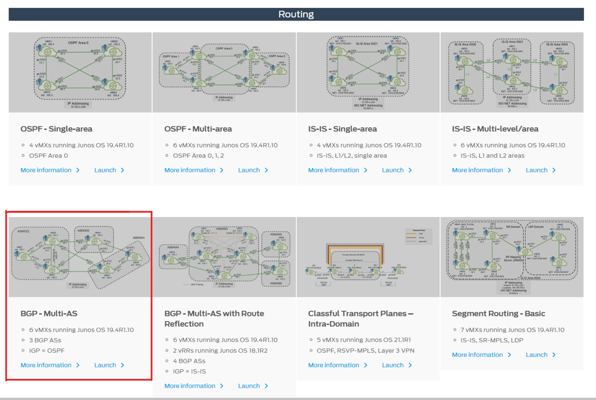
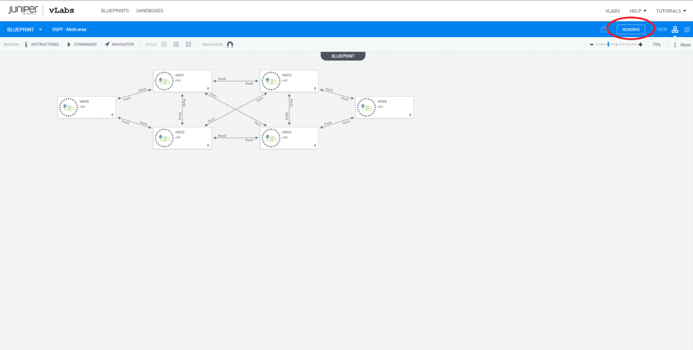
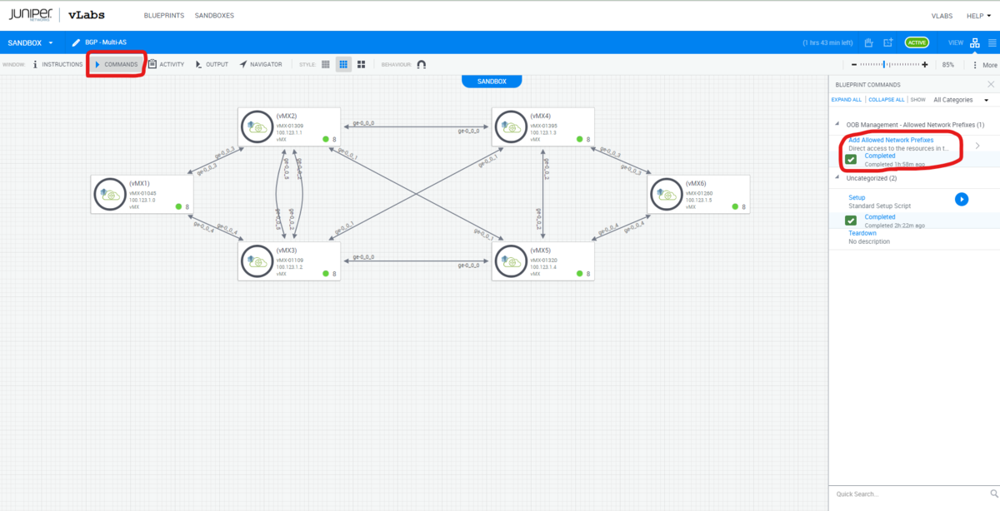
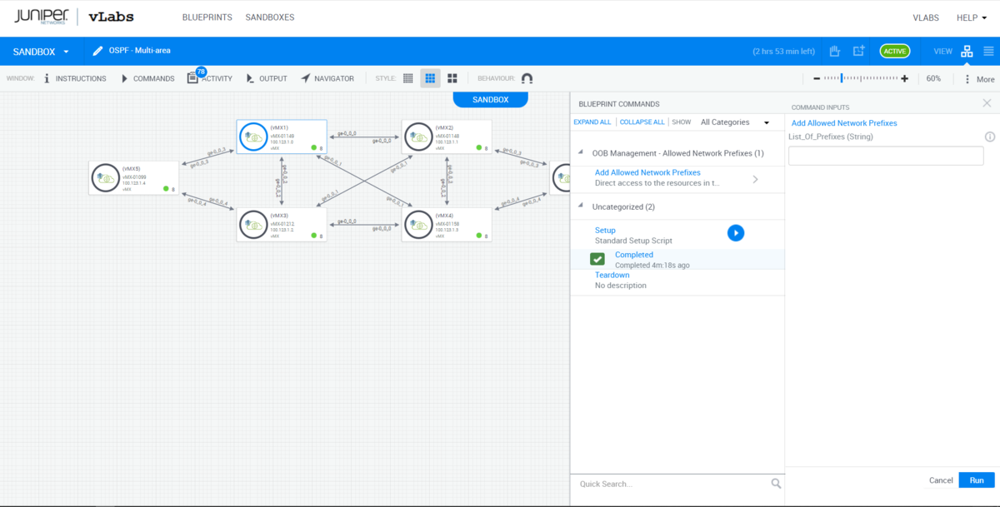

## Juniper vLabsとは

Juniper Networks社が提供するデモ環境が利用できるサービス。  
デモ環境は様々なシチュエーションを想定したものが用意されているので目的に合わせた構成のものを使うことが出来ます。

デモ環境は大きな分類として下記がありさらにその下に詳細な構成がいくつか割り当てられています。

-   Standalone
-   Routing
-   Switching
-   Security
-   Automation
-   Network Management, Telemetry, and Analytics

今回はMPLSを構築するためにRoutingのOSPF-Multi-areaを使います。

## MPLSとは

[MPLS - MPLSの概要](https://www.infraexpert.com/study/mpls1.html)

パケットにラベルを付与し、そのラベルでルーティングを行うことでIPルーティングよりも高速なルーティングができるようになるシステムということですが、 IPルーティングの高速化からその差はほぼなくなっていて現在はVPNサービスを提供する際の顧客の識別などに使われるようです。

MPLSヘッダはL2ヘッダとIPヘッダの間に入る


## Juniper vLabsでMPLSを組んでみる

### 目指す最終形

### vLabsの準備

1.  まずJuniper vLabsにログインしてOSPF-Multi-areaのLaunchをクリック
    
    
    
2.  表示されたページのReserveをクリック 画面の右上の方にReserveボタンがあるのでそれをクリックします。 そうすると確認のポップアップがでるのでそこでもReserveをクリックするとvLabsのセットアップが始まります。
    
    
    
3.  ローカルのSSHクライアントで接続できるようにする vLabsのセットアップが完了したら、次に自分のローカルのSSHクライアント（Tera Termなど）からvLabsの機器に入れるようにvLabsに自分のGlobal IPからの接続を許可する設定を入れます。 左上にあるCommandをクリックすると画面右側に画像のようなバーが出ます。そこにあるAdd Allowed Network PrefixをクリックするとvLabsへの接続を許可するIPを入力することが出来ます。 ここで自分のGlobal IPを入れると自分のローカルからvLabsの機器に接続できるようになります。 自分のGlobal IPは[https://www.cman.jp/network/support/go\_access.cgi](https://www.cman.jp/network/support/go_access.cgi)などで確認できます。
    



### ルーターの設定確認

早速VMX1にSSSHでログインしてせていの確認をおこなう。 VMX1に入ってから接続をとろうとしているところでは依然として支援んが必要です

```
set version 21.1R3.11
set system host-name vMX1
set system root-authentication encrypted-password "$6$w0uV/Veg$MxUKS00aYKDRZKuI13guEQ3yhv0XjZ5vDD/xBSVatXwzxvgMZCjERUu5kEpMaRzFDhrcyf8NLW8lQiM.KpUCE1"
set system scripts language python
set system login user jcladmin uid 2000
set system login user jcladmin class super-user
set system login user jcladmin authentication encrypted-password "$6$COH4QgW/$uFzZAk1fYdnuwVl5WUjhb/4JdtSWIq7y/eCqB3qEFLFK/QBeG1C686NzW0XL0sz8qX4bzyYW0uMIBNXK47Kw7."
set system login user jcluser uid 2001
set system login user jcluser class super-user
set system login user jcluser authentication encrypted-password "$6$G44rGtvQ$I3jMwJk.0/CbTlhEoZzoDGv9dcFuZYdKvNFHiZwZ6s5Lktf/vMHipZxDwEXxgtid.dmN5K27fMBYwKnSijiQ/."
set system services ssh root-login allow
set system services netconf ssh
set system services rest http port 3000
set system services rest enable-explorer
set system syslog user * any emergency
set system syslog file messages any notice
set system syslog file messages authorization info
set system syslog file interactive-commands interactive-commands any
set system processes dhcp-service traceoptions file dhcp_logfile
set system processes dhcp-service traceoptions file size 10m
set system processes dhcp-service traceoptions level all
set system processes dhcp-service traceoptions flag all
set chassis fpc 0 pic 0 number-of-ports 8
set chassis fpc 0 lite-mode
set interfaces ge-0/0/0 unit 0 family inet address 10.100.12.1/24
set interfaces ge-0/0/1 unit 0 family inet address 10.100.14.1/24
set interfaces ge-0/0/2 unit 0 family inet address 10.100.13.1/24
set interfaces ge-0/0/3 unit 0 family inet address 10.100.15.1/24
set interfaces fxp0 unit 0 family inet address 100.123.1.0/16
set interfaces lo0 unit 0 family inet address 10.100.100.1/32
set protocols ospf area 0.0.0.0 interface ge-0/0/0.0
set protocols ospf area 0.0.0.0 interface ge-0/0/1.0
set protocols ospf area 0.0.0.0 interface lo0.0
set protocols ospf area 0.0.0.1 interface ge-0/0/2.0
set protocols ospf area 0.0.0.1 interface ge-0/0/3.0
set routing-options static route 0.0.0.0/0 next-hop 100.123.0.1
```
