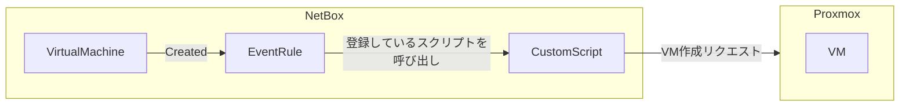
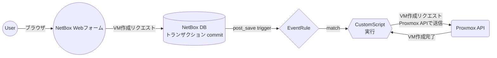
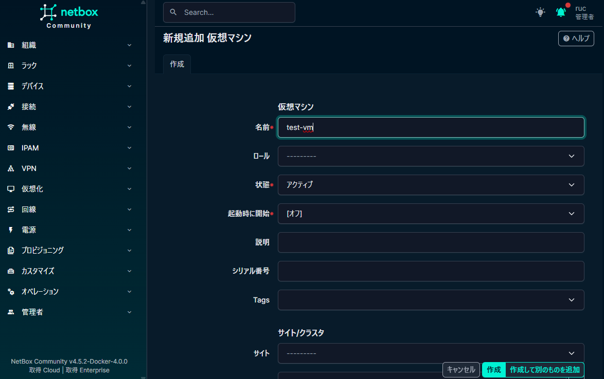
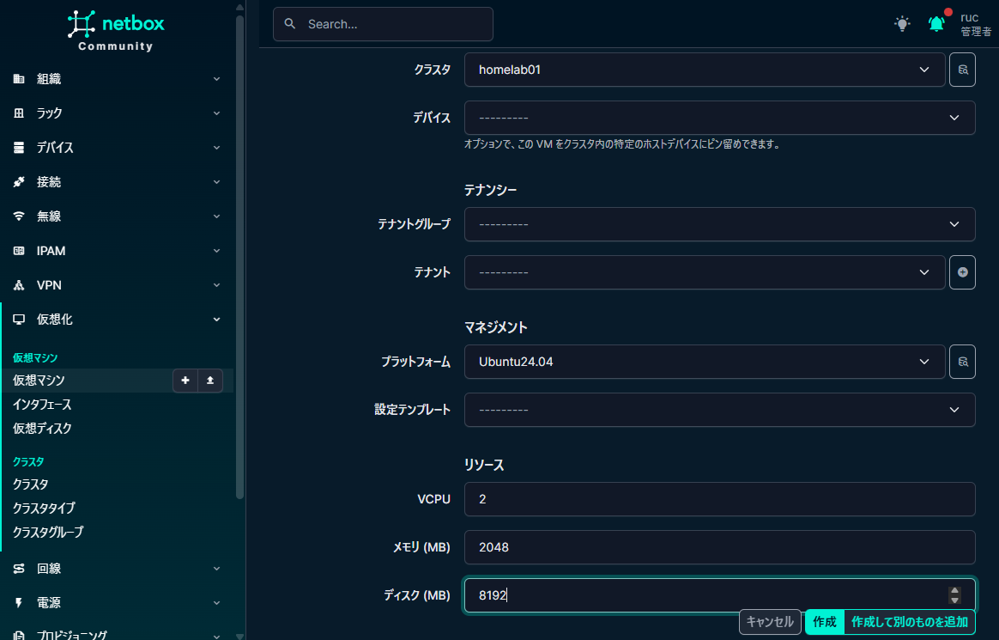
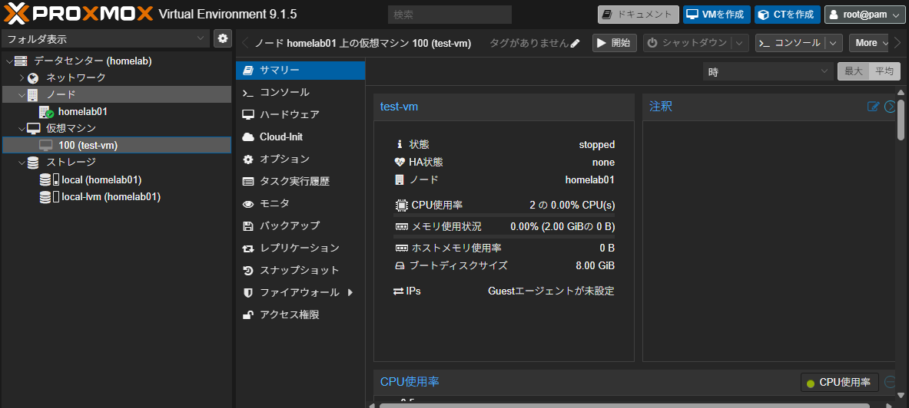
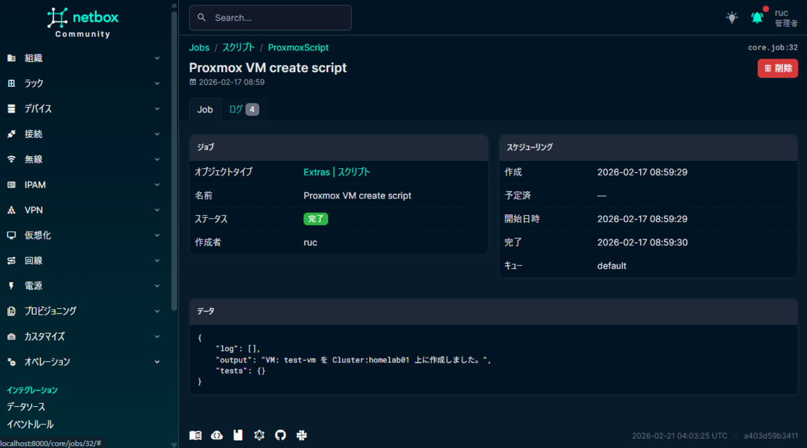
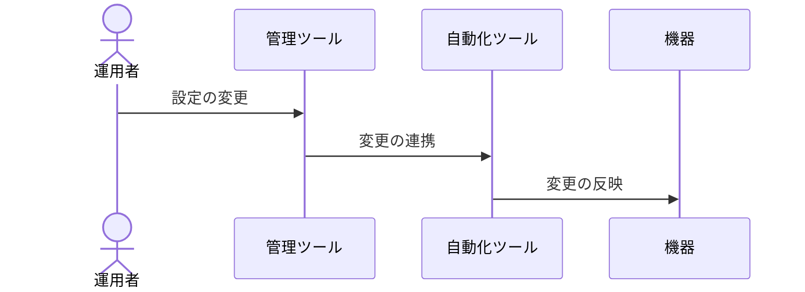
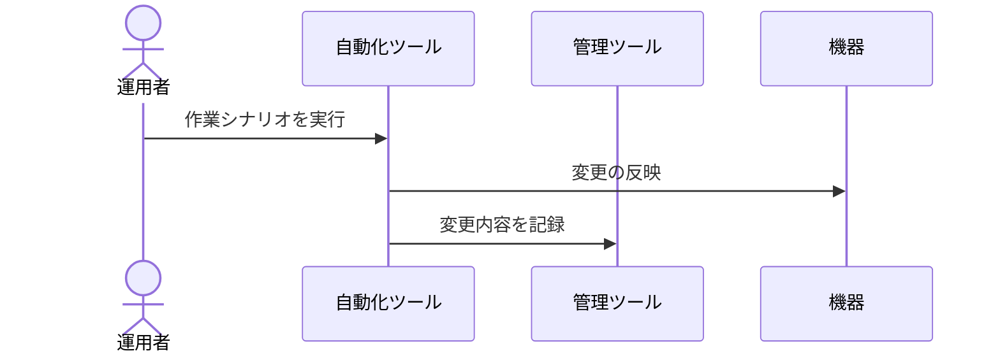

NetBoxはNetBoxLab社が開発しているDCIM/IPAMツールです。

NetBoxには`CustomScript`、`EventRule`といった自動化に繋げられる要素が搭載されています。

これらを組み合わせて仮想基盤（Proxmox）へのVM自動払い出しを実装してみます。

※ NetBoxやProxmoxのインストール方法や基本的な使用方法については割愛します。

### NetBoxからProxmoxへのVM払い出しの流れ

全体図としては下記のような流れを目指します。



つまり、NetBox上で仮想マシンが作成されたときにProxmox上にもVMの払い出しが完了している状態を目指します。

### CustomScriptについて

NetBoxでは特定のタイミングで発火可能なPythonスクリプトを作成することができます。

CustomScriptは`extras.scripts.Script`を継承したクラスの`run`メソッドがエントリーポイントとなります。

```python
from extras.scripts import Script

class SampleScript(Script):
  def run(self, data, commit):
    """ここがエントリーポイント
    Args:
      data: スクリプトに対して渡される辞書データ（呼び出し元次第で中身は変わる）
      commit: データベースへのコミットが行われているかどうかを示すフラグ
    """
```

CustomScriptではNetBoxの内部モジュールを使用することができます。 外部のライブラリを使用する場合はNetBoxを起動している仮想環境へ追加をする必要があります。

Dockerで立ち上げている場合は`requirements-container.txt`にライブラリ情報を追加して`build.sh`を実行することでカスタマイズされたコンテナを作成することができます。

### EventRuleについて

EventRuleではNetBox内のオブジェクトが作成・変更・削除された際に特定のアクションをとることを設定できます。

EventRuleからつなげることができるアクションは下記の3種類。

-   Webhook
-   CustomScript
-   Notification（通知）

ここでCustomScriptを選択することで、NetBox内の仮想マシンオブジェクトの作成に対応してCustomScriptを起動することができます。

### 実装

#### Proxmox APIを準備

Proxmox側でまずAPIユーザーを作成します。

ここでは手順のみ記載し、各要素の詳細については説明しません。

#

操作画面

操作内容

1

データセンター > アクセス権限 > ユーザー

APIユーザーを作成

2

データセンター > アクセス権限 > APIトークン

作成したAPIユーザーのトークンを生成

3

データセンター > アクセス権限 > ロール

API用ロールを作成

4

データセンター > アクセス権限

APIトークンのアクセス権限を作成（パス: `/`、上記のトークンとロールを紐づけ）

手順3で作成するロールには以下の権限を付与します。

`Datastore.Allocate` `Datastore.AllocateSpace` `Datastore.Audit` `SDN.Use` `VM.Allocate` `VM.Audit` `VM.Clone` `VM.Config.*` `VM.Migrate` `VM.PowerMgmt`

こちらを参考にさせていただきました。

[Proxmox VE APIを使ってみる](https://zenn.dev/takeda_dev/articles/44bd03452b7909)

#### Proxmox APIを呼び出すスクリプトを作成

Proxmox APIを扱うための[`proxmoxer`ライブラリ](https://github.com/proxmoxer/proxmoxer)があるのでこれを利用して呼び出しを行います。

EventRuleでオブジェクトの作成時にScriptを呼ぶ場合は、作成されたオブジェクトをシリアライズしたデータが`run`メソッドの`data`に入ってくるため、これを利用して作成するVMの情報を作ります。

ざっくりデータフローは下記の形です。



NetBoxの`Virtualization/VirtualMachine`で設定できる項目からNetBoxからProxmoxのREST APIに渡して渡せそうな情報をまとめます。 [参考](https://pve.proxmox.com/pve-docs/api-viewer/#/nodes/{node}/qemu)

-   name - VMの識別名
-   cluster - VMが所属するクラスタ情報
-   platform - VMのOS情報
-   vcpus - vCPU数
-   memory - メモリサイズ(MB)
-   disk - ディスクサイズ(MB)

デフォルトの項目からは大体上記の内容くらいかなと、この辺はCustomFieldなどでいい感じに拡張できそうです。

一応工夫として、仮想マシンを乗せるクラスタはクラスタタイプで識別できるのでこれがProxmoxの時だけProxmox APIを呼び出すようにしてみます。

```python
from extras.scripts import Script
from proxmoxer import ProxmoxAPI
from virtualization.models import Cluster

PROXMOX_CONFIG = {
    "host": "proxmox.mylab",
    "user": "api-user@pve",
    "token_name": "api-token",
    "token_value": "xxxxxxxxxxxxxxxxxxxxxx",
    "verify_ssl": False,
}

class ProxmoxScript(Script):
    class Meta:
        name = "Proxmox VM create script"
        description = "Create a vm for the Proxmox cluster."
        commit_default = True

    def run(self, data, commit):
        """
        ProxmoxのVMを作成するスクリプト
        Args:
            data (dict): 仮想マシンの情報を含む辞書
            commit (bool): 変更を保存するかどうかのフラグ
        """
        # 仮想マシンがProxmox環境のものかを判定
        cluster_id = data.get("cluster", {}).get("id")
        cluster_name = data.get("cluster", {}).get("name")
        cluster = Cluster.objects.filter(pk=cluster_id).first()
        if cluster is None:
            return "仮想マシンが配置されているクラスターの情報が取得できませんでした。"
        cluster_type_slug = cluster.type.slug

        if cluster_type_slug == "proxmox":
            # Proxmoxの場合
            cfg = PROXMOX_CONFIG
            proxmox = ProxmoxAPI(
                cfg["host"],
                user=cfg["user"],
                token_name=cfg["token_name"],
                token_value=cfg["token_value"],
                verify_ssl=cfg.get("verify_ssl", False),
            )
            vm_id = proxmox.cluster.nextid.get()
            vm_name = data.get("name")
            vm_platform = data.get("platform", {}).get("slug")
            vm_vcpus = str(data.get("vcpus")).split(".")[
                0
            ]  # 小数点以下を切り捨てて整数部分のみを取得
            vm_memory = data.get("memory")
            vm_disk = data.get("disk")
            # MB単位からGB単位に変換
            vm_disk = int(vm_disk) // 1024

            if vm_platform == "ubuntu-24-04":
                iso_file = "ubuntu-24.04.2-live-server-amd64.iso"
            else:
                return f"指定されたプラットフォーム {vm_platform} はサポートされていません。"

            vm_config = {
                "vmid": vm_id,
                "name": vm_name,
                "cpu": "x86-64-v2-AES",
                "cores": 2,
                "vcpus": vm_vcpus,
                "memory": vm_memory,
                "sockets": 1,
                "net0": "virtio,bridge=vmbr0",
                "ide2": f"local:iso/{iso_file},media=cdrom",
                "ostype": "l26",
                "scsihw": "virtio-scsi-pci",
                "scsi0": f"local-lvm:{vm_disk},discard=on",
            }

            proxmox.nodes(cluster.name).qemu.create(**vm_config)

            return f"VM: {vm_name} を Cluster:{cluster_name} 上に作成しました。"
        elif cluster_type_slug == "vmware":
            # VMwareの場合は、VMwareのAPIを使用してVMを作成するコードをここに追加。
            pass
        return f"{cluster_name}は自動化の対象ではありません。"
```

### 動かしてみる

NetBoxのフォームから仮想マシンを作成します。





Proxmoxの仮想マシンが無事に作成されていることを確認します。



NetBoxのジョブを確認すると、スクリプトが正常に動いた結果が取得できます。



### まとめ

NetBoxのEventRuleとCustomScriptを使用することで、イベント駆動の外部連携を実装することができました。

スクリプトの方をもっと改善すればProxmox上のVM作成をcloud-initを利用する形にしたり、VMWareやAWSなどの基盤にも対応したりとかなり拡張できる気がします。

余談：管理と自動化の関係

-   管理
    -   ネットワーク機器やサーバ機器、VMなど管理台帳を作成して管理していた一連の業務を想定。
-   自動化
    -   機器やVMへの設定作業にツールやスクリプトなどを用いて行うということを想定。

インフラ周りには管理に重点を置いたツールと自動化に重点を置いたツール、その両方に強みを持つツールがあります。

できることならツールチェーンはない方がいいので管理と自動化は一つのツールで収まるようにしたいところですが、 既に運用が始まってしまっているところにツールを後から乗せる際は様々な要件から管理と自動化で別々のツールが採用される場合がほとんどというのが体感です。

管理と自動化が一体になっているツールは対象機器が特定ベンダーに寄っていたりなどで将来的な自由度を狭めるところから不採用になりがち

管理と自動化で異なるツールを採用したとします。

そうした場合、管理ツールと自動化ツールでの連携を行う必要が出てきます。 それぞれのツールをどのような流れで連携させていくか？ユースケースの始点は管理ツールか自動化ツールか、これはツールの強み弱みもあるが業務の性質にも関係があると考えています。

#### 管理 -> 自動化

管理ツールでの変更が自動化ツールへ影響し、機器へと反映されるパターン。

このパターンでは運用者の作業起点が管理ツールになります。運用者にとっては「台帳を更新している」という意識で操作を始めることになりますが、その裏では自動化が走り実機への変更が発生します。

ITインフラ管理の現場を想像してみると業務の流れ的にはおおよそ作業 -> 記録という形が多いと感じています。

ですが、このパターンはその逆を行きます。 従来の管理台帳は「記録」の場であり、記載を間違えても台帳を直せば済みました。しかし管理ツールから自動化が連動している場合、台帳への記載が即座に実機への操作になります。運用者が「記録しているだけ」という意識のまま操作していると、意図しない変更が本番環境に反映されるリスクがあります。

このギャップを解消するためには様々なアプローチはあるかと思います。 簡単なところでいえば管理ツールの操作が機器への変更に繋がることを運用者にアナウンスすることです。 とはいえ仕組みで制限した方が良さそうです。 管理ツールの権限設計を丁寧に行い、変更が可能なユーザーと閲覧のみのユーザーをきっちり分けて運用していくことができれば、人の努力に頼らない方向で解決できます。

これまでの運用体系と異なる流れとなることから、メンバーのメンタルモデルを組み替えるための教育・浸透を行う必要があるため、すぐの導入は中々難しいのかなと感じています。

このパターンは管理ツールに定義される状態を中心に連携を組むため、自動化ツールがとるべき動きは固定化されてきます。そのため、ツールチェーンの自由度は低くなり安定した運用が期待できます。



#### 自動化 -> 管理

自動化ツールが機器の変更と管理ツールの変更を連携させるパターン。

これは作業 -> 記録というパターンに沿った流れとなるため、導入が容易であると感じています。

自動化ツールの自由度が高いため、運用をしていく中で機能追加などを行う場合の開発方針を明確に打ち出さないと保守しづらいものが積みあがってしまう危険性もあります。



#### 余談まとめ

どちらのパターンにも言えますが、ツールチェーンを利用しているときに特に気を付けなければならないこととして、連携しているツールのどこかでエラーがでたときにどのようにデータの整合性を保つかは考えなければなりません。

個人的にはマイクロサービスにおけるサーガパターンはこの問題を解決するための考え方として有用であると考えています。

ITインフラを自動化するためのツールチェーンはマイクロサービスアーキテクチャにおける各サービスの隔離と似たものがあり、マイクロサービスアーキテクチャにて用いられるナレッジがもっと活用できると考えています。
