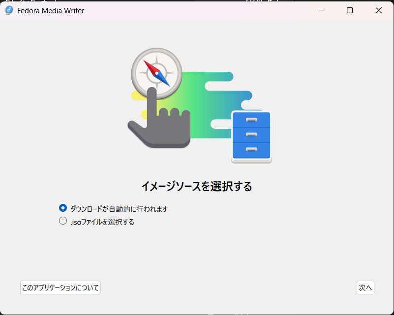
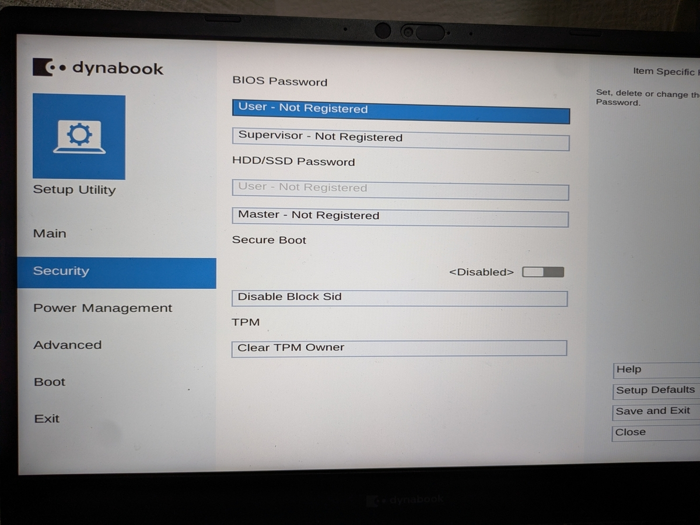
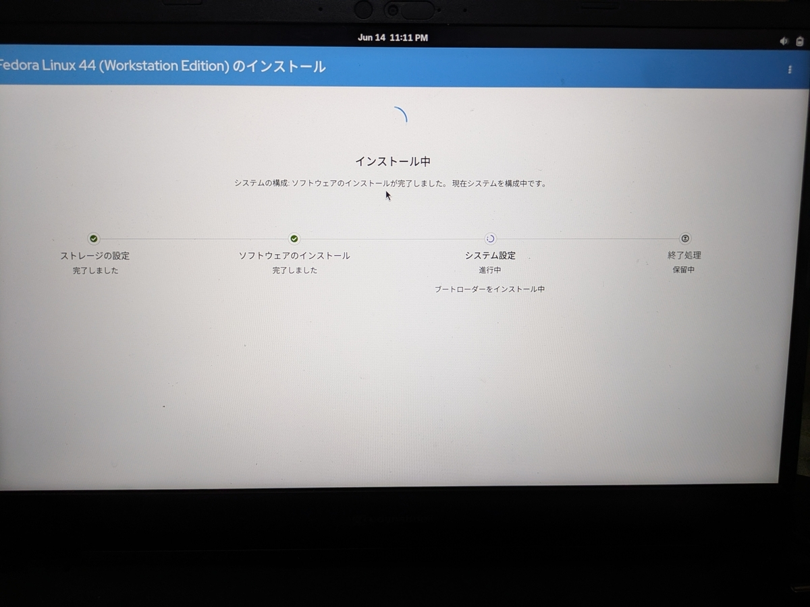
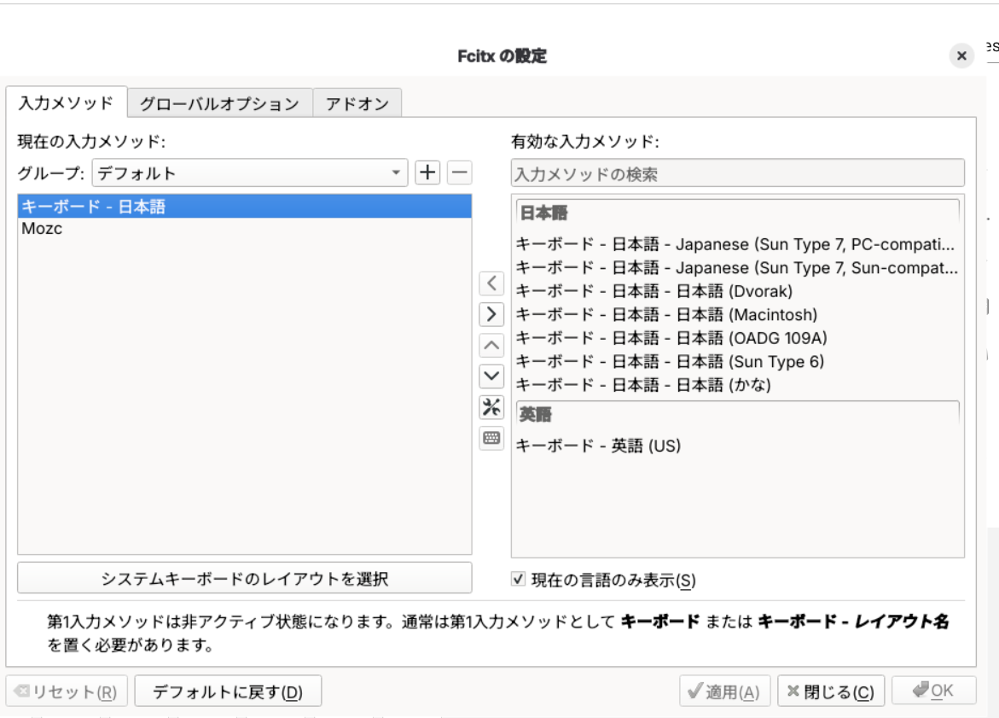

## グッバイWindows

個人で開発等に利用するノートPCを使用しているのだが、最近ふと「これWindowsである必要はないな」と感じたのでそれならLinux Desktopとか使いたいなと思い立ったのがきっかけ。

PCつけたときにセットアップ画面に連れて行かれM365に入らないかっていう勧誘をちょいちょい受けて嫌気が差した

それでどのディストリビューションにしようかなと色々考えた結果、Linusが使っているらしいFedoraがよさそう！となった。（ミーハー）

## Hello fedora

### ブートメディアを作ろう

FedoraがFedora Media Writerとかいう使い勝手のよいブートメディア作成ツールを出してくれているのでこれを活用。

こんな感じで日本語にも対応してくれている。



### 早速起動！

dynabookは起動時にF2でBIOSに入れます。

Bootのメニューからブートの順番を変えてUSBが1番になるようにします。

よく言われている要注意ポイントですが、Secure Bootを落としておかないとUSBからのブートがうまくいかなかったです。



USBからブートしてインストールができたらOKです。



なんかVMWareのコンソールのちっさい窓からおんなじ画面見たことあるけど、実際手元のノートPCでこれを見るのはまた違った趣きがありますな。

### 日本語環境をつくるぞ

Fedoraをインストールしたら次は日本語環境を整備していきます。

というのはデフォルトだと、若干キーバインドが違う？とかでWindowsから乗り換えるには少し使いづらい入力だと感じています。

なのでFcitx5をインストールします。この手のものはインターネットを漁ればいっぱいありますが、一応コマンド載せときます。

```
sudo dnf install fcitx5 fcitx5-mozc
```

インストールしたらあとはGUIの設定で日本語をデフォルトに設定します。



これでいいかんじ。

#### Google Chromeに気をつけろ

ブラウザは慣れたものを使いたかったのでdnfでGoogle Chromeを入れたのですが、 ChromiumはなんかWaylandとの相性よくないらしく、入力時に予測のボックスがずれるなどが発生してすごく使いづらい状態になってしまいました。

なので設定でX11の互換で動くようにします。

まずはシステム側の`.desktop`をコピー。

```
cp /usr/share/applications/google-chrome.desktop ~/.local/share/applications/
```

そして`Exec`の部分全てに`--ozone-platform=x11`のオプションを追記する。

```
Exec=/usr/bin/google-chrome-stable --ozone-platform=x11 %U
```

これでGoogle Chromeでも問題なく日本語入力での予測変換表示をできるようになりました。

ということでこれで大体Windowsと遜色ない環境ができました。

開発系のものはもともとWSL2でしかやっていなかったので、移行は全く問題なしでした。

最近はGitHubやGoogle Driveをはじめとしたクラウドストレージのお世話になっているため、もうローカルにしかないものも少なくて移行が捗りますね。

皆様もぜひLinux Desktopに切り替えてみませんか。最近のはだいぶ快適です。
