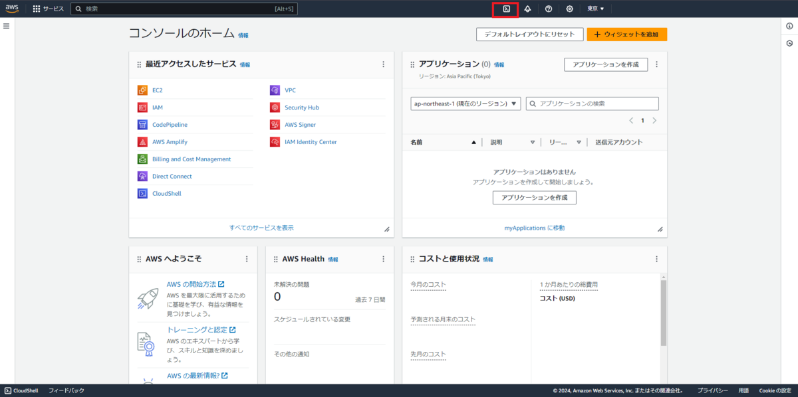

## AWSのCloudShellでお手軽Terraform体験

AWSではトップのバーからCloudShellに入れます。（赤枠で囲んでいるところをクリック）

AWS CloudShellについての公式はこちら

[AWS CloudShell の機能 - AWS CloudShell](https://docs.aws.amazon.com/ja_jp/cloudshell/latest/userguide/cloudshell-features.html)

簡単にまとめると

-   bash, zshとpowershellを内蔵
-   1Gの永続ストレージ
-   Amazon Linux 2023ベース（2024年3月現在）
-   aws cliをデフォルトで使用可能

です。その他は公式を参照してください。

んで、AWS CloudShellのいいところは

-   aws cliが入っているのでクラウドの操作をCLIで実行可能
-   マネジメントコンソールと同等の権限が付与されている

この2つが大きいかなと私は思います。
