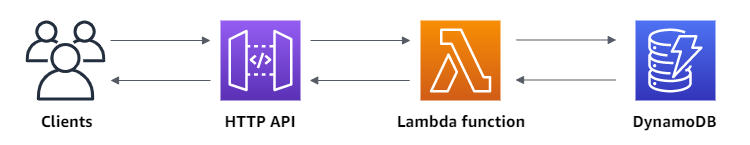
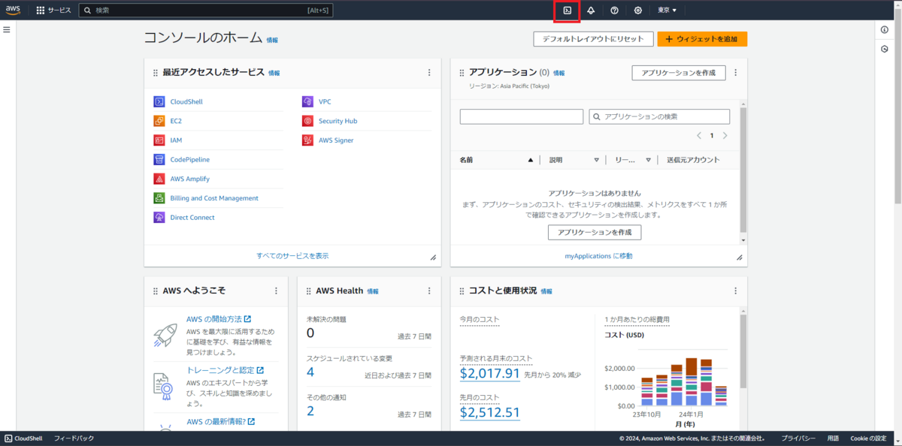
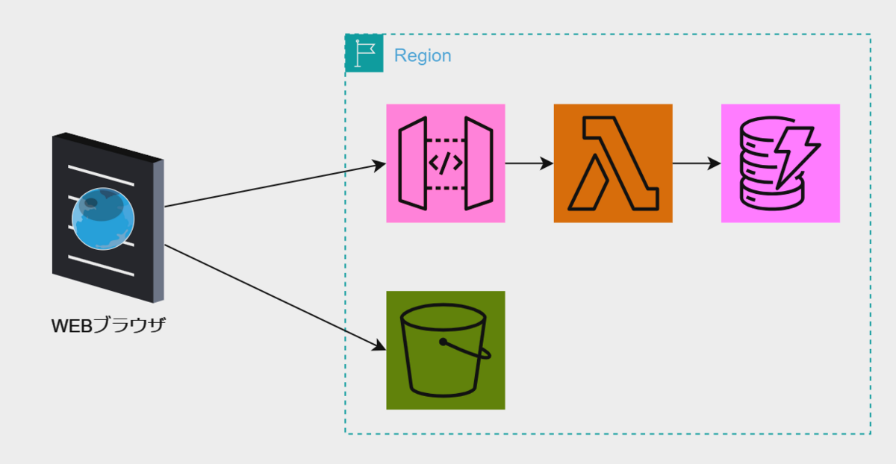
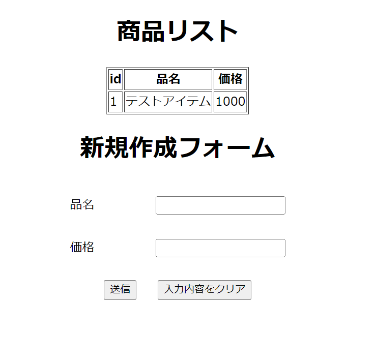

## Terraformでサーバレスを作る

クラウドの自動化などでTerraformを使うときはVPC、EC2を構築することが多くサーバレスの部分に触れる機会が少なかったので、 Terraformを使ってAWS上にEC2の仮想マシンを使用しないサーバレスの形のアプリケーション作成に挑戦してみようと思います。

公式にチュートリアルがあったのでそれをTerraformで作る形に書き直してみます。

[チュートリアル: Lambda と DynamoDB を使用して CRUD HTTP API を作成する - Amazon API Gateway](https://docs.aws.amazon.com/ja_jp/apigateway/latest/developerguide/http-api-dynamo-db.html)

[docs.aws.amazon.com](https://docs.aws.amazon.com/ja_jp/apigateway/latest/developerguide/http-api-dynamo-db.html)

### 構成

#### インフラ

チュートリアルの構成だと



-   S3でHTMLファイルを静的ホスティング
-   LambdaとAPIゲートウェイによるでAPIエンドポイント
-   DynamoDBでのデータ集積

#### アプリケーション

-   フロントはHTMLのペライチ
-   Lambdaで代用するバックエンドはNode.js

### 実行環境の用意

AWSのCloudShellを実行環境とします。  
CloudShellではデフォルトでAWS CLIが入っている関係でTerraformを使う上で必要な認証をスキップできます。これが地味に嬉しい。

まずはCloudShellを開いてTerraformを入れます。

CloudShellはAWSコンソールのバーかシェルのマークをクリックすると起動できます。



下記のスクリプトでCloudShellにTerraformをインストールできます。  
AWSのCloudShellはAmazon Linuxベースなので、公式のAmazon Linux用の手順を参照します。

[Install Terraform | Terraform | HashiCorp Developer](https://developer.hashicorp.com/terraform/tutorials/aws-get-started/install-cli)

[developer.hashicorp.com](https://developer.hashicorp.com/terraform/tutorials/aws-get-started/install-cli)

```bash
sudo yum install -y yum-utils
sudo yum-config-manager --add-repo https://rpm.releases.hashicorp.com/AmazonLinux/hashicorp.repo
sudo yum -y install terraform
```

これで実行環境の用意ができました。

AWSのCloudShellでは一定時間でホームディレクトリ以外は再利用されてしまうので、上記のTerraform導入部分はスクリプトファイルにしておくと時間を空いた際にも再開しやすいです。

### tfファイルを作成する

Terraformでの構築で利用するtfファイルを作成します。

今回は特にモジュールなどは使用せずにAWSプロバイダーとルートモジュールのみで構築します。

ということで、まずはプロバイダー周りの設定を入れます。

`main.tf`ファイルを作成し、Terraformの基本設定部分を入れます。  
今回はAWSの東京リージョンを使っていきます。

```hcl
terraform {
  required_version = ">=1.9.7" # terraformのバージョンを固定
  required_providers {
    aws = {
      source  = "hashicorp/aws"
      version = "5.70.0" # AWSプロバイダーのバージョンを固定
    }
  }
}

provider "aws" {
  region = "ap-northeast-1" # 東京リージョンを指定
}
```

### AWSリソースを作成

今回は下記の構成を作っていきます。



S3からCloudFrontへ伸ばせるとより良い形になると思います。  
ですが、簡単に始めるには重いのでここでは省きます。

この構成を用いて簡単なタスク管理のアプリケーションを作っていきます。

#### DynamoDB

まずはアプリケーションで利用するデータのためのDBを作ります。

パーティションキーはTerraformでは`hash_key`となります。

```hcl
# DynamoDB
resource "aws_dynamodb_table" "main" {
  name         = "http-crud-tutorial-items"
  billing_mode = "PROVISIONED"
  read_capacity = 1
  write_capacity = 1
  hash_key     = "id"

  attribute {
    name = "id"
    type = "S"
  }
}
```

上記を`main.tf`に追記します。

#### Lambda

続いてDynamodbを操作するLambda関数を作成します。

ランタイムはNode.jsを使用します。 Node.jsのコードは公式のものをそのまま利用します。  
[チュートリアルに記載のもの](https://docs.aws.amazon.com/ja_jp/apigateway/latest/developerguide/http-api-dynamo-db.html#http-api-dynamo-db-create-function)を`index.mjs`として保存しておきます。

リソースとしては`aws_lambda_function`とLambdaに適用する`aws_iam_role`、DyanmoDBを操作するためのポリシーと、そのアタッチメントを作成します。

また、Lambdaはコードを配置する際にzip化もしくはS3においておく必要がありますが、Terraformの`archive_file`のデータリソースでzip化が可能なのでそれを採用しています。

```hcl
# Lambdaにあてるポリシーステートメント
data "aws_iam_policy_document" "lambda_assume_role_policy" {
  statement {
    actions = ["sts:AssumeRole"]
    principals {
      type        = "Service"
      identifiers = ["lambda.amazonaws.com"]
    }
  }
}

# Lambdaに設定するiam role
resource "aws_iam_role" "lambda_role" {
  name               = "http-crud-tutorial-role"
  assume_role_policy = data.aws_iam_policy_document.lambda_assume_role_policy.json
}

# DynamoDBへのアクセスを許可するポリシーステートメント
data "aws_iam_policy_document" "dynamodb_policy" {
  statement {
    actions = [
      "dynamodb:PutItem",
      "dynamodb:GetItem",
      "dynamodb:UpdateItem",
      "dynamodb:DeleteItem",
      "dynamodb:Scan",
    ]
    resources = [
      aws_dynamodb_table.main.arn
    ]
  }
}

# DynamoDBへのアクセス許可ポリシー
resource "aws_iam_policy" "dynamodb_policy" {
  name        = "http-crud-tutorial-dynamodb-policy"
  description = "Policy to allow Lambda to access DynamoDB"

  policy = data.aws_iam_policy_document.dynamodb_policy.json
}

# DynamoDBへのアクセス許可をLambdaのiam roleへアタッチ
resource "aws_iam_role_policy_attachment" "attach_policy" {
  role       = aws_iam_role.lambda_role.name
  policy_arn = aws_iam_policy.dynamodb_policy.arn
}

# Lambdaで使用する関数をファイルをzip化
data "archive_file" "lambda" {
  type = "zip"
  source_file = "index.mjs"
  output_path = "function_payload.zip"
}

# Lambda
resource "aws_lambda_function" "main" {
  function_name = "http-crud-tutorial-function"
  handler       = "index.handler"
  runtime       = "nodejs20.x"

  role = aws_iam_role.lambda_role.arn
  filename = data.archive_file.lambda.output_path
}
```

##### API Gateway

ステップ3

API Gatewayをまずは作成します。

```hcl
# API Gateway
resource "aws_apigatewayv2_api" "main" {
  name="http-crud-tutorial-api"
  protocol_type = "HTTP"
}
```

上記を`main.tf`に追記。

##### API GatewayとLambdaを統合する

LambdaとAPI Gateway、この２つのリソースを統合する設定を`main.tf`に追記します。  
ちょっと長いですが下記となります。

```hcl
# Lambdaに統合するための統合設定とルート設定
resource "aws_apigatewayv2_integration" "main" {
  api_id = aws_apigatewayv2_api.main.id
  connection_type = "INTERNET"
  integration_method = "POST"
  integration_uri = aws_lambda_function.main.invoke_arn
  integration_type = "AWS_PROXY"
  payload_format_version = "2.0"
}

resource "aws_apigatewayv2_route" "get_all" {
  api_id = aws_apigatewayv2_api.main.id
  route_key = "GET /items"
  target = "integrations/${aws_apigatewayv2_integration.main.id}"
}

resource "aws_apigatewayv2_route" "put_item" {
  api_id = aws_apigatewayv2_api.main.id
  route_key = "PUT /items"
  target = "integrations/${aws_apigatewayv2_integration.main.id}"
}

resource "aws_apigatewayv2_route" "get_item" {
  api_id = aws_apigatewayv2_api.main.id
  route_key = "GET /items/{id}"
  target = "integrations/${aws_apigatewayv2_integration.main.id}"
}

resource "aws_apigatewayv2_route" "delete_item" {
  api_id = aws_apigatewayv2_api.main.id
  route_key = "DELETE /items/{id}"
  target = "integrations/${aws_apigatewayv2_integration.main.id}"
}

# API Gatewayのデプロイ設定
resource "aws_apigatewayv2_stage" "main" {
  api_id      = aws_apigatewayv2_api.main.id
  auto_deploy = true # 自動デプロイを有効にする
  name        = "$default"
}

# LambdaのAPI Gatewayからの呼び出し許可設定
resource "aws_lambda_permission" "lambda_permission" {
  statement_id  = "AllowExecutionFromAPIGateway"
  action        = "lambda:InvokeFunction"
  function_name = aws_lambda_function.main.function_name
  principal     = "apigateway.amazonaws.com"

  source_arn = "${aws_apigatewayv2_api.main.execution_arn}/*/*"
}
```

これでチュートリアルに記載されているリソースをTerraformで記述することができました。

main.tf

```hcl
terraform {
  required_version = ">=1.9.7" # terraformのバージョンを固定
  required_providers {
    aws = {
      source  = "hashicorp/aws"
      version = "5.70.0" # AWSプロバイダーのバージョンを固定
    }
  }
}

provider "aws" {
  region = "ap-northeast-1" # 東京リージョンを指定
}

# DynamoDB
resource "aws_dynamodb_table" "main" {
  name           = "http-crud-tutorial-items"
  billing_mode   = "PROVISIONED"
  read_capacity  = 1
  write_capacity = 1
  hash_key       = "id"

  attribute {
    name = "id"
    type = "S"
  }
}

# Lambdaにあてるポリシーステートメント
data "aws_iam_policy_document" "lambda_assume_role_policy" {
  statement {
    actions = ["sts:AssumeRole"]
    principals {
      type        = "Service"
      identifiers = ["lambda.amazonaws.com"]
    }
  }
}

# Lambdaに設定するiam role
resource "aws_iam_role" "lambda_role" {
  name               = "http-crud-tutorial-role"
  assume_role_policy = data.aws_iam_policy_document.lambda_assume_role_policy.json
}

# DynamoDBへのアクセスを許可するポリシーステートメント
data "aws_iam_policy_document" "dynamodb_policy" {
  statement {
    actions = [
      "dynamodb:PutItem",
      "dynamodb:GetItem",
      "dynamodb:UpdateItem",
      "dynamodb:DeleteItem",
      "dynamodb:Scan",
    ]
    resources = [
      aws_dynamodb_table.main.arn
    ]
  }
}

# DynamoDBへのアクセス許可ポリシー
resource "aws_iam_policy" "dynamodb_policy" {
  name        = "http-crud-tutorial-dynamodb-policy"
  description = "Policy to allow Lambda to access DynamoDB"

  policy = data.aws_iam_policy_document.dynamodb_policy.json
}

# DynamoDBへのアクセス許可をLambdaのiam roleへアタッチ
resource "aws_iam_role_policy_attachment" "attach_policy" {
  role       = aws_iam_role.lambda_role.name
  policy_arn = aws_iam_policy.dynamodb_policy.arn
}

# Lambdaで使用する関数をファイルをzip化
data "archive_file" "lambda" {
  type        = "zip"
  source_file = "index.mjs"
  output_path = "function_payload.zip"
}

# Lambda
resource "aws_lambda_function" "main" {
  function_name = "http-crud-tutorial-function"
  handler       = "index.handler"
  runtime       = "nodejs20.x"
  role          = aws_iam_role.lambda_role.arn
  filename      = data.archive_file.lambda.output_path
}

# API Gateway
resource "aws_apigatewayv2_api" "main" {
  name          = "http-crud-tutorial-api"
  protocol_type = "HTTP"
  cors_configuration {
    allow_headers = ["content-type"]
    allow_methods = ["*"]
    allow_origins = ["*"]
  }
}

# Lambdaに統合するための統合設定とルート設定
resource "aws_apigatewayv2_integration" "main" {
  api_id                 = aws_apigatewayv2_api.main.id
  connection_type        = "INTERNET"
  integration_method     = "POST"
  integration_uri        = aws_lambda_function.main.invoke_arn
  integration_type       = "AWS_PROXY"
  payload_format_version = "2.0"
}

resource "aws_apigatewayv2_route" "get_all" {
  api_id    = aws_apigatewayv2_api.main.id
  route_key = "GET /items"
  target    = "integrations/${aws_apigatewayv2_integration.main.id}"
}

resource "aws_apigatewayv2_route" "put_item" {
  api_id    = aws_apigatewayv2_api.main.id
  route_key = "PUT /items"
  target    = "integrations/${aws_apigatewayv2_integration.main.id}"
}

resource "aws_apigatewayv2_route" "get_item" {
  api_id    = aws_apigatewayv2_api.main.id
  route_key = "GET /items/{id}"
  target    = "integrations/${aws_apigatewayv2_integration.main.id}"
}

resource "aws_apigatewayv2_route" "delete_item" {
  api_id    = aws_apigatewayv2_api.main.id
  route_key = "DELETE /items/{id}"
  target    = "integrations/${aws_apigatewayv2_integration.main.id}"
}

# API Gatewayのデプロイ設定
resource "aws_apigatewayv2_stage" "main" {
  api_id      = aws_apigatewayv2_api.main.id
  auto_deploy = true # 自動デプロイを有効にする
  name        = "$default"
}

# LambdaのAPI Gatewayからの呼び出し許可設定
resource "aws_lambda_permission" "lambda_permission" {
  statement_id  = "AllowExecutionFromAPIGateway"
  action        = "lambda:InvokeFunction"
  function_name = aws_lambda_function.main.function_name
  principal     = "apigateway.amazonaws.com"
  source_arn    = "${aws_apigatewayv2_api.main.execution_arn}/*/*"
}
```

##### フロントを追加する

最後にチュートリアルにはない内容としてS3のWebホスティング機能を使ってS3にHTMLファイルを配置します。

HTMLファイルはペライチで作るのでAPI Gatewayのエンドポイントを記述する必要があります。  
Terraformの`local_file`リソースと`templatefile`のメソッドを利用すると、テンプレートファイルをレンダリングして変数を書き込むことができます。

このテンプレートの書き方についてはこちら。

[templatefile - Functions - Configuration Language | Terraform | HashiCorp Developer](https://developer.hashicorp.com/terraform/language/functions/templatefile)

私見ですが、なんかJinja2っぽいようなShellっぽいような感じでちょっと書きづらいです。

エンドポイントの部分に変数を埋める形のHTML形式のテンプレートファイルとして`index.tftpl`を作成しました。

index.tftpl

```html
<!DOCTYPE html>
<html lang="ja">

<head>
    <meta charset="UTF-8">
    <meta name="viewport" content="width=device-width, initial-scale=1.0">
    <title>Item List</title>
</head>

<body>
    <h1>商品リスト</h1>
    <table id="item-table" border="1">
        <thead>
            <tr>
                <th>id</th>
                <th>品名</th>
                <th>価格</th>
            </tr>
        </thead>
        <tbody id="item-table-body">
        </tbody>
    </table>
    <h1 id="form-info">新規作成フォーム</h1>
    <form id="item-form">
        <input id="item-form-id" name="id" type="number" hidden>
        <div class="item-form-row">
            <label for="item-form-name">品名</label>
            <input id="item-form-name" name="name" required>
        </div>
        <div class="item-form-row">
            <label for="item-form-price">価格</label>
            <input id="item-form-price" name="price" type="number">
        </div>
        <div class="submit-btn-row">
            <button class="submit-btn" type="submit">送信</button>
            <button class="clear-btn" type="button" onclick="handleClear()">入力内容をクリア</button>
        </div>
    </form>
    <script>
        // ここにエンドポイントのURLをレンダリングしてもらう
        const endpoint = "${endpoint}";
        /* tdエレメントを作成する関数 */
        function createTableData(text) {
            const tableData = document.createElement("td")
            tableData.textContent = text
            return tableData
        }
        /* dynamoDBのデータを取得しtableの行を作成する関数 */
        async function fetchData() {
            const response = await fetch(
                `${endpoint}/items`,
                {
                    method: "GET", mode: "cors",
                    headers: {
                        'Content-Type': 'application/json;charset=utf-8'
                    }
                }
            )
            const data = await response.json()

            const tableBody = document.getElementById("item-table-body")
            // idの順に帰ってくるわけではないのでソートをする
            data.sort((a, b) => Number(a.id) - Number(b.id)).forEach((item, index) => {
                const tableRow = document.createElement("tr")
                tableRow.appendChild(createTableData(item.id))
                tableRow.appendChild(createTableData(item.name))
                tableRow.appendChild(createTableData(item.price))
                tableRow.onclick = () => {
                    parseForm(item, "編集フォーム")
                }
                tableBody.appendChild(tableRow)
                // 動的styleを追加
                const style = document.createElement("style")
                style.textContent = `
                    tr {
                        cursor: pointer;
                    }
                    
                    tr:hover {
                        opacity: 0.5;
                    }
                `
                tableBody.appendChild(style)
            });
            // localStorageに新規のIDをセットする
            localStorage.setItem("newId", String(Number(data.length) + 1))
        }

        function parseForm(data, title) {
            // 要素取得
            const idInput = document.getElementById("item-form-id")
            const nameInput = document.getElementById("item-form-name")
            const priceInput = document.getElementById("item-form-price")
            const formTitle = document.getElementById("form-info")
            // データを埋める
            idInput.value = data.id
            nameInput.value = data.name
            priceInput.value = data.price
            // フォームタイトルを変える
            formTitle.textContent = title
        }
        function handleClear() {
            parseForm({ id: null, name: "", price: null }, "新規作成フォーム")
        }

        const form = document.getElementById("item-form")
        form.addEventListener("submit", (ev) => {
            ev.preventDefault()
            const formData = new FormData(ev.target)
            const id = formData.get("id")
            console.log(id === "" ? localStorage.getItem("newId") : id)
            console.log(formData.get("name"))
            console.log(formData.get("price"))
            fetch(
                `${endpoint}/items`,
                {
                    method: "PUT",
                    body: JSON.stringify({
                        id: id === "" ? localStorage.getItem("newId") : id,
                        name: formData.get("name"),
                        price: Number(formData.get("price"))
                    }),
                    mode: "cors",
                }
            ).then(() => {
                location.reload()
            })
        })
        fetchData()
    </script>
</body>
<style>
    h1 {
        text-align: center;
    }

    #item-table {
        margin: auto;
    }

    #item-form {
        margin: auto;
    }

    .item-form-row {
        display: flex;
        justify-content: center;
        padding: 1rem;
    }

    .item-form-row label {
        text-align: right;
        padding-right: 5rem;
    }

    .submit-btn-row {
        display: flex;
        justify-content: center;
    }

    .submit-btn-row button {
        margin: 2%;
    }
</style>

</html>
```

こんな感じの画面を出してくれます。



そうしたら、これをレンダリングした`index.html`を作成する`local_file`リソースを`main.tf`に追記します。

```hcl
# API Gatewayのエンドポイントをファイルに書き出す
resource "local_file" "main" {
  content = templatefile("index.tftpl", {
    endpoint = aws_apigatewayv2_api.main.api_endpoint
    }
  )
  filename = "index.html"
}
```

続いてこのHTMLファイルをS3に配置する設定を追加します。

Terraformリソースとして作成するのは下記。

-   aws\_s3\_bucket - S3のバケット
-   aws\_s3\_bucket\_public\_access\_block - バケットへ外部からのアクセスを許可する
-   aws\_s3\_bucket\_policy - アクセス許可ポリシー
-   aws\_s3\_object - S3に配置するファイルの設定

S3は静的ホスティングの設定もあるのですが、今回`index.html`のペライチだとパブリックアクセスで十分

Terraformコードは下記を`main.tf`に追加します。

```hcl
# S3
resource "aws_s3_bucket" "main" {
  bucket = "http-crud-tutorial-front"
  tags = {
    Name = "http-crud-tutorial-front"
  }
}

resource "aws_s3_object" "index_html" {
  depends_on   = [local_file.main]
  bucket       = aws_s3_bucket.main.id
  key          = "index.html"
  source       = "index.html"
  content_type = "text/html"
}

# 外部からのアクセスを許可する
resource "aws_s3_bucket_public_access_block" "main" {
  bucket                  = aws_s3_bucket.main.id
  block_public_acls       = false
  block_public_policy     = false
  ignore_public_acls      = false
  restrict_public_buckets = false
}

data "aws_iam_policy_document" "s3_allow_access" {
  statement {
    sid    = "Statement1"
    effect = "Allow"
    principals {
      type        = "*"
      identifiers = ["*"]
    }
    actions = [
      "s3:GetObject"
    ]
    resources = [
      "${aws_s3_bucket.main.arn}/*"
    ]
  }
}

resource "aws_s3_bucket_policy" "main" {
  depends_on = [aws_s3_bucket_public_access_block.main]
  bucket     = aws_s3_bucket.main.id
  policy     = data.aws_iam_policy_document.s3_allow_access.json
}

# 現在のリージョンを取得
data "aws_region" "current" {}
# アクセス用のURLを表示
output "s3_url" {
  value = "https://${aws_s3_bucket.main.bucket}.s3.${data.aws_region.current.name}.amazonaws.com/${aws_s3_object.index_html.key}"
}
```

リソース作成の後に`output`で`index.html`のオブジェクト URLを表示させています。

### Terraformを実行

`main.tf`が完成したら実行して、AWSリソースを作成していきます。

```shell
$ terraform apply
(省略)

Apply complete! Resources: 18 added, 0 changed, 0 destroyed.

Outputs:

s3_url = "https://http-crud-tutorial-front.s3.ap-northeast-1.amazonaws.com/index.html"
```

リソースの作成に成功したら最後に表示されるアドレスにアクセスしてみましょう。  
新規作成フォームでアイテム追加ができることを確認できれば完成です！

### 作成したリソースを削除

最後に作成したリソースを忘れずに削除します。

```shell
$ terraform destroy
```

## まとめ

AWS公式チュートリアルをTerraformで書き換えてみましたが、思ったよりWebコンソールはリソースを自動で作ってくれているということを実感しました。

特にポリシー周り。

IAMロールの仕組みとか結構あいまいな理解をしているので改めて勉強せねば。
