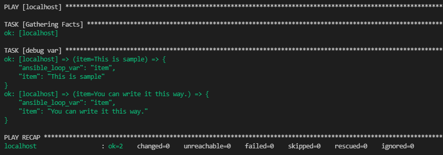

-   [Playbookをなんとなく書いている。](#Playbookをなんとなく書いている)
    -   [YAML?](#YAML)
    -   [YAMLの構造について](#YAMLの構造について)
        -   [基本的な配列構造、キーバリュー構造](#基本的な配列構造キーバリュー構造)
        -   [プレイブックの構造を考える](#プレイブックの構造を考える)
        -   [これがわかったときに何がよかったか](#これがわかったときに何がよかったか)

## Playbookをなんとなく書いている。

業務でAnsibleを触るようになってからPlaybookを読んだり書いたりする場面はただ勉強としてAnsibleを触っていた時より当たり前ですが格段に増えました。 そういう中でそもそもPlaybookてYAMLで書かれているけどそのYAMLについてって意外とわかってないこと多いなと思い、やっぱり

Ansibleのプレイブックの形式として、、、 以下の形が最もよく見る形なのかなと思います。

```yaml
---
- hosts: host_name
  gather_facts: false
  tasks:
    - name: task_name
      module:
        parameter:
          - arg1
          - arg2 
      loop: "{{ var }}"
      when: specific condition
```

一番初めに`- hosts:`を書いてそのあとはインデント下げて`gather_facts: false`を書いて、、、と  
半ば形式的に書いているところがあるのでこれをYAMLの構造から考えてもっとPlaybookを理解していきたいと思います。

### YAML?

そもそもYAMLってなんだっけとなったので公式サイトを確認。

[公式サイト](https://yaml.org/)によるとYAMLは2004年にYAML1.0がリリースされており、もともとはXMLの仕様などに対して疑問を感じていた人々が作り上げたコミュニティの中から生まれてきたようです。  
その後2005年にYAML1.1、2009年にYAML1.2.0と1.2.1がリリースされ、少し時を開けて昨年(2021)の10月に最新版のYAML1.2.2がリリースされました。  
この時を経ての更新について公式のページには以下のようにあります。

> This YAML 1.2.2 specification, published in October 2021, is the first step in YAML’s rejuvenated development journey.

ここからYAMLはさらなる進化を遂げるのでしょうか。

### YAMLの構造について

YAMLの基本的な構造について再確認。

#### 基本的な配列構造、キーバリュー構造

おなじみの配列

```yaml
- 1
- 2
- 3
- 4
```

おなじみのキーバリュー

```yaml
name: neko
height: 30
home: Tokyo
```

以上からプレイブックの構造についてを見ていきます。

#### プレイブックの構造を考える

これをYAMLの構造から考えると、プレイブックの一番大きな構造として配列から始まっているということがわかります。

```yaml
- hosts: # <= ｺｺ!

...
```

そして`hosts:`や`tasks:`は配列の最初の要素のキーバリューのキーであるということ、`tasks:`以下は配列になっていてその要素には行う処理のモジュールや`loop`、`when`などの制御系のキーが入っているということ。 そして、それらの構造が崩れなければ色々ずらしても大丈夫だということ。  
実際こんな風に書くことはないけど、これもありなんだ！って気づくことは自分にとってプレイブックの理解に大きく貢献しました。

```yaml
---
- tasks:
    - loop: "{{ sample }}"
      debug:
        var: item
      name: debug var
  hosts: localhost
  vars:
    - sample:
      - This is sample
      - You can write it this way.
```

これで全然通る。



#### これがわかったときに何がよかったか

自分はこれを認識するまではAnsibleのPlaybookについてYAMLの記法を意識する部分がtasks以下の部分でしかなく、それ以外は決まりきったものととらえていたので「よくわかってないけどそういうもの」という認識でPlaybookの大半を書いていました。ですが、こうしてPlaybookについてYAMLとして紐解いてみることでPlaybookとは、YAMLとはの部分がより深まったように思います。
